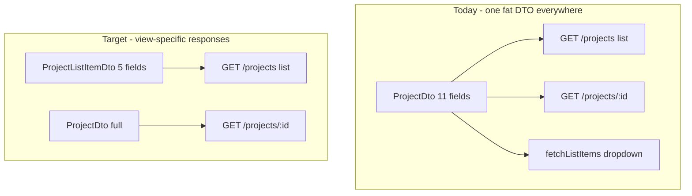

# Frontend ↔ Backend API Audit

## Verdict at a glance

| Area                           | Assessment                                                                                                                                                                                                                                                            |
| ------------------------------ | --------------------------------------------------------------------------------------------------------------------------------------------------------------------------------------------------------------------------------------------------------------------- |
| **Admin app** (~60 endpoints)  | Calls are feature-scoped; waste is mostly **fetching too many rows** and **N+1 follow-ups**, not wrong endpoints                                                                                                                                                      |
| **Member app** (~45 endpoints) | Same — clean endpoint set; **duplicate `/users/me`** and **full DTOs on list calls**                                                                                                                                                                                  |
| **Response shapes**            | Most services use explicit mappers (`toDto`, `buildSession`, `toProfileDto`) — good. Gaps: **workspace list/update spreads Prisma**, **timesheet approve/reject returns raw row**, and **contracts define one fat DTO per entity** even when list UIs read 4–6 fields |
| **Backend** (112 endpoints)    | 6 dead routes, 1 missing role guard, pagination default 1000                                                                                                                                                                                                          |

Principle for fixes: **return only what the calling screen reads**, using **view-specific DTOs** (list vs detail vs session) rather than trimming fields ad hoc in the frontend.

---

## Response vs frontend expectation (field-level)

Legend: **Contract** = Zod schema in `packages/contracts`. **Backend** = what API actually serializes. **Frontend uses** = property reads in `apps/admin`, `apps/client`, `packages/web-shared`. **Omit** = safe to drop without breaking current UI.

### Auth — `AuthSessionDto` / `AuthUserDto`

Endpoints: `POST /auth/login`, `/auth/refresh`, `GET /auth/me`, `POST /auth/switch-workspace`

| Field                          | Contract     | Backend mapper             | Frontend uses                     | Omit?                       |
| ------------------------------ | ------------ | -------------------------- | --------------------------------- | --------------------------- |
| `user.id`                      | yes          | `buildSession()` whitelist | session store, filters, "is self" | keep                        |
| `user.name`                    | yes          | yes                        | shells, profile sync              | keep                        |
| `user.firstName`, `lastName`   | yes          | yes                        | user menu, assistant greeting     | keep                        |
| `user.email`                   | yes          | yes                        | **never read from session**       | **yes from session**        |
| `user.defaultHourlyRate`       | yes          | yes                        | **never read from session**       | **yes for MEMBER**          |
| `workspaceId`, `workspaceRole` | yes          | yes                        | all API calls, gates              | keep                        |
| `workspaceName`                | optional     | yes                        | workspace settings, profile hero  | keep                        |
| `impersonatorId/Name`          | optional     | yes                        | impersonation banner              | keep                        |
| `accessToken`, `refreshToken`  | on token DTO | controller spread          | session store                     | keep until cookie-only mode |

**Backend note:** [`auth.service.ts`](apps/api/src/modules/auth/application/auth.service.ts) `buildSession()` is clean — no Prisma leak. Over-return is **contract-level** (fields defined but unused).

**Fix:** `AuthUserSessionDto` slim variant for session bootstrap; full `AuthUserDto` only where needed. Add `defaultWorkspaceId` to `AuthSessionDto` so bootstrap skips `GET /users/me`.

---

### Users — `UserProfileDto` (`GET /users/me`)

| Field                                                                                                            | Frontend uses                                                   | Omit from default profile? |
| ---------------------------------------------------------------------------------------------------------------- | --------------------------------------------------------------- | -------------------------- |
| `id`                                                                                                             | never                                                           | **yes**                    |
| `email`, `name`, `firstName`, `lastName`                                                                         | profile sections                                                | keep                       |
| `phone`, `location`, `jobTitle`, `department`, `workStartDate`                                                   | profile sections                                                | keep                       |
| `avatarUrl`                                                                                                      | never (avatars derive from name)                                | **yes**                    |
| `defaultHourlyRate`                                                                                              | admin work-details read-only                                    | **MEMBER: yes**            |
| `preferences.*`                                                                                                  | settings, theme, week start, startup page                       | keep (except below)        |
| `preferences.dashboardLayouts`                                                                                   | **not read** — layout uses `GET/PUT /users/me/dashboard-layout` | **yes**                    |
| `effectiveDailyTargetHours`, `effectiveTimezone`, `effectiveDateFormat`, `effectiveTimeFormat`, `effectiveTheme` | daily goal, display prefs                                       | keep                       |
| `twoFactorEnabled`                                                                                               | security section                                                | keep                       |
| `activityStats.*`                                                                                                | work details stats                                              | keep                       |
| `createdAt`                                                                                                      | never                                                           | **yes**                    |

**Backend note:** [`users.service.ts`](apps/api/src/modules/users/application/users.service.ts) `toProfileDto()` matches contract exactly — no extra Prisma fields. Trimming requires **contract change** + mapper update.

**Fix:** Split into `UserProfileDto` (settings pages) vs `UserSessionPreferencesDto` (bootstrap/theme/weekStart only) if you want a lighter bootstrap payload.

---

### Workspaces — `WorkspaceWithRoleDto` (`GET /workspaces`)

| Field                    | Contract            | Backend                                                                                                                    | Frontend uses                                                | Omit?             |
| ------------------------ | ------------------- | -------------------------------------------------------------------------------------------------------------------------- | ------------------------------------------------------------ | ----------------- |
| `id`, `name`, `role`     | yes                 | yes                                                                                                                        | switcher, labels, admin filter                               | keep              |
| `slug`                   | yes                 | yes                                                                                                                        | **never**                                                    | **yes**           |
| `settings`               | optional            | yes (full blob)                                                                                                            | **never from list** — timer reads one key via full list hack | **yes from list** |
| `createdAt`, `updatedAt` | **not in contract** | **yes — Prisma spread** in [`workspace.service.ts:30-38`](apps/api/src/modules/workspace/application/workspace.service.ts) | never                                                        | **yes — bug**     |

**PATCH `/workspaces/:id`** returns raw Prisma row including `createdAt`/`updatedAt` — frontend only reads returned `name`/`settings` from its own PATCH body today, but contract should enforce shape.

**Fix:** Add `toWorkspaceDto()` mapper; expose `effectiveTimerStaleWarningHours` on profile instead of forcing `GET /workspaces` on timer page.

---

### Projects — `ProjectDto` (list vs detail)

Full contract ([`project.dto.ts`](packages/contracts/src/dto/project.dto.ts)): 11 fields. Backend [`projects.service.ts`](apps/api/src/modules/projects/application/projects.service.ts) `toDto()` maps all — no leak.

| Field                                                 | List UI reads                                   | Detail/settings reads   | Omit on list?       |
| ----------------------------------------------------- | ----------------------------------------------- | ----------------------- | ------------------- |
| `id`, `name`, `color`, `clientName`, `isActive`       | yes                                             | yes                     | keep                |
| `workspaceId`                                         | client cross-workspace list only                | —                       | admin list: **yes** |
| `workspaceName`                                       | client list labels                              | —                       | admin list: **yes** |
| `myColor`                                             | client member views only                        | member project overview | admin: **yes**      |
| `budgetHours`                                         | **never from ProjectDto** (separate budget API) | settings tab            | list: **yes**       |
| `timesheetApprovalEnabled`, `timesheetApprovalPeriod` | never on list                                   | settings tab only       | list: **yes**       |

**Fix:** `ProjectListItemDto` with 5 fields for dropdowns/tables; full `ProjectDto` on `GET /projects/:id` and admin settings.

---

### Tasks — `TaskDto`

All contract fields used somewhere. List views (timer dropdowns, filters) only need: `id`, `projectId`, `categoryId`, `categoryName`, `taskName`. **`assignees[]`** only used on admin task panel.

**Fix:** Optional `TaskListItemDto` without assignees for member/admin pickers.

---

### Categories — `CategoryDto`

| Field                                    | Used              | Omit?   |
| ---------------------------------------- | ----------------- | ------- |
| `id`, `name`, `description`, `taskCount` | yes (admin table) | keep    |
| `workspaceId`                            | never             | **yes** |

---

### Timesheets

**`PendingTimesheetDto`** (admin approvals) — all fields used except:

| Field         | Used                             | Omit?   |
| ------------- | -------------------------------- | ------- |
| `status`      | never (endpoint implies pending) | **yes** |
| `submittedAt` | never                            | **yes** |

**`TimesheetPeriodDto`** (member submissions) — UI reads: `id`, `projectId`, `projectName`, `periodStart`, `approvalPeriod`, `status`, `note`, `reviewNote`, `amendmentPending`, `reviewedAt` (one card). Unused: `userId`, `workspaceId`, `periodEnd` (derived), `reviewedBy`, `submittedAt`.

**Approve/reject response** — **no contract schema**; returns raw Prisma `TimesheetPeriod` with `createdAt`/`updatedAt` and **missing** `projectName`, `approvalPeriod`, `amendmentPending` that `toPeriodDto()` would add. Frontend ignores response body today (refetches list) — backend should return `{ ok: true }` or slim `TimesheetPeriodDto`.

---

### Time logs — `TimeLogDto`

All fields used. Member-scoped lists could omit `userId` when caller is MEMBER (server already scopes).

---

### Notifications — `NotificationDto`

| Field                                                                       | Used                                | Omit?           |
| --------------------------------------------------------------------------- | ----------------------------------- | --------------- |
| `id`, `type`, `title`, `body`, `readAt`, `createdAt`                        | yes                                 | keep            |
| `metadata.variant`, `metadata.details[]`                                    | yes                                 | keep            |
| `workspaceId`                                                               | never (request is workspace-scoped) | **yes**         |
| `metadata.href`, `ctaLabel`, `preheader`, `projectId`, `periodId`, `taskId` | never (dropdown only marks read)    | **yes for now** |

Backend [`notifications.service.ts`](apps/api/src/modules/notifications/application/notifications.service.ts) `toDto()` correctly excludes `userId`; metadata passthrough is contract-intentional.

---

### Team — `WorkspaceMemberDto` vs `TeamMemberOverviewDto`

**`WorkspaceMemberDto`** (pickers: exports, project team, hourly rates):

| Field                                   | Used                   | Omit?   |
| --------------------------------------- | ---------------------- | ------- |
| `id`, `userId`, `userName`, `userEmail` | yes                    | keep    |
| `workspaceId`, `role`                   | never on this DTO path | **yes** |

**`TeamMemberOverviewDto`** (team management table):

| Field                                   | Used            | Omit?   |
| --------------------------------------- | --------------- | ------- |
| all except `workspaceId`, `memberSince` | yes             | keep    |
| `workspaceId`, `memberSince`            | never displayed | **yes** |

---

### Reporting — sub-DTO unused fields

| DTO                             | Returned                                      | Frontend reads                                                | Omit                         |
| ------------------------------- | --------------------------------------------- | ------------------------------------------------------------- | ---------------------------- |
| `MyWeekSummaryDto.byProject[]`  | incl. `billableHours`                         | only `projectId`, `projectName`, `projectColor`, `totalHours` | `billableHours` on list rows |
| `MyWeekSummaryDto.byCategory[]` | incl. `billableHours`                         | only `categoryName`, `totalHours`                             | `billableHours`              |
| `UtilizationMemberDto`          | incl. `targetHours`                           | uses workspace-level target only                              | per-member `targetHours`     |
| `TaskBreakdownResponseDto`      | incl. `taskId`, `categoryId`, `billableHours` | only `taskName`, `categoryName?`, `totalHours`                | ids + billable               |
| `ProjectSummaryDto`             | incl. `nonBillableHours`, `period`            | derives non-billable client-side; ignores `period`            | both                         |
| `DashboardReportDto`            | all sections                                  | **all fields used** — no trim needed                          | —                            |

---

## Backend mapper health summary

| Endpoint area             | Mapper           | Returns beyond contract?      | Returns fields UI ignores?                       |
| ------------------------- | ---------------- | ----------------------------- | ------------------------------------------------ |
| Auth session              | `buildSession()` | No (service)                  | Yes — email, rate in session                     |
| User profile              | `toProfileDto()` | No                            | Yes — id, avatarUrl, createdAt, dashboardLayouts |
| Workspace list/update     | **none**         | **Yes — createdAt/updatedAt** | Yes — slug, settings on list                     |
| Timesheet approve/reject  | **none**         | **Yes — raw Prisma**          | N/A (body ignored)                               |
| Projects/tasks/categories | `toDto()`        | No                            | Yes — full DTO on list endpoints                 |
| Notifications             | `toDto()`        | No                            | Yes — workspaceId, extra metadata                |
| Reporting dashboard       | inline builder   | No                            | Minor on sub-reports                             |

---

## Frontend — unnecessary calls (unchanged)

See prior sections: bootstrap chain (refresh → auth/me → users/me → switch? → workspaces), `fetchListItems` default limit 1000, approvals N+1 audit fetches, dashboard N+1 budget fetches, polling intervals.

---

## Recommended actions (updated priority)

### P0 — Fix wrong/extra backend bytes

1. **`@Roles("ADMIN")`** on `GET /billing/summary` or delete endpoint.
2. **`toWorkspaceDto()`** on list/create/update — strip `createdAt`/`updatedAt`; omit `slug`/`settings` from list response.
3. **Timesheet approve/reject** — return `{ ok: true }` or `toPeriodDto()`; stop returning raw Prisma.
4. **`defaultHourlyRate`** — omit from `AuthUserDto` when `workspaceRole === "MEMBER"`.

### P1 — Contract slimming (view-specific DTOs)

5. **`ProjectListItemDto`**, **`TaskListItemDto`**, **`CategoryListItemDto`** for list endpoints; keep full DTOs on detail routes.
6. **`AuthSessionDto`** — add `defaultWorkspaceId`; drop `user.email` from session payload.
7. **`UserProfileDto`** — drop `preferences.dashboardLayouts` (already on layout endpoint); drop `id`, `avatarUrl`, `createdAt` if nothing breaks.
8. **Member/team list DTOs** — drop `workspaceId`, unused `role`/`memberSince`.
9. **Reporting sub-DTOs** — trim unused fields on `MyWeekSummary`, utilization, task breakdown responses.
10. **PendingTimesheetDto** — drop `status`, `submittedAt`.

### P2 — Frontend alignment (consume slim shapes)

11. Shared profile cache — stop redundant `GET /users/me`.
12. Approvals card — `projectId` on timelog query; no full project/task list fetch.
13. Explicit list limits on dropdown calls.
14. Notification UI — if `metadata.href` added later, keep field; until then backend can omit.

### P3 — Cleanup

15. Dead routes, pagination default 1000 → explicit per endpoint, cookie-only tokens, SSE presence.

---

## Implementation pattern (contract-first)

Steps per entity:

1. Add slim schema in [`packages/contracts`](packages/contracts/src/dto/)
2. Update list service method to map to slim DTO
3. Update [`contracts.spec.ts`](packages/contracts/src/contracts.spec.ts)
4. Frontend already typed via contracts — list call sites narrow to list DTO type
5. E2e/unit tests on mapper field whitelist

---

## What is already good

- Explicit mappers on auth, users, projects, tasks, categories, notifications, reporting — no blanket Prisma spread (except workspace + timesheet mutations).
- Role-separated endpoint surfaces between admin and member apps.
- `DashboardReportDto` — frontend consumes essentially everything returned.

Confirm which tier to implement first, or whether to start with **P0 mapper fixes** (no contract changes) vs **P1 slim DTOs** (contract-first per workspace rules).
