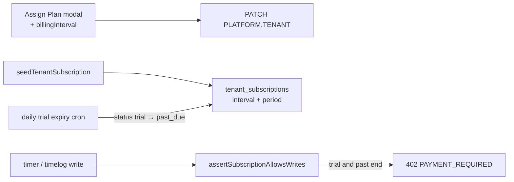

# Close billing cycle and trial gaps

## Defaults (locked)

- Assign Plan gets **Monthly / Annual** (default Monthly), same as create/tenant detail
- Seed demo stays **active** (not trial) but gets `billingInterval: monthly` + period start/end so Period Boundaries are not empty
- Expired trials: **soft-enforce at write time** (block timer/timelog when `status=trial` and `trialEndsAt < now`); daily cron also flips status to `past_due` and logs `trial_ended` for ops visibility
- Out of scope: Stripe reverse-write of `trial_end`, marketing 14 vs 30 day copy



## 1. Assign Plan sends billing interval

Both modals currently PATCH only `{ planId }`:

- [subscription-detail-page.tsx](apps/platform-admin/src/features/subscriptions/subscription-detail-page.tsx) (`handleAssignPlanSubmit`)
- [subscriptions-list-page.tsx](apps/platform-admin/src/features/subscriptions/subscriptions-list-page.tsx) (same pattern)

Add Monthly/Annual `Select` (prefill from current subscription when on detail), submit:

```ts
{ planId, billingInterval: "monthly" | "yearly" }
```

API path already applies interval + refreshes `currentPeriodStart`/`currentPeriodEnd` when `planId` is set ([platform-tenants.service.ts](apps/api/src/modules/platform/application/platform-tenants.service.ts)).

Update [subscriptions.spec.ts](apps/platform-admin/e2e/subscriptions.spec.ts) to assert the interval control is present in the Assign Plan dialog.

## 2. Seed demo subscription with a real cycle

Update [seed-data.ts](apps/api/prisma/seed-data.ts) `SEED_TENANT_SUBSCRIPTION` and [seed.ts](apps/api/prisma/seed.ts) `seedTenantSubscription`:

- `billingInterval: "monthly"`
- `billingSource: "manual"`
- `currentPeriodStart: now`
- `currentPeriodEnd: now + 1 month`

Keep `status: "active"` (stable demos). Update [seed-data.spec.ts](apps/api/prisma/seed-data.spec.ts).

## 3. Expired trial becomes enforceable

**Write guard** in [subscriptions.service.ts](apps/api/src/modules/subscriptions/application/subscriptions.service.ts) `assertSubscriptionAllowsWrites`:

- If `status === "trial"` and `trialEndsAt` is set and `< now` → throw `PAYMENT_REQUIRED` (same as blocked statuses)

**Cron** (extend existing trial cron or reconcile job): find `status=trial` and `trialEndsAt < now`, set `status=past_due`, record lifecycle `trial_ended`, so platform work-queues / alerts stay consistent.

Unit tests in subscriptions service + cron; reuse existing e2e lifecycle patterns if cheap.

## 4. Docs touch

Short note in [docs/specs/subscriptions.md](docs/specs/subscriptions.md): Assign Plan sends interval; expired trial blocks writes; seed has period bounds.

## Delivery order

1. Seed + Assign Plan UI (fixes the Demo org / Assign Plan empty-cycle symptom)
2. Soft write guard + cron
3. Tests + `pnpm format:check && pnpm lint && pnpm typecheck && pnpm test` on touched packages
