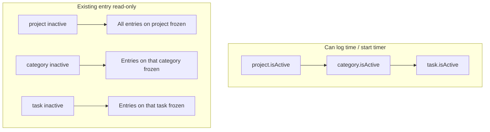

# Active/Inactive Category, Task, and Project

## Current state

| Entity | `isActive` field | Admin toggle | Logging enforcement |
|--------|------------------|--------------|---------------------|
| **Project** | Yes ([schema.prisma](apps/api/prisma/schema.prisma)) | Settings checkbox ([project-settings-tab.tsx](apps/admin/src/features/projects/project-settings-tab.tsx)) | Members lose access via [project-access.service.ts](apps/api/src/common/access/project-access.service.ts); **admins can still log**; **existing entries remain editable** |
| **Category** | No | None | Always listed |
| **Task** | No | None | Filtered by assignment only |

Time entries reference **Task only**; project/category are resolved through joins. Client logging surfaces (timer, timesheet, time-tracker, dashboard) load options via `fetchListItems` with **no active filtering** ([timer-page.tsx](apps/client/src/features/timer/timer-page.tsx), [timesheet-page.tsx](apps/client/src/features/timesheet/timesheet-page.tsx)).

Locking today is period-based only ([entry-approval-status.ts](apps/client/src/features/time-tracker/entry-approval-status.ts)).

## Target behavior (confirmed)



- **Category inactive:** tasks in that category are not loggable; cannot activate a task while its category is inactive; existing entries on those tasks are **fully read-only** (no edit/delete).
- **Task inactive:** not loggable; cannot activate while category (or project) is inactive; existing entries on that task are **fully read-only**.
- **Project inactive:** not selectable for logging/timer; **all** entries on that project are **fully read-only**; applies to **admins and members**.
- **Existing DB records:** no automatic mutation — only UI/API write guards change.

**Effective loggability:** `project.isActive && category.isActive && task.isActive`

---

## Phase 1 — Contracts (contract-first)

Files: [category.dto.ts](packages/contracts/src/dto/category.dto.ts), [task.dto.ts](packages/contracts/src/dto/task.dto.ts), [errors.ts](packages/contracts/src/errors.ts), [contracts.spec.ts](packages/contracts/src/contracts.spec.ts)

- Add `isActive: z.boolean()` to `categorySchema`, `taskSchema`, and list item schemas (default `true` on create).
- Extend `updateCategorySchema` / `updateTaskSchema` with optional `isActive`.
- Extend `listCategoriesQuerySchema` / `listTasksQuerySchema` with optional `isActive` filter.
- Add `loggableOnly: z.coerce.boolean().optional()` to `listTasksQuerySchema` — when true, API returns only tasks where task, category, and project are all active (single server-side filter for client logging UIs).
- Add error code `ENTITY_INACTIVE` (reuse `TIMELOG_NOT_EDITABLE` message pattern for frozen entries).

---

## Phase 2 — Database migration

File: [schema.prisma](apps/api/prisma/schema.prisma)

```prisma
// Category
isActive Boolean @default(true) @map("is_active")

// Task
isActive Boolean @default(true) @map("is_active")
```

- New migration: add columns with default `true` (all existing rows stay active).
- Add index on `categories(workspace_id, is_active)` and `tasks(project_id, is_active)` if list queries need it.

---

## Phase 3 — API enforcement (authoritative)

### 3a. Central loggability helper

Extend [project-access.service.ts](apps/api/src/common/access/project-access.service.ts):

```typescript
// Load task + category.isActive + project.isActive
assertTaskLoggable(workspaceId, taskId)  // throws ENTITY_INACTIVE
assertCanLogTask(...)                     // existing access checks + assertTaskLoggable
```

Call sites:
- [timelogs.service.ts](apps/api/src/modules/timelogs/application/timelogs.service.ts) — `create`, `createBatch`, `update` (always validate current + target task)
- [timer.service.ts](apps/api/src/modules/timer/application/timer.service.ts) — `start` (stop remains allowed so running timers can finish)

### 3b. Time entry freeze on inactive chain

In `timelogs.service.ts` `update` / `remove`, before timesheet-lock checks:

```typescript
await this.assertTimeLogEditable(log) // project OR category OR task inactive → TIMELOG_NOT_EDITABLE
```

Also block calendar-equivalent mutations (PATCH changing times/task on frozen entries).

**Admin:** no bypass — same rules for all roles on write paths.

### 3c. Entity services

**Categories** ([categories.service.ts](apps/api/src/modules/categories/application/categories.service.ts)):
- Map `isActive` in `toDto` / `toListItem`.
- Support `isActive` in `update` and optional filter in `list`.
- Deactivating a category does **not** bulk-update tasks (derived via join at query/validation time).

**Tasks** ([tasks.service.ts](apps/api/src/modules/tasks/application/tasks.service.ts)):
- Map `isActive` in DTOs.
- `update`: if `dto.isActive === true`, reject when `category.isActive === false` or `project.isActive === false` (`VALIDATION_ERROR`).
- `list`: support `isActive` and `loggableOnly` filters.
- `create`: default `isActive: true`; reject if assigned category is inactive.

**Projects** ([projects.service.ts](apps/api/src/modules/projects/application/projects.service.ts)):
- Update deactivation copy/notification context to mention frozen time entries.
- No schema change needed.

### 3d. List endpoints for client logging

Client logging surfaces should fetch:

```typescript
fetchListItems(ROUTES.PROJECTS.LIST, { filters: { isActive: true } })
fetchListItems(ROUTES.TASKS.LIST, { filters: { loggableOnly: true } })
```

Admin management pages continue fetching **without** filters so inactive rows remain visible.

---

## Phase 4 — Admin UI

### Categories ([categories-page.tsx](apps/admin/src/features/categories/categories-page.tsx))

- Add **Active/Inactive** `Badge` column (pattern from [project-detail-shell.tsx](apps/admin/src/features/projects/project-detail-shell.tsx)).
- Add **Activate / Deactivate** action buttons (pattern from [project-team-tab.tsx](apps/admin/src/features/projects/project-team-tab.tsx)) → `PATCH` with `{ isActive }`.
- Add status filter (`All` / `Active` / `Inactive`) like [projects-list-page.tsx](apps/admin/src/features/projects/projects-list-page.tsx).

### Tasks ([project-tasks-panel.tsx](apps/admin/src/features/projects/project-tasks-panel.tsx))

- Add `isActive` checkbox in create/edit forms.
- Disable "Active" checkbox when selected category is inactive or project is inactive (with helper text).
- Show inactive badge on task rows; category picker for **new** tasks shows only active categories.

### Projects ([project-settings-tab.tsx](apps/admin/src/features/projects/project-settings-tab.tsx))

- Update checkbox label: inactive projects are hidden from time logging and **all time entries are frozen**.
- Optional: confirmation dialog on deactivate (warns about frozen entries + running timers).

---

## Phase 5 — Client UI

### Shared lock helper

Extend [entry-approval-status.ts](apps/client/src/features/time-tracker/entry-approval-status.ts) (and admin copy at [admin/.../entry-approval-status.ts](apps/admin/src/features/time-tracker/entry-approval-status.ts)):

```typescript
export function isTimeEntryReadOnly(
  log, project, task, category, submissionByKey
): boolean
```

Returns `true` when:
- Project inactive, **or**
- Task inactive, **or**
- Category inactive, **or**
- Existing submitted/approved period lock

Add message constant: `INACTIVE_ENTITY_MESSAGE`.

Wire into:
- [timesheet-page.tsx](apps/client/src/features/timesheet/timesheet-page.tsx) — dialog `readOnly`, calendar drag/resize/delete
- [time-tracker-page.tsx](apps/client/src/features/time-tracker/time-tracker-page.tsx)
- [dashboard-page.tsx](apps/client/src/features/dashboard/dashboard-page.tsx)
- [timesheet-calendar.tsx](apps/client/src/features/timesheet/timesheet-calendar.tsx)

### Selector filtering

Update all logging `fetchListItems` call sites (8 files under `apps/client`) to pass active filters. Filter **QuickActions** favorites/recents ([quick-actions.tsx](apps/client/src/features/timer/quick-actions.tsx)) to skip inactive combinations.

Load categories (with `isActive`) wherever lock resolution needs category state — extend [projects.store.ts](apps/client/src/stores/projects.store.ts) or resolve via task + categories list.

### Timer edge case

- Block **new** timer starts on inactive tasks.
- Allow **stop/pause/resume** on an already-running timer (creates a valid historical entry); show warning if task became inactive while running.

---

## Phase 6 — Tests

| Layer | Files |
|-------|-------|
| Contracts | `packages/contracts/src/contracts.spec.ts` |
| API unit | `project-access.service.spec.ts`, `categories.service.spec.ts`, `tasks.service.spec.ts`, `timelogs.service.spec.ts` |
| API e2e | `apps/api/test/categories.e2e.ts`, new/extended timelogs e2e for inactive chain |
| Client unit | `entry-approval-status.spec.ts` |
| Admin e2e | `apps/admin/e2e/categories.spec.ts`, `projects.spec.ts` (task toggle) |
| Client e2e | extend timer/timesheet specs if present |

Key scenarios:
- Deactivate category → task list `loggableOnly` excludes its tasks; PATCH timelog on that task returns `TIMELOG_NOT_EDITABLE`.
- Activate task rejected when category inactive.
- Deactivate project → all timelog mutations blocked (member + admin).
- Create timelog / start timer rejected on inactive task.

---

## Phase 7 — Docs

- Add `docs/specs/entity-lifecycle.md` (or extend [timelogs.md](docs/specs/timelogs.md) + projects spec) with Given/When/Then for the three levels.
- Update [DOMAIN_MODEL.md](docs/architecture/DOMAIN_MODEL.md) if it lists entity fields.

---

## Delivery order (MIP)

1. Contracts + migration
2. API access/validation + service specs
3. Admin UI toggles
4. Client selectors + read-only wiring
5. E2E + pre-PR gate: `pnpm format:check && pnpm lint && pnpm typecheck && pnpm test && pnpm build`

## Out of scope

- Auto-stopping active timers when admin deactivates a project (warn only).
- Bulk cascade `isActive=false` on tasks when category deactivates (derived checks preferred).
- Changing historical time entry data in DB on deactivation.
