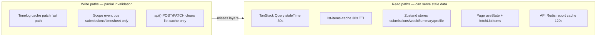
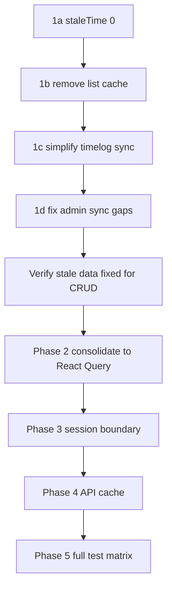

# Frontend Cache Remediation — Fix All Stale Data

## The problem in one sentence

You added **performance caches** (TTLs, optimistic patches, Zustand stores, in-memory list cache) to speed up the UI, but they **invalidate independently** — so after any mutation or session change, some layers update and others don't, and users see stale data everywhere.

This is **not** a Next.js or CDN issue. `apps/web` (marketing) has no data cache. **Client, admin, and platform-admin** all share [`packages/web-shared`](packages/web-shared) — one broken layer breaks all three apps.

---

## The six optimization layers causing stale data



| Layer | File | Optimization added | Why it causes stale data |
|-------|------|--------------------|--------------------------|
| **1. TanStack Query defaults** | [`query-client.ts`](packages/web-shared/src/query/query-client.ts) | `staleTime: 30_000` | Most queries treat data as fresh for 30s; mutations don't always invalidate the right keys |
| **2. In-memory list cache** | [`list-items-cache.ts`](packages/web-shared/src/api/list-items-cache.ts) | 30s TTL on `fetchListItems` | Used by 20+ pages for projects/tasks/categories dropdowns; only cleared on matching POST or explicit `bypassCache` |
| **3. Timelog optimistic patch** | [`timelog-data-sync.ts`](packages/web-shared/src/realtime/timelog-data-sync.ts) | Patch in-place, `refetchType: "none"` | Skips network refetch; cross-view correctness depends on patch being perfect; local saves don't broadcast `timelogs` scope |
| **4. Zustand member stores** | [`member-data.store.ts`](apps/client/src/stores/member-data.store.ts) | Submissions + week summary cached in Zustand | Separate from React Query; only invalidated via scope events in [`workspace-data-sync.ts`](apps/client/src/lib/workspace-data-sync.ts) |
| **5. Page-level useState** | dashboard, timesheet, submissions, timer quick-actions | Direct `api()` / `fetchListItems` into local state | Never in any cache invalidation path unless manually wired |
| **6. API Redis cache** | [`report-cache.service.ts`](apps/api/src/common/cache/report-cache.service.ts) | 120s dashboard/report TTL | Dashboard widgets can lag up to 2 minutes |

**Admin gap:** [`apps/admin/src/lib/workspace-data-sync.ts`](apps/admin/src/lib/workspace-data-sync.ts) only handles `pending_approvals` and `timelogs`/`timesheet` — it does **not** refetch projects/tasks on `projects`/`tasks` scope events (client does).

---

## Strategy: correctness over optimization

Do **not** add more invalidation logic on top of broken layers. Instead:

1. **Roll back aggressive TTLs** (immediate, low risk)
2. **Simplify timelog sync** — patch for instant UI, then refetch active queries (correctness safety net)
3. **Consolidate to one cache layer** (React Query) — remove parallel Zustand/list-cache for server data
4. **Harden session boundary** — prevent cross-user leaks
5. **Fix API report cache** — server-side stale widgets

---

## Phase 1 — Immediate rollbacks (fix stale data today)

### 1a. TanStack Query: default `staleTime: 0`

**File:** [`packages/web-shared/src/query/query-client.ts`](packages/web-shared/src/query/query-client.ts)

```typescript
// Before
staleTime: 30_000,

// After
staleTime: 0,
```

Keep `gcTime: 5 * 60_000` (memory management, not freshness). Queries refetch on mount/focus when stale — slightly more API calls, but data is always current.

### 1b. Remove list-items-cache TTL

**Files:** [`list-items-cache.ts`](packages/web-shared/src/api/list-items-cache.ts), [`fetch-list-items.ts`](packages/web-shared/src/api/fetch-list-items.ts)

**Option A (recommended):** Delete the cache layer entirely — `fetchListItems` always hits the network. Inflight GET dedup in [`client.ts`](packages/web-shared/src/api/client.ts) still prevents duplicate concurrent requests.

**Option B (minimal):** Set `LIST_CACHE_TTL_MS = 0` so cache never hits.

Remove `invalidateListItemsCache` calls scattered across codebase once layer is gone.

### 1c. Simplify timelog post-mutation sync

**File:** [`timelog-data-sync.ts`](packages/web-shared/src/realtime/timelog-data-sync.ts)

Current fast path patches cache then marks stale with `refetchType: "none"` — data looks updated in patched queries but is wrong when patch misses (cross-week moves, uncached views, filter mismatches).

**New contract:**

```typescript
export async function commitTimelogMutation(workspaceId, localRefresh?, cachePatch?) {
  clearTimelogInflightRequests();
  await getQueryClient().cancelQueries({ queryKey: timelogQueryKeys.workspace(workspaceId) });

  if (cachePatch) {
    applyTimelogCachePatch(workspaceId, cachePatch); // instant UI
  }
  if (localRefresh) await localRefresh();

  // Always refetch ACTIVE queries (mounted views) — correctness safety net
  await getQueryClient().refetchQueries({
    queryKey: timelogQueryKeys.workspace(workspaceId),
    type: "active"
  });

  // Broadcast ALL scopes that depend on timelogs
  invalidateWorkspaceData(workspaceId, ["timelogs", "timesheet", "submissions"]);
}
```

Remove the slow-path vs fast-path split. One path, always correct.

Update [`timelog-data-sync.spec.ts`](packages/web-shared/src/realtime/timelog-data-sync.spec.ts) and [`timelog-cross-view-sync.spec.ts`](packages/web-shared/src/query/timelog-cross-view-sync.spec.ts).

### 1d. Fix admin workspace-data-sync gaps

**File:** [`apps/admin/src/lib/workspace-data-sync.ts`](apps/admin/src/lib/workspace-data-sync.ts)

Mirror client handler: on `projects`/`tasks` scope, invalidate list cache and trigger catalog refetch. Wire `useWorkspaceStaleRefetch` on admin pages that use `fetchListItems` into `useState` (dashboard, exports, project panels).

---

## Phase 2 — Consolidate to React Query (remove parallel caches)

### 2a. Replace Zustand member-data caches

**Files:** [`member-data.store.ts`](apps/client/src/stores/member-data.store.ts), [`use-my-submissions.ts`](apps/client/src/features/submissions/use-my-submissions.ts), [`use-member-week-summary.ts`](apps/client/src/hooks/use-member-week-summary.ts)

Create React Query hooks in `packages/web-shared`:

- `useMySubmissionsQuery(workspaceId, filters?)`
- `useWeekSummaryQuery(workspaceId)`

Invalidate via query keys in `commitTimelogMutation` and `workspace-data-sync` instead of Zustand `invalidate()`. Keep Zustand only for **client-only UI state** (timer running, widget layout).

### 2b. Replace `fetchListItems` + `useState` catalog pattern

**Affected pages (client + admin):**

- [`dashboard-page.tsx`](apps/client/src/features/dashboard/dashboard-page.tsx) (client + admin)
- [`timesheet-page.tsx`](apps/client/src/features/timesheet/timesheet-page.tsx)
- [`submissions-page.tsx`](apps/client/src/features/submissions/submissions-page.tsx)
- [`timer/quick-actions.tsx`](apps/client/src/features/timer/quick-actions.tsx) — recents still use direct `api()`
- Admin: exports, approvals, project panels, budget widgets

Create shared hooks:

```typescript
// packages/web-shared/src/query/use-catalog-queries.ts
useProjectsListQuery(workspaceId)
useTasksListQuery(workspaceId, filters?)
useCategoriesListQuery(workspaceId)
```

Wire `useWorkspaceStaleRefetch(ws, ["projects"], refetch)` on each consumer. Delete [`list-items-cache.ts`](packages/web-shared/src/api/list-items-cache.ts) once all call sites migrated.

### 2c. Timesheet occupancy → React Query

**File:** [`timesheet-page.tsx`](apps/client/src/features/timesheet/timesheet-page.tsx)

Move `/timelogs/occupancy` from `useState` to `useTimelogOccupancyQuery` — invalidate in `onLocalRefresh` or via `timelogs` scope.

### 2d. Migrate `usePaginatedList` to React Query

**File:** [`use-paginated-list.ts`](packages/web-shared/src/hooks/use-paginated-list.ts)

Currently uses `useState` + manual fetch. Replace with `useQuery` + `keepPreviousData` for pagination. Eliminates another non-React-Query cache path.

---

## Phase 3 — Session boundary (prevent wrong-user stale data)

Finish [session cache boundary plan](.cursor/plans/session_cache_boundary_bc6f5de9.plan.md):

| Task | Why |
|------|-----|
| Audit all logout/switch → `logoutSession()` only | Partial clears resurrect old data |
| Verify `usePaginatedList` + all list pages remount on `sessionGeneration` | Mounted components keep stale `useState` |
| Scope all `localStorage` keys by `cm-{scope}-userId-*` | Cross-account leaks |
| Guard `applyDefaultWorkspaceIfNeeded` during onboarding | Wrong workspace context |
| E2E: account switch, impersonation stop, bfcache back-nav | Regression prevention |

Key files: [`session.store.ts`](packages/web-shared/src/stores/session.store.ts), [`register-session-boundary.ts`](apps/client/src/lib/register-session-boundary.ts), [`register-session-boundary.ts`](apps/admin/src/lib/register-session-boundary.ts).

---

## Phase 4 — API report cache

**File:** [`report-cache.service.ts`](apps/api/src/common/cache/report-cache.service.ts)

- Reduce `DASHBOARD_TTL_SEC` from 120 → 30 (or 0 for member-facing `/reporting/me`)
- Verify `invalidateWorkspace()` on **every** timelog/timesheet write path (already in [`timelogs.service.ts`](apps/api/src/modules/timelogs/application/timelogs.service.ts) — audit timesheets module too)
- Optional: `Cache-Control: no-store` on member reporting endpoints

---

## Phase 5 — Verification

### Automated

```
pnpm format:check && pnpm lint && pnpm typecheck && pnpm test && pnpm build
```

Focus tests:
- [`timelog-data-sync.spec.ts`](packages/web-shared/src/realtime/timelog-data-sync.spec.ts)
- [`patch-timelog-list-caches.spec.ts`](packages/web-shared/src/query/patch-timelog-list-caches.spec.ts)
- [`timelog-cross-view-sync.spec.ts`](packages/web-shared/src/query/timelog-cross-view-sync.spec.ts)
- [`session-boundary.spec.ts`](packages/web-shared/src/auth/session-boundary.spec.ts)
- New: `use-catalog-queries.spec.ts`, submissions/week-summary query specs
- E2E: timelog CRUD cross-view (client), account switch, admin edit → client sees update

### Manual matrix (no reload allowed)

| Action | Timesheet | Time Tracker | Dashboard | Submissions | Admin tracker |
|--------|-----------|--------------|-----------|-------------|---------------|
| Create entry | instant | instant | instant | instant | instant |
| Edit / move week | no ghost | no ghost | correct | correct | correct |
| Delete entry | gone | gone | gone | gone | gone |
| Switch workspace | zero old data | zero old data | zero old data | zero old data | zero old data |
| Admin edits member log | n/a | n/a | updates | updates | updates |

---

## What we are deliberately NOT doing

- **Not** adding more cache layers or TTLs
- **Not** relying solely on optimistic patch without refetch
- **Not** keeping parallel Zustand + React Query for the same server data
- **Not** touching `apps/web` (no data cache)
- **Not** changing Next.js config (not the cause)

---

## Execution order (recommended)



Phase 1 alone should eliminate the majority of "stale data after mutation" reports. Phases 2–4 eliminate the architectural debt that makes bugs recur.

---

## Risk / trade-off

| Change | Performance impact | Correctness impact |
|--------|-------------------|-------------------|
| `staleTime: 0` | More refetches on mount/focus | Data always fresh |
| Remove list cache | Dropdowns hit network each open | Dropdowns always current |
| Refetch active after timelog mutation | ~1 extra GET per mounted timelog view | Cross-view always correct |
| Zustand → React Query | Neutral (React Query dedupes) | Single invalidation path |

The inflight GET dedup in `api()` and React Query's built-in deduplication prevent refetch storms. Correctness is worth the marginal API increase.
