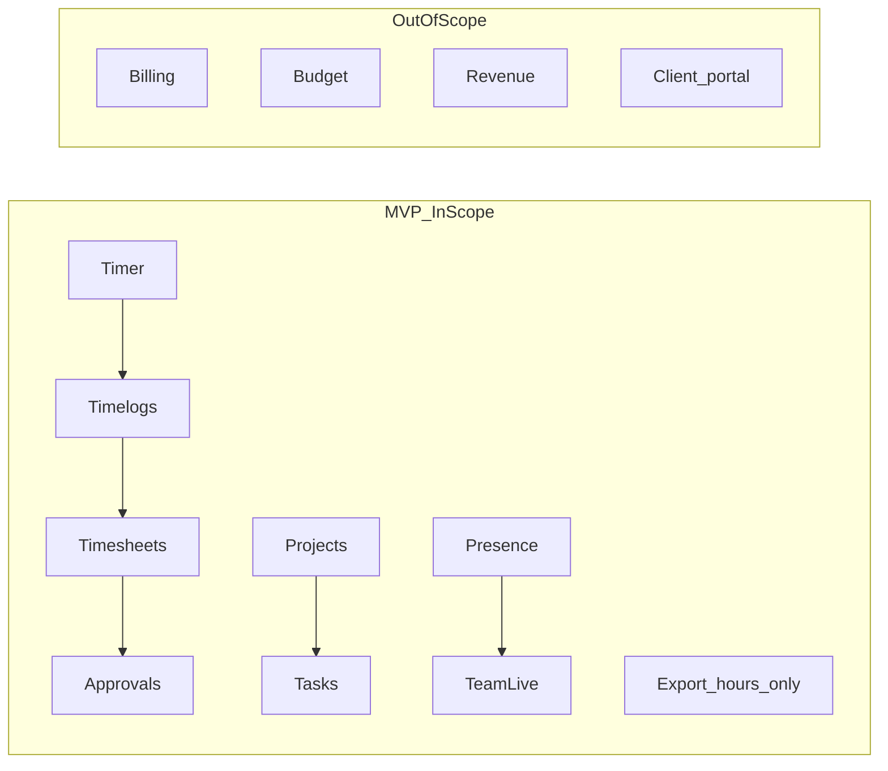
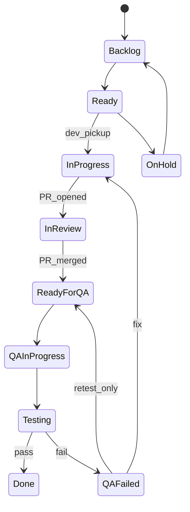

# GitHub Kanban Bootstrap & Agent Skill (MVP-Scoped)

## Context

- **Repo:** [SCITAIGROUP1/ChronoMint](https://github.com/SCITAIGROUP1/ChronoMint) (product: Kloqra)
- **Board:** [Org Project #4](https://github.com/orgs/SCITAIGROUP1/projects/4)
- **Source of truth:** GitHub Issues + Project #4 (not [`TASK_BOARD.json`](TASK_BOARD.json))
- **Investigation:** Code-first, feature-wise ([`FEATURE_INVENTORY.md`](docs/agent/FEATURE_INVENTORY.md))

### MVP scope boundary (explicit exclusions)

**Do not create board items** for these domains until post-MVP. Tag any discovered code debt here as `mvp:out-of-scope` — do not pull to Ready.

| Excluded domain       | Examples in codebase                                                                                                | Action on board                                  |
| --------------------- | ------------------------------------------------------------------------------------------------------------------- | ------------------------------------------------ |
| **Budget**            | `budget-burndown-widget`, `budgetHours` alerts, `budget_vs_actual` export                                           | No new issues; existing widgets = reference only |
| **Revenue & billing** | `billing` module, `/billing/*`, invoice wizard, revenue-trend widget, hourly rates UI, `defaultHourlyRate` DTO work | No new issues                                    |
| **Client management** | External client portal, client org logins, cross-workspace client billing                                           | No issues (FUTURE_SCOPE)                         |

**MVP focus:** time capture → logs → calendar → submit/approve → team visibility → exports of **hours** (not money) → notifications → core platform quality.



---

## Kanban lanes (10 columns — required)

Configure Project #4 with **exactly** these columns in order:

| #   | Lane               | Who moves | Entry criteria                     | Exit criteria                              |
| --- | ------------------ | --------- | ---------------------------------- | ------------------------------------------ |
| 1   | **Backlog**        | PM/BA     | Idea captured, not refined         | AC written, deps clear → Ready             |
| 2   | **Ready**          | PM/BA     | Refined, assignable, no blockers   | Agent/human picks up → In Progress         |
| 3   | **On Hold**        | PM/BA     | Blocked external / descoped sprint | Unblocked → Backlog or Ready               |
| 4   | **In Progress**    | BE/FE/LSA | Active implementation              | PR opened → In Review                      |
| 5   | **In Review**      | Dev       | PR open, awaiting code review      | Approved + merged to main → Ready for QA   |
| 6   | **Ready for QA**   | Dev       | Merged; deployable on branch/main  | QA picks up → QA In Progress               |
| 7   | **QA In Progress** | QA        | Writing/running tests              | Tests green → Testing                      |
| 8   | **Testing**        | QA        | Manual + automated verification    | Pass → Done; Fail → QA Failed              |
| 9   | **QA Failed**      | QA        | Defect found                       | Fix merged → Ready for QA (or In Progress) |
| 10  | **Done**           | PM/QA     | DoD met, demoable                  | —                                          |



**Project Status field** must mirror lane names exactly (lowercase, hyphenated) for agent scripts.

---

## Phase 1 — MVP feature inventory (12 epics)

Drop billing epic; rename export epic. Scan code per prior audit.

| Epic | Domain                  | MVP status                                           |
| ---- | ----------------------- | ---------------------------------------------------- |
| F-01 | Auth & session          | Shipped                                              |
| F-02 | Users & profile         | Shipped — gap: `/users/me/activity`                  |
| F-03 | Workspace & RBAC        | Shipped                                              |
| F-04 | Projects & invites      | Shipped                                              |
| F-05 | Categories & tasks      | Shipped — orphan `/tasks` route                      |
| F-06 | Timer                   | Shipped                                              |
| F-07 | Timelogs & tracker      | Shipped                                              |
| F-08 | Timesheets & approvals  | Shipped                                              |
| F-09 | ~~Billing~~             | **OUT OF MVP** — do not file                         |
| F-10 | Reporting & dashboards  | Shipped — hours widgets only; wire `MyWeekSummary`   |
| F-11 | Presence & team live    | Partial — needs tests                                |
| F-12 | Export (**hours only**) | Partial — wire `TimesheetExport`; no invoice stories |
| F-13 | Notifications           | Partial                                              |
| F-14 | AI assistant            | Partial                                              |
| F-15 | Onboarding              | Shipped                                              |
| F-X  | Platform & quality      | API DTO audit, e2e gaps                              |

### MVP gap backlog (board candidates)

**Ready (P0–P1)**

- Wire `TimesheetExport` on member timesheet/time-tracker (F-12, FE)
- Prisma DTO leaks on workspace/timesheet mutations (F-X, BE)
- `presence` + `notifications-dispatch` unit tests (F-11/F-13, QA)
- Slim list DTOs per api audit (F-X, LSA→BE)

**Backlog (P2)**

- Mount `MyWeekSummary` on dashboard (F-10, FE)
- Orphan `/tasks` route cleanup (F-05, FE)
- Implement or remove `GET /users/me/activity` (F-02, BE)
- Deprecate `GET /export` legacy route (F-12, BE)

**Excluded — do not file**

- Billing guard, hourly rate scope, invoice PDF, budget alerts, client portal, revenue widgets

---

## Phase 2 — GitHub Project setup

- Link ChronoMint repo
- Labels: `type:*`, `feature:*`, `layer:*`, `role:*`, `priority:P0-P3`, `mvp:out-of-scope`, `health:shipped|gap|planned`
- Custom fields: Work item type, Feature domain, Lane (Status), Priority, Owner role
- Views: **Main Kanban** (10 lanes), **By feature**, **QA queue** (lanes 6–9), **Gaps only**

---

## Acceptance criteria & QA verification (required on every story/task/bug)

Every work item that reaches **Ready** must include **testable acceptance criteria** and a **QA verification matrix** so QA can check boxes without guessing.

### AC rules (BA writes, QA validates)

| Rule               | Requirement                                                             |
| ------------------ | ----------------------------------------------------------------------- |
| **ID**             | Each criterion prefixed `AC-1`, `AC-2`, …                               |
| **Format**         | Gherkin: `Given` / `When` / `Then` (or bullet if pure API contract)     |
| **Testable**       | Observable outcome — URL, HTTP status, UI label, file output, test name |
| **No vagueness**   | Ban: "works well", "fast", "user-friendly" without metric               |
| **Negative cases** | At least one `AC-N` for error/denied path on stories                    |
| **Traceability**   | Every `AC-*` has a row in QA Verification Matrix                        |

### QA verification matrix (QA owns at posting time for Ready items)

```markdown
## QA verification matrix

| AC   | Type     | Automated                                                 | Manual steps                                       | Pass? |
| ---- | -------- | --------------------------------------------------------- | -------------------------------------------------- | ----- |
| AC-1 | E2E      | `apps/client/e2e/timesheet.spec.ts` — "exports CSV"       | 1. Login member 2. Open /timesheet 3. Click Export | [ ]   |
| AC-2 | API      | `apps/api/test/export.e2e.ts` — 200 + Content-Disposition | curl POST /export/me with seed user                | [ ]   |
| AC-3 | Contract | `packages/contracts/src/export.spec.ts`                   | N/A                                                | [ ]   |
```

**Type values:** `Contract` | `Unit` | `API` | `E2E` | `Manual` | `Regression`

### Lane gates tied to AC

| Transition                   | AC / QA requirement                                                     |
| ---------------------------- | ----------------------------------------------------------------------- |
| backlog → **ready**          | All `AC-*` written + QA matrix drafted                                  |
| in-review → **ready-for-qa** | PR links; automated rows in matrix identified                           |
| qa-in-progress → **testing** | Automated tests implemented for every `Contract`/`Unit`/`API`/`E2E` row |
| testing → **done**           | Every matrix row checked `[x]`; QA comment with evidence                |
| testing → **qa-failed**      | Comment cites failed `AC-*` + repro steps                               |

### Bug-specific AC format

Bugs use **Expected vs Actual** instead of user story:

```markdown
**AC-1 (fix verification):** Given [precondition], when [action], then [expected] — and [actual before fix] no longer occurs.
```

---

## Phase 3 — Skill deliverable (required)

On execution, copy **Appendix A** to [`.cursor/skills/kloqra-github-kanban/SKILL.md`](.cursor/skills/kloqra-github-kanban/SKILL.md) plus:

- `templates/story.md`, `templates/bug.md`, `templates/qa-matrix.md`
- `reference/lanes.md`, `reference/acceptance-criteria.md` (AC + QA standards)

---

## Phase 4 — First sprint Ready column

| Issue                              | Epic | Role | Lane after merge         |
| ---------------------------------- | ---- | ---- | ------------------------ |
| Wire TimesheetExport               | F-12 | FE   | Ready for QA             |
| Prisma DTO mapper fixes            | F-X  | BE   | Ready for QA             |
| Presence unit tests                | F-11 | QA   | QA In Progress → Testing |
| PRODUCT_ROADMAP MVP reconciliation | F-X  | BA   | Done                     |

---

## Execution order

1. Write `FEATURE_INVENTORY.md` (MVP-filtered)
2. Create skill files from Appendix A
3. Configure Project #4 with 10 lanes
4. Post issues using skill templates (quality gate checklist)
5. Archive TASK_BOARD.json; update orchestrator
6. Smoke-test lane transitions end-to-end

---

# Appendix A — `SKILL.md` draft (copy on execute)

> **Path:** `.cursor/skills/kloqra-github-kanban/SKILL.md`

```markdown
---
name: kloqra-github-kanban
description: >-
  Bootstraps and maintains GitHub Projects kanban for Kloqra MVP. Performs
  code-first feature inventory, posts high-quality Epic/Story/Task/Bug issues
  with PM/BA/Dev/QA sections, enforces MVP scope (no budget/revenue/client-mgmt),
  and manages 10-lane workflow through QA. Use when initializing a board,
  posting backlog items, moving issues across lanes, or auditing feature gaps.
---

# Kloqra GitHub Kanban

## When to use

- Empty or stale GitHub Project board needs population
- User asks for epic/story/task breakdown, kanban setup, or backlog from codebase
- Agent must **post** or **update** GitHub issues with consistent quality
- Sprint dispatch from Project #4 lanes

## MVP scope gate (apply before every issue)

**NEVER create issues for:**

- Budget burn-down, budget alerts, `budgetHours` features
- Billing, hourly rates, revenue, invoices, multi-currency
- External client portal / client org management

If code audit finds gaps in excluded areas, add label `mvp:out-of-scope` and lane **On Hold** — do not assign to Ready.

**MVP in scope:** timer, timelogs, timesheet, approvals, projects, tasks, categories, workspace, auth, presence, hours export, notifications, assistant, onboarding, platform quality.

## Board configuration

- **Org project:** `SCITAIGROUP1` project `4`
- **Repo:** `SCITAIGROUP1/ChronoMint`
- **Lanes (Status field — exact strings):**

  `backlog` | `ready` | `on-hold` | `in-progress` | `in-review` | `ready-for-qa` | `qa-in-progress` | `testing` | `qa-failed` | `done`

### Lane transition rules

| From           | To             | Actor | Requirement                                              |
| -------------- | -------------- | ----- | -------------------------------------------------------- |
| backlog        | ready          | PM/BA | All AC-\* written + QA verification matrix complete      |
| ready          | in-progress    | Dev   | Branch created `feat/GH-<num>-slug`                      |
| in-progress    | in-review      | Dev   | PR linked in issue                                       |
| in-review      | ready-for-qa   | Dev   | PR approved + merged                                     |
| ready-for-qa   | qa-in-progress | QA    | QA matrix reviewed; test files identified                |
| qa-in-progress | testing        | QA    | All automated rows green locally                         |
| testing        | done           | QA    | Every AC row in matrix marked pass with evidence comment |
| testing        | qa-failed      | QA    | Comment cites AC-ID + repro; label `qa-failed`           |
| qa-failed      | in-progress    | Dev   | Fix pushed                                               |
| any            | on-hold        | PM    | Comment with blocker reason                              |
| on-hold        | backlog/ready  | PM    | Blocker resolved                                         |

## Discovery workflow (code-first)

1. Run `node .cursor/skills/kloqra-github-kanban/scripts/inventory-features.mjs` (or manual scan)
2. For each feature domain F-01…F-15, F-X (skip F-09 billing):
   - List API module, client routes, admin routes, contracts, specs, tests
   - Classify: Shipped | Gap | Planned
3. Cross-check `docs/specs/` and `.cursor/plans/` — **code wins** on conflict
4. **Ignore** `TASK_BOARD.json` (deprecated)
5. Write `docs/agent/FEATURE_INVENTORY.md` before bulk posting

## Issue posting quality standard

Every issue must be **self-contained**: a new agent can start work without reading chat history.

### Title format
```

[Type][F-XX] Short imperative title — max 72 chars

````

Types: `Epic`, `Story`, `Task`, `Bug`
Examples:

- `[Story][F-12] Wire member timesheet CSV export on timesheet page`
- `[Bug][F-X] Workspace PATCH returns Prisma createdAt in response`
- `[Task][F-08][QA] Add Playwright e2e for amendment request flow`

### Body template (copy and fill — all sections required)

```markdown
## Summary
One sentence: what and why.

## Feature
| Field | Value |
|-------|-------|
| Domain | F-XX — Name |
| Layer | API / Client / Admin / Contracts / Cross |
| Health | Shipped / Gap / Planned |
| MVP | In scope / Out of scope |

## PM
- **Priority:** P0 | P1 | P2 | P3
- **Lane:** backlog (new issues default here unless shipped → done)
- **Parent epic:** #NNN
- **Dependencies:** #NNN or None
- **Success metric:** Measurable outcome

## BA
**User story:** As a [role], I want [action], so that [benefit].

**Acceptance criteria (testable — Gherkin):**

- [ ] **AC-1:** Given [context], when [action], then [observable outcome]
- [ ] **AC-2:** Given [context], when [action], then [observable outcome]
- [ ] **AC-N:** Given [invalid/forbidden context], when [action], then [error state — status code / message / no side effect]

**Spec:** `docs/specs/<file>.md` or "N/A — tech debt"

**Out of scope:** Explicit boundaries

## QA verification matrix

| AC | Type | Automated test / command | Manual steps (QA checks) | Pass |
|----|------|--------------------------|--------------------------|------|
| AC-1 | E2E | `pnpm --filter @kloqra/client test:e2e --grep "..."` | 1. … 2. … 3. … | [ ] |
| AC-2 | API | `apps/api/test/<module>.e2e.ts` — describe block name | curl / Swagger steps | [ ] |
| AC-3 | Unit | path/to/*.spec.ts | N/A | [ ] |

**Regression:** List related specs that must still pass: `pnpm test -- <paths>`

**QA sign-off template (fill in testing lane):**
````

QA sign-off GH-<issue>:

- AC-1: PASS — evidence: screenshot / test output link
- AC-2: PASS — evidence: ...
- pnpm gate: PASS (attach CI or local log)

```

## Dev
| Field | Value |
|-------|-------|
| Role | LSA / BE / FE |
| Branch | `feat/GH-<issue>-short-slug` |
| Target paths | `apps/...` (bullet list) |
| Contracts | `packages/contracts/...` or N/A |

**Execution order:** contracts → failing tests → implementation → lint/typecheck

**MIP handoff:**
<AGENT_INSTRUCTION role="BE" task_id="GH-<issue>">
- Read: docs/specs/...
- Target: apps/api/src/modules/...
- TDD: apps/api/.../*.spec.ts must fail first
</AGENT_INSTRUCTION>

## QA (implementation checklist — maps to matrix above)

- [ ] Each AC has at least one automated OR manual matrix row
- [ ] Contract spec if DTO/route changed
- [ ] API unit for service logic changed
- [ ] API e2e if HTTP surface changed
- [ ] UI unit if presentational component changed
- [ ] Playwright if member/admin user journey changed

**Definition of done:** All matrix rows `[x]` + `pnpm format:check && pnpm lint && pnpm typecheck && pnpm test && pnpm build`

## Evidence
- API: `apps/api/src/modules/<name>/`
- Client: `apps/client/src/features/<name>/`
- Admin: `apps/admin/src/features/<name>/`

## Agent sync
<SYNC_BLOCK status="TODO" task_id="GH-<issue>" github="#<issue>" lane="backlog">
</SYNC_BLOCK>
```

### Acceptance criteria quality gate

Reject or return to BA if any AC:

- Lacks Given/When/Then or measurable Then clause
- Missing AC-ID (`AC-1`, `AC-2`, …)
- Has no row in QA verification matrix
- Uses subjective language without metric

**Good AC example:**

> **AC-1:** Given a logged-in MEMBER on `/timesheet`, when they click "Export CSV" for the current week, then a file `timesheet-YYYY-MM-DD.csv` downloads with ≥1 row per logged entry.

**Bad AC example:**

> ~~Export works correctly~~

### Posting checklist (verify before `gh issue create`)

- [ ] Title matches `[Type][F-XX]` convention
- [ ] All PM/BA/Dev/QA sections filled (no "TBD")
- [ ] ≥2 acceptance criteria with AC-IDs; ≥1 negative/error AC on stories
- [ ] QA verification matrix: every AC mapped to Type + Automated + Manual
- [ ] Target file paths exist in repo (grep to confirm)
- [ ] MVP scope gate passed
- [ ] Labels applied: `type:*`, `feature:*`, `role:*`, `priority:*`
- [ ] Parent/child link set for stories under epics
- [ ] Issue added to Project #4 with correct Status lane
- [ ] New work → **backlog**; move to **ready** only when AC + matrix complete

## Epic bootstrap pattern

Create one epic per MVP feature domain, then child stories:

1. `[Epic][F-06] Timer` — body lists shipped evidence + gap story links
2. Child stories only for **Gap** and **Planned** items
3. One `[Story][F-06] Timer — shipped baseline` → lane **done** (documentation anchor)

## gh CLI commands

Prerequisites: `gh auth login` + `gh auth refresh -s project`

```bash
# Create issue
gh issue create --repo SCITAIGROUP1/ChronoMint \
  --title "[Story][F-12] Wire member timesheet CSV export" \
  --label "type:story,feature:export,layer:client,role:FE,priority:P1" \
  --body-file /tmp/issue-body.md

# Add to project and set status (after capturing project/item IDs)
gh project item-add 4 --owner SCITAIGROUP1 --url <issue-url>
# Set Status field via gh project item-edit (see reference/github-fields.md)

# Link sub-issue (GitHub parent issue)
gh api repos/SCITAIGROUP1/ChronoMint/issues/<child>/sub_issues -f issue_id=<parent_node_id>
```

If `gh` unavailable, post via GitHub UI using the same body template.

## Role routing for parallel agents

| Lane range             | Primary roles         |
| ---------------------- | --------------------- |
| backlog, ready         | PM, BA                |
| in-progress, in-review | LSA, BE, FE           |
| ready-for-qa → testing | QA                    |
| qa-failed              | BE, FE (fix), then QA |

Per feature delivery order (in-scope only):

1. BA updates spec in `docs/specs/`
2. LSA updates `packages/contracts`
3. QA writes failing tests
4. BE implements API
5. FE implements UI
6. QA moves lane: testing → done or qa-failed

## Feature domains (MVP)

| ID   | Domain           | Scan paths                                            |
| ---- | ---------------- | ----------------------------------------------------- |
| F-01 | Auth             | `modules/auth`, `apps/*/login`                        |
| F-02 | Users            | `modules/users`, web-shared profile                   |
| F-03 | Workspace        | `modules/workspace`, workspace pages                  |
| F-04 | Projects         | `modules/projects`, `features/projects`               |
| F-05 | Categories/tasks | `modules/categories`, `modules/tasks`                 |
| F-06 | Timer            | `modules/timer`, `features/timer`                     |
| F-07 | Timelogs         | `modules/timelogs`, `features/time-tracker`           |
| F-08 | Timesheets       | timesheets controller, submissions, approvals         |
| F-10 | Reporting        | `modules/reporting`, dashboard widgets (hours only)   |
| F-11 | Presence         | `modules/presence`, `features/team`                   |
| F-12 | Export           | `modules/export`, `timesheet-export.tsx` (no invoice) |
| F-13 | Notifications    | `modules/notifications`                               |
| F-14 | Assistant        | `modules/assistant`, `features/assistant`             |
| F-15 | Onboarding       | `features/onboarding`                                 |
| F-X  | Platform         | contracts, CI, api audit                              |

**F-09 Billing — skip entirely for MVP.**

## Supporting files

- [templates/story.md](templates/story.md) — includes AC + QA matrix
- [templates/bug.md](templates/bug.md) — repro + AC fix verification
- [templates/qa-matrix.md](templates/qa-matrix.md) — matrix-only snippet
- [reference/lanes.md](reference/lanes.md) — lane definitions
- [reference/acceptance-criteria.md](reference/acceptance-criteria.md) — AC rules + examples by layer
- [reference/feature-domains.md](reference/feature-domains.md) — scan paths
- [scripts/inventory-features.mjs](scripts/inventory-features.mjs) — code scanner

## References

- [kloqra-feature-delivery](../chronomint-feature-delivery/SKILL.md)
- [kloqra-test-delivery](../chronomint-test-delivery/SKILL.md)
- [docs/agent/AGENTS.md](../../../docs/agent/AGENTS.md)

````

---

## Appendix B — `templates/story.md` (with AC + QA matrix)

```markdown
## Summary
{{one_line}}

## Feature
| Domain | {{F-XX}} — {{name}} |
| Layer | {{layer}} |
| MVP | In scope |

## PM
- **Priority:** {{P0-P3}}
- **Parent epic:** #{{epic_num}}
- **Success metric:** {{metric}}

## BA
**User story:** As a {{role}}, I want {{action}}, so that {{benefit}}.

**Acceptance criteria:**
- [ ] **AC-1:** Given {{pre}}, when {{action}}, then {{observable}}
- [ ] **AC-2:** Given {{pre}}, when {{action}}, then {{observable}}
- [ ] **AC-3:** Given {{invalid}}, when {{action}}, then {{error — 4xx / toast / no mutation}}

**Spec:** `{{spec_path}}`
**Out of scope:** {{out_of_scope}}

## QA verification matrix

| AC | Type | Automated | Manual steps | Pass |
|----|------|-----------|--------------|------|
| AC-1 | E2E | `apps/client/e2e/{{spec}}.ts` — "{{test name}}" | 1. Login seed member 2. … | [ ] |
| AC-2 | API | `apps/api/test/{{module}}.e2e.ts` | Swagger / curl | [ ] |
| AC-3 | Unit | `{{path}}/*.spec.ts` | Trigger error path in UI | [ ] |

**Regression:** `pnpm test -- {{related_paths}}`

## Dev
<AGENT_INSTRUCTION role="{{role}}" task_id="GH-{{num}}">
- Target: {{target}}
- TDD: {{test_path}} must fail first; tests must cover AC-1..AC-3
</AGENT_INSTRUCTION>

<SYNC_BLOCK status="TODO" task_id="GH-{{num}}" lane="backlog" />
````

---

## Appendix C — Worked example (F-12 export story)

Full issue body agents should emulate:

```markdown
## Summary

Expose existing TimesheetExport component on the member timesheet page so members can download their hours as CSV.

## Feature

| Domain | F-12 — Export (hours only) |
| Layer | Client |
| MVP | In scope |

## PM

- **Priority:** P1
- **Parent epic:** #TBD
- **Success metric:** ≥1 successful CSV download per seed member in QA

## BA

**User story:** As a workspace member, I want to export my timesheet from the calendar page, so that I can archive my hours without admin help.

**Acceptance criteria:**

- [ ] **AC-1:** Given a MEMBER with ≥1 timelog in the visible week on `/timesheet`, when they click "Export", then a `.csv` file downloads within 5s containing columns Date, Project, Task, Duration.
- [ ] **AC-2:** Given a MEMBER with zero logs in the selected range, when they click "Export", then a toast explains "No entries to export" and no file downloads.
- [ ] **AC-3:** Given an unauthenticated user, when they request export, then they are redirected to `/login` (no CSV).

**Spec:** `docs/specs/export.md`
**Out of scope:** PDF, invoice, billable amounts, admin export wizard

## QA verification matrix

| AC   | Type       | Automated                                                        | Manual steps                                                      | Pass |
| ---- | ---------- | ---------------------------------------------------------------- | ----------------------------------------------------------------- | ---- |
| AC-1 | E2E        | `apps/client/e2e/timesheet.spec.ts` — "member exports CSV" (new) | 1. Login `member@seed.kloqra` 2. /timesheet 3. Export 4. Open CSV | [ ]  |
| AC-2 | E2E        | same spec — "empty week shows toast"                             | Clear week or use empty seed                                      | [ ]  |
| AC-3 | E2E        | `apps/client/e2e/smoke.spec.ts` — unauthenticated redirect       | Logout → hit export                                               | [ ]  |
| —    | Regression | `pnpm --filter @kloqra/client test:e2e timesheet`                | Full timesheet suite still green                                  | [ ]  |

## Dev

- Target: `apps/client/src/features/timesheet/timesheet-page.tsx`, `components/timesheet-export.tsx`
- TDD: add failing Playwright tests for AC-1..3 before wiring UI

## QA sign-off (fill at testing → done)

- AC-1: PASS — attached CSV sample
- AC-2: PASS — screenshot of toast
- AC-3: PASS — redirect URL logged
- Gate: `pnpm test` PASS
```

---

## Appendix D — `reference/acceptance-criteria.md` outline

Skill reference file listing **default AC patterns by layer**:

| Layer     | Minimum ACs                               | Typical automated hook             |
| --------- | ----------------------------------------- | ---------------------------------- |
| Contracts | Schema parses; invalid input rejects      | `packages/contracts/src/*.spec.ts` |
| API       | 200 + DTO shape; 401/403; 404             | `apps/api/test/*.e2e.ts`           |
| Client UI | Visible element; interaction; error state | `apps/client/e2e/*.spec.ts`        |
| Admin UI  | Same + ADMIN gate                         | `apps/admin/e2e/*.spec.ts`         |
| Bug fix   | Repro fails before fix; AC-1 passes after | New regression test required       |

**Seed accounts for manual QA** (from README): document in matrix Manual steps — `member@seed.kloqra`, `admin@seed.kloqra`.

---

## Risks

| Risk                                  | Mitigation                                             |
| ------------------------------------- | ------------------------------------------------------ |
| 10 lanes feel heavy                   | QA lanes optional for doc-only BA tasks → skip to Done |
| Existing billing code confuses agents | `mvp:out-of-scope` label + skill gate                  |
| Issue volume                          | ~12 epics + gaps only (~35 items), not 70              |

## Out of scope

- Budget/revenue/client-mgmt features (entire domains)
- Jira/Linear integration
- Auto-sync GitHub Action (future)
