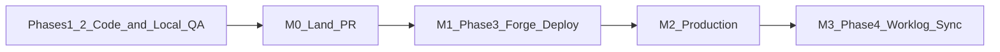
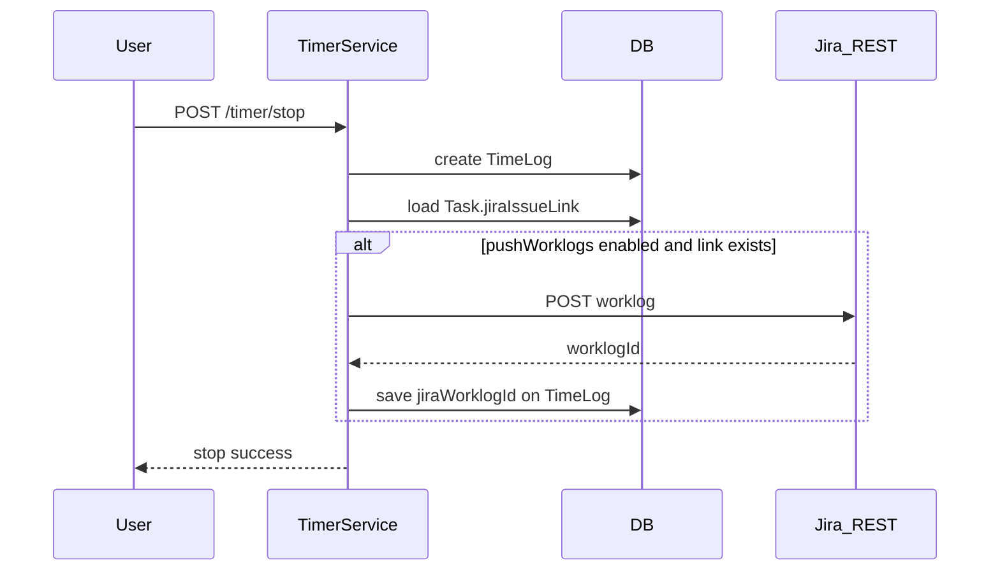

# Jira Integration — Developer Handoff

## Where things stand

**Branch:** `[feature/jira](feature/jira)` (diverged from `780dc27`; **all Jira work is uncommitted**)

**Manually verified by lead (local):**

- Atlassian OAuth app **Kloqra** connected to `https://cjaliyasln2.atlassian.net`
- Admin mapping: Jira key `KAN` → ChronoMint **Annual Audit** + category
- Deep link works: `http://localhost:3000/timer?jiraIssue=KAN-1`
- Member PAT created (Settings → Integrations) for Forge

**Automated coverage exists** — run `[scripts/test-jira-integration.sh](scripts/test-jira-integration.sh)` (API e2e, Forge unit tests, web-shared + client specs).

**Not done yet:**

- Git commit + PR
- Forge app **deployed/installed** on Jira site (manifest still has placeholder `app.id`)
- Production env + URLs on Railway
- Phase 4 worklog push to Jira



---

## Architecture recap (read first)

| Layer            | Key paths                                                                                                                                                                                       |
| ---------------- | ----------------------------------------------------------------------------------------------------------------------------------------------------------------------------------------------- |
| Contracts        | `[packages/contracts/src/dto/jira.dto.ts](packages/contracts/src/dto/jira.dto.ts)`, `[routes.ts](packages/contracts/src/routes.ts)`, `[errors.ts](packages/contracts/src/errors.ts)`            |
| API module       | `[apps/api/src/modules/integrations/jira/](apps/api/src/modules/integrations/jira/)`                                                                                                            |
| PAT auth         | `[jwt-or-pat-auth.guard.ts](apps/api/src/common/guards/jwt-or-pat-auth.guard.ts)`, `[personal-access-token.service.ts](apps/api/src/modules/auth/application/personal-access-token.service.ts)` |
| Admin UI         | `[apps/admin/src/features/integrations/jira-settings-panel.tsx](apps/admin/src/features/integrations/jira-settings-panel.tsx)`                                                                  |
| Client deep link | `[use-jira-issue-deep-link.ts](apps/client/src/features/timer/use-jira-issue-deep-link.ts)`, `[timer-page.tsx](apps/client/src/features/timer/timer-page.tsx)`                                  |
| Forge app        | `[apps/jira-forge/](apps/jira-forge/)`                                                                                                                                                          |
| Runbook          | `[docs/runbooks/jira-integration.md](docs/runbooks/jira-integration.md)`                                                                                                                        |
| Master spec      | `[.cursor/plans/jira_integration_options_9635311c.plan.md](.cursor/plans/jira_integration_options_9635311c.plan.md)`                                                                            |

**Auth model:**

- **Deep link (Phase 2):** member JWT in browser
- **Forge panel (Phase 3):** member PAT (`klo_pat_`\*) + `X-Workspace-Id` + `X-Auth-Scope: client`

**Resolve flow:** `GET /integrations/jira/resolve?issueKey=KAN-1` → finds/creates `JiraIssueLink` + `Task` → returns `taskId`. Recent fixes (ensure these are in the commit):

- Duplicate-link race handled in `[jira-issue-resolver.service.ts](apps/api/src/modules/integrations/jira/application/jira-issue-resolver.service.ts)` (P2002 retry)
- Existing links **re-sync Jira summary** into `task.taskName`
- Client **always refreshes task list** after resolve (`[use-jira-issue-deep-link.ts](apps/client/src/features/timer/use-jira-issue-deep-link.ts)`)

---

## Milestone 0 — Land the branch (do this first)

### 0.1 Local verification

```bash
pnpm prisma:migrate
pnpm prisma:seed   # if needed
bash scripts/test-jira-integration.sh
pnpm format:check && pnpm lint && pnpm typecheck && pnpm test && pnpm build
```

### 0.2 Commit scope

Stage **Jira-related files only** (avoid unrelated `tsconfig.tsbuildinfo` / dashboard WIP unless intentional):

- `apps/api/` — migration, jira module, PAT, crypto, guards, e2e
- `apps/admin/src/features/integrations/`, workspace page wiring
- `apps/client/src/features/timer/use-jira-issue-deep-link`\*
- `apps/jira-forge/`
- `packages/contracts/`, `packages/web-shared/src/integrations/`, integrations settings UI
- `docs/runbooks/jira-integration.md`, `docs/development/ENVIRONMENT.md`, `.env.example` files
- `scripts/test-jira-integration.sh`

**Do not commit** `apps/api/.env` (secrets).

### 0.3 PR

- Base: `main` (or team default)
- Title suggestion: `feat: Jira Cloud integration (OAuth, deep link, Forge, PAT)`
- Test plan: link runbook sections 3–4 + automated script output
- Reference handoff + remaining Phase 3 deploy / Phase 4 in PR description

---

## Milestone 1 — Phase 3: Deploy Forge issue panel

Code is written; **operational deploy is the work**.

### 1.1 Prerequisites

- Phase 1–2 working locally (admin connected, `KAN` mapped)
- Member PAT exists (lead already created one; junior can create their own for testing)
- **Workspace ID:** from browser devtools → Network → login response `workspaceId`

### 1.2 Expose API to Atlassian (local)

Forge runs on Atlassian infrastructure — `**localhost` will not work\*\* without a tunnel.

```bash
ngrok http 3001
```

Note the `https://….ngrok-free.app` URL.

### 1.3 Register and deploy Forge app

```bash
cd apps/jira-forge
npm install && npm --prefix static/panel install && npm run build
npm install -g @forge/cli
forge login
forge register                    # first time — copy app id into manifest.yml
forge deploy
forge install                     # select cjaliyasln2.atlassian.net
```

Update `[apps/jira-forge/manifest.yml](apps/jira-forge/manifest.yml)`:

- Replace placeholder `app.id: ari:cloud:ecosystem::app/00000000-...`
- Confirm `permissions.external.fetch.backend` allows your ngrok/production API host

### 1.4 Configure panel in Jira

1. Open issue `KAN-1` in Jira
2. Open **ChronoMint** issue panel (right sidebar)
3. Enter: API base URL (ngrok), Workspace ID, PAT
4. **Start timer** → verify in ChronoMint client timesheet
5. **Stop timer** → verify time log created

### 1.5 Phase 3 acceptance criteria

- [ ] Resolve issue from panel without opening ChronoMint tab
- [ ] Start/stop timer from panel using PAT auth
- [ ] Error states documented (bad PAT, unmapped project, API unreachable)
- [ ] README/runbook updated with real `app.id` flow if anything differed from docs

**Forge resolvers** (`[apps/jira-forge/src/resolvers/index.js](apps/jira-forge/src/resolvers/index.js)`): `resolveIssue` → `startTimer` → `stopTimer` → `getActiveTimer`.

---

## Milestone 2 — Production deployment

### 2.1 API (Railway)

Set on production API (`[deploy/env.production.example](deploy/env.production.example)` pattern):

```env
ATLASSIAN_CLIENT_ID=...
ATLASSIAN_CLIENT_SECRET=...
ATLASSIAN_REDIRECT_URI=https://chronomintapi-production.up.railway.app/integrations/jira/callback
INTEGRATION_TOKEN_ENCRYPTION_KEY=<unique-32+-chars>
FRONTEND_ORIGIN=https://<client>,https://<admin>
```

Atlassian Developer Console must list the **production callback** (lead already added it alongside localhost).

**Admin must re-connect Jira** on production workspace after deploy.

### 2.2 Client / Admin URLs

- `NEXT_PUBLIC_API_BASE_URL` → production API
- Admin deep-link template: set `NEXT_PUBLIC_CLIENT_APP_URL` to production client
- Update Jira Automation deep link from `localhost:3000` to production client URL

### 2.3 Forge production

```bash
cd apps/jira-forge
# Add production API host to manifest permissions.external.fetch.backend
forge deploy --environment production
forge install --environment production
```

Marketplace listing is **out of scope** unless product asks — dev/installed app is enough for internal use.

### 2.4 Production acceptance criteria

- [ ] Admin connects Jira on prod
- [ ] Deep link works on prod client
- [ ] Forge panel works against prod API (members configure prod URL + PAT)

---

## Milestone 3 — Phase 4: Worklog sync to Jira

**Contract-first** per repo rules. Defer nothing from contracts → migration → API → tests.

### 3.1 Atlassian + admin

1. Add `**write:jira-work`\*\* classic scope in Atlassian app Permissions
2. Workspace admin **Disconnect + Re-connect Jira** (re-consent)
3. Optional admin toggle: “Push worklogs to Jira” on workspace integration settings

### 3.2 Data model

Add to `[apps/api/prisma/schema.prisma](apps/api/prisma/schema.prisma)` on `TimeLog`:

```prisma
jiraWorklogId String? @unique @map("jira_worklog_id")
```

New migration under `apps/api/prisma/migrations/`.

### 3.3 Contracts

In `[packages/contracts/src/dto/jira.dto.ts](packages/contracts/src/dto/jira.dto.ts)`:

- Workspace setting DTO for `pushWorklogsToJira: boolean`
- Error codes e.g. `JIRA_WORKLOG_SYNC_FAILED` in `[errors.ts](packages/contracts/src/errors.ts)`
- Contract spec updates in `[contracts.spec.ts](packages/contracts/src/contracts.spec.ts)`

### 3.4 API implementation

| Piece            | Location / action                                                                                                                                                                         |
| ---------------- | ----------------------------------------------------------------------------------------------------------------------------------------------------------------------------------------- |
| Jira REST client | Extend `[jira-api.client.ts](apps/api/src/modules/integrations/jira/infrastructure/jira-api.client.ts)` — `POST /rest/api/3/issue/{issueId}/worklog`                                      |
| Sync service     | New `jira-worklog-sync.service.ts` in jira module                                                                                                                                         |
| Hook             | After successful stop in `[timer.service.ts](apps/api/src/modules/timer/application/timer.service.ts)` `stop()` — if task has `jiraIssueLink` and workspace setting enabled, push worklog |
| Idempotency      | Skip if `timeLog.jiraWorklogId` already set; store returned Jira worklog id                                                                                                               |
| Failure handling | Log + surface non-blocking warning (timer stop must still succeed)                                                                                                                        |



### 3.5 Tests (required)

- Unit: `jira-worklog-sync.service.spec.ts`
- Extend `[apps/api/test/jira.e2e.ts](apps/api/test/jira.e2e.ts)` — mock Jira worklog POST on timer stop via PAT
- Update `[scripts/test-jira-integration.sh](scripts/test-jira-integration.sh)` if new suite added

### 3.6 Phase 4 acceptance criteria

- [ ] Stop timer on Jira-linked task creates worklog visible in Jira issue **Work log** tab
- [ ] Re-stop / retry does not duplicate worklogs (idempotent)
- [ ] Workspace without `write:jira-work` or setting off → timer still works, no sync
- [ ] Manual time entries (`POST /timelogs`) — decide: sync or scope to timer-only (recommend **timer stop only** for v1)

---

## Known gotchas (from lead QA)

| Issue                                   | Cause                                    | Fix                                                        |
| --------------------------------------- | ---------------------------------------- | ---------------------------------------------------------- |
| “Access denied” on OAuth                | Atlassian account has no Jira Cloud site | Create/join `*.atlassian.net` site; use site admin account |
| “Invalid Jira project key”              | Entered `KAN-` or project name           | Use prefix only: `KAN`                                     |
| Toast correct, dropdown stale           | Client cached task list                  | Fixed — always refetch tasks after resolve                 |
| Task name “Task 1” after Jira rename    | Link created before rename               | Fixed — resolver syncs summary on existing links           |
| Unique constraint on `jira_issue_links` | React strict mode double resolve         | Fixed — P2002 race handling                                |
| Forge can’t reach API                   | Atlassian can’t hit localhost            | Use ngrok or production API URL                            |

---

## Open product decisions (escalate if blocked)

Documented in [plan Key decisions](.cursor/plans/jira_integration_options_9635311c.plan.md):

- **Auto-start on deep link** — currently pre-fill only; confirm before implementing auto `POST /timer/start`
- **Forge OAuth** — PAT is v1; seamless OAuth is future
- **Jira description** — not fetched; `Task` has no description field (only `taskName` from summary)
- **Phase 4 scope** — timer stop only vs all time log creation paths

Default if no answer: keep current behavior; Phase 4 = timer stop only.

---

## Skills and repo rules

Before coding, read:

- `[.cursor/skills/chronomint-feature-delivery/SKILL.md](.cursor/skills/chronomint-feature-delivery/SKILL.md)` — contracts → API → FE order
- `[.cursor/skills/chronomint-test-delivery/SKILL.md](.cursor/skills/chronomint-test-delivery/SKILL.md)` — tests required with every change
- `[.cursor/skills/chronomint-api-slice/SKILL.md](.cursor/skills/chronomint-api-slice/SKILL.md)` — NestJS module patterns

**Pre-PR gate:** `pnpm format:check && pnpm lint && pnpm typecheck && pnpm test && pnpm build`

---

## Suggested time order

1. **Day 1:** M0 — tests green, commit, open PR
2. **Day 2:** M1 — Forge deploy + manual QA; update runbook with any deploy notes
3. **Day 3:** M2 — production env + reconnect + prod smoke test
4. **Day 4–5:** M3 — Phase 4 contracts → migration → worklog sync → e2e → PR update

---

## Reference: local dev quick start

| App    | URL                                            | Login                               |
| ------ | ---------------------------------------------- | ----------------------------------- |
| Client | [http://localhost:3000](http://localhost:3000) | `member@kloqra.dev` / `password123` |
| Admin  | [http://localhost:3002](http://localhost:3002) | `admin@kloqra.dev` / `password123`  |
| API    | [http://localhost:3001](http://localhost:3001) | Swagger: `/api/docs`                |

API Jira env vars: see `[apps/api/.env.example](apps/api/.env.example)` and `[docs/development/ENVIRONMENT.md](docs/development/ENVIRONMENT.md)`.
