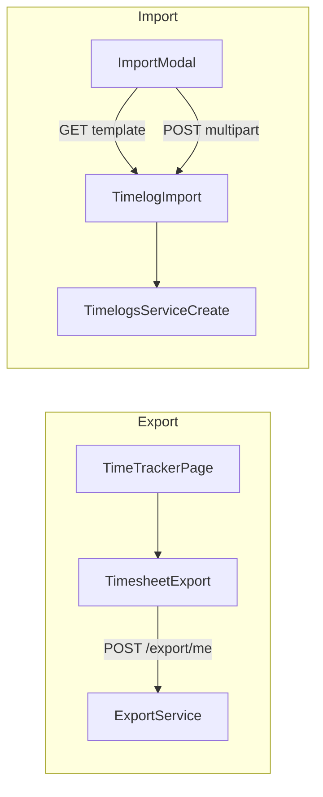

# Member time export + import (Time Tracker)

## Current state

| Capability | Status |
|------------|--------|
| Member export API `POST /export/me` | Exists ([export.controller.ts](apps/api/src/modules/export/interface/http/export.controller.ts), [export.dto.ts](packages/contracts/src/dto/export.dto.ts)) |
| Member export UI | Exists but **unmounted**: [timesheet-export.tsx](apps/client/src/components/timesheet-export.tsx) |
| Timesheet/time-entry file import | **Missing** (no routes/DTOs/service). Tenant ZIP import is OWNER-only and stubbed — do not reuse. |

**Locked decisions**
- **UI home: Time Tracker** (`/time-tracker`) — list + period filters are a better fit than the calendar timesheet
- Scope: **both** export wiring and new import
- Import mode: **create-only** (no update/overwrite by row id)
- Import always creates logs for the **authenticated member** (`source: manual`)
- Template columns aligned with member `time_entries` export so users can export → edit → re-import

---

## Phase 1 — Export (FE only)

Mount existing export UI on [time-tracker-page.tsx](apps/client/src/features/time-tracker/time-tracker-page.tsx) / [time-tracker-toolbar.tsx](apps/client/src/features/time-tracker/time-tracker-toolbar.tsx):

- Add **Export** (and later **Import**) actions on the toolbar next to **Add entry** / filters — Time Tracker already owns period (`rangeFrom` / `rangeTo`) and project filters
- Pass `defaultFrom` / `defaultTo` from the active Time Tracker period; optionally prefill `projectId` from the toolbar project filter
- Prefer a compact control: outline buttons that open the export card in a sheet/modal (or expandable panel under the toolbar) so the entry list stays primary
- Keep the existing simple [timesheet-export.tsx](apps/client/src/components/timesheet-export.tsx) logic; do **not** port the admin `/exports` wizard
- Move/rename the component under `features/time-tracker/` when wiring (e.g. `time-tracker-export.tsx`) for cohesion

No API changes. Add client e2e/unit coverage that export is reachable from `/time-tracker`.

---

## Phase 2 — Import contracts (SSOT first)

Add to [packages/contracts](packages/contracts):

**Routes** in [routes.ts](packages/contracts/src/routes.ts) under `TIMELOGS`:

- `IMPORT_TEMPLATE: "/timelogs/import/template"`
- `IMPORT: "/timelogs/import"`

**DTOs** (new `timelog-import.dto.ts` or extend [timelog.dto.ts](packages/contracts/src/dto/timelog.dto.ts)):

- Template column keys (stable): `project`, `task`, `date`, `start_time`, `end_time`, `description?`, `billable?`
  - Resolve `project`/`task` by **name** (case-insensitive, member-accessible) or UUID
  - Ignore export-only columns if present (`hours`, `rate`, `amount`, `category`, `source`) — duration/source derived server-side
- Response: `{ created: number; failed: Array<{ row: number; reason: string }> }` with row cap (e.g. **500**)
- Contract unit tests for routes + schemas

---

## Phase 3 — Import API

New slice under [apps/api/src/modules/timelogs](apps/api/src/modules/timelogs):

| Endpoint | Role | Behavior |
|----------|------|----------|
| `GET /timelogs/import/template` | MEMBER, ADMIN | Download `.xlsx` template (same pattern as [categories.controller.ts](apps/api/src/modules/categories/interface/http/categories.controller.ts) bulk template) |
| `POST /timelogs/import` | MEMBER, ADMIN | Multipart `file` (`.xlsx` / `.csv`, ~2MB); parse → validate → create |

**Service rules** (reuse [timelogs.service.ts](apps/api/src/modules/timelogs/application/timelogs.service.ts) `create`):

1. Force `userId` = caller (never import for others)
2. Resolve task within caller-accessible projects; fail row if ambiguous/missing
3. Build `startTime`/`endTime` from `date` + times in user timezone (or UTC documented in template)
4. Call existing `create` so **lock**, **overlap**, and **period editable** checks apply per row
5. Partial success: create valid rows; collect failures with row numbers (do not abort entire file on first error)
6. Sync processing for MVP (no Bull queue) given the row cap

Tests: service unit specs (happy path, overlap, locked period, unresolved task, over cap) + thin controller/e2e smoke.

---

## Phase 4 — Import UI (client)

On `/time-tracker`, mirror admin category bulk modal ([categories-page.tsx](apps/admin/src/features/categories/categories-page.tsx)):

1. Toolbar **Import** next to Export
2. `AppModal`: download template → pick `.xlsx`/`.csv` → submit
3. Show result summary (`created` / failed rows with reasons)
4. On success, refresh Time Tracker logs (same path as after add/edit entry)

Feature files: `apps/client/src/features/time-tracker/time-tracker-import-modal.tsx` (+ small helper/spec).

Playwright: open Import modal from `/time-tracker`, assert template control + upload affordance (mock API).

---

## Phase 5 — Docs

- Update [export-my-data.md](docs/user-guides/member/export-my-data.md) to point at **Time Tracker** (`/time-tracker`), not Timesheet
- Add import steps + column rules (same guide or `import-my-time.md`)
- Short note in [docs/specs](docs/specs) (new `timelog-import.md`) listing endpoints and create-only semantics

---

## Out of scope

- Mounting export/import on `/timesheet` calendar (unless requested later as a secondary entry)
- Admin workspace-wide timesheet import for other users
- Update/overwrite by exported row id
- Async import jobs / tenant GDPR ZIP path
- Porting admin export wizard to client
