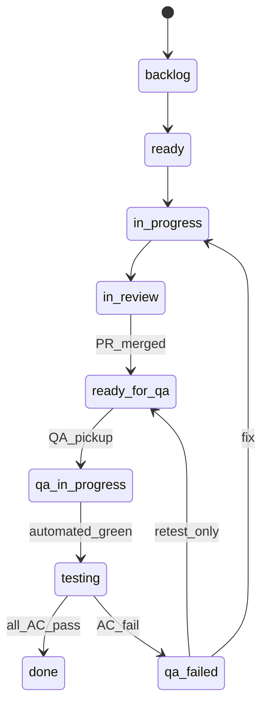

# Kloqra QA Workflow Plan (updated)

## What changed since the first draft

The [GitHub Kanban Bootstrap](.cursor/plans/github_kanban_bootstrap_dbfecb2c.plan.md) landed while this plan was pending. **Do not re-bootstrap** — align QA operations with what exists.

| Area              | First-draft assumption | **Actual state (2026-06-15)**                                                                                                                                                                                                                    |
| ----------------- | ---------------------- | ------------------------------------------------------------------------------------------------------------------------------------------------------------------------------------------------------------------------------------------------ |
| Issue templates   | Missing                | **Shipped:** [bug.yml](.github/ISSUE_TEMPLATE/bug.yml), [story.yml](.github/ISSUE_TEMPLATE/story.yml), [epic.yml](.github/ISSUE_TEMPLATE/epic.yml), [task.yml](.github/ISSUE_TEMPLATE/task.yml), [config.yml](.github/ISSUE_TEMPLATE/config.yml) |
| Project #4 lanes  | 6 simplified columns   | **10 lanes** per [lanes.md](.cursor/skills/kloqra-github-kanban/reference/lanes.md)                                                                                                                                                              |
| Board population  | Empty                  | **~130+ issues** posted — see [backlog README](docs/agent/backlog/README.md)                                                                                                                                                                     |
| Sprint tracking   | `TASK_BOARD.json`      | **Deprecated** — [TASK_BOARD.json](TASK_BOARD.json) points to Project #4                                                                                                                                                                         |
| AC + QA matrix    | Proposed               | **Required on every Ready story** — see [qa-matrix.md](.cursor/skills/kloqra-github-kanban/templates/qa-matrix.md)                                                                                                                               |
| Labels            | Proposed `severity:*`  | **Shipped:** `type:*`, `feature:*`, `layer:*`, `role:*`, `priority:P0-P3`, `mvp:out-of-scope`, `health:*` per [github-fields.md](.cursor/skills/kloqra-github-kanban/reference/github-fields.md)                                                 |
| PR template       | Missing                | **Still missing**                                                                                                                                                                                                                                |
| `docs/qa/` hub    | Missing                | **Still missing**                                                                                                                                                                                                                                |
| CI PR annotations | Proposed               | **On board** as [#313+](docs/agent/backlog/plans-posted.json) (`testing_coverage_plan`)                                                                                                                                                          |

---

## Board inventory (what QA works from)

**Source of truth:** [SCITAIGROUP1 Project #4](https://github.com/orgs/SCITAIGROUP1/projects/4) + [kloqra-github-kanban skill](.cursor/skills/kloqra-github-kanban/SKILL.md)

### Issue ranges on the board

| Batch            | Issues                                            | Content                                                                                                                          |
| ---------------- | ------------------------------------------------- | -------------------------------------------------------------------------------------------------------------------------------- |
| Initial MVP gaps | [#198–#204](docs/agent/backlog/posted.json)       | F-12 export epic, ready stories, backlog cleanup                                                                                 |
| Full breakdown   | #206–#242 (per expand-breakdown script)           | Epic → Story → Task hierarchy for F-01…F-15                                                                                      |
| Plan-derived     | [#243–#330](docs/agent/backlog/plans-posted.json) | api_surface_audit, admin_member_provisioning, brevo_email, member_ai_help_bot, **testing_coverage_plan**, notifications dispatch |
| On hold          | 5 Jira-integration stories                        | `on-hold` lane — post-MVP                                                                                                        |

### First sprint — **Ready** column (QA pickup order)

| Issue                                                         | Title                            | QA role                                                                                                          |
| ------------------------------------------------------------- | -------------------------------- | ---------------------------------------------------------------------------------------------------------------- |
| [#199](https://github.com/SCITAIGROUP1/ChronoMint/issues/199) | Wire member timesheet CSV export | Verify AC-1..3 via matrix in [f-12-wire-export.md](docs/agent/backlog/bodies/f-12-wire-export.md) after FE merge |
| [#200](https://github.com/SCITAIGROUP1/ChronoMint/issues/200) | Prisma DTO mappers               | API contract regression — matrix rows in body                                                                    |
| [#201](https://github.com/SCITAIGROUP1/ChronoMint/issues/201) | PresenceService unit tests       | **QA-owned** — lane `qa-in-progress` → write failing specs first                                                 |

### Platform QA stories (from testing_coverage_plan)

Execute in order; each story has sub-tasks on the board:

| Story | Plan todo              | QA impact                                                  |
| ----- | ---------------------- | ---------------------------------------------------------- |
| #313  | phase1-reporters-ci    | JUnit on PR Checks tab — **unblocks artifact-free triage** |
| #315  | phase2-api-unit        | Deeper API unit coverage                                   |
| #319  | phase3-api-integration | DB-backed API integration specs                            |
| #322  | phase4-playwright-full | Full client + admin Playwright                             |
| #325  | phase5-coverage-gates  | Coverage thresholds                                        |

**Dedup rule:** `ci-test-reporter` work in this plan = deliver #313; do not implement twice.

### MVP scope gate (QA must enforce)

Before filing or verifying issues, apply skill gate — **no QA time on:**

- Budget burn-down, `budgetHours`, revenue widgets
- Billing, hourly rates, invoices
- External client portal

Tag discoveries `mvp:out-of-scope` → lane `on-hold`. See [SKILL.md MVP section](.cursor/skills/kloqra-github-kanban/SKILL.md).

---

## Target operating model

### Two lanes, one board — 10-lane kanban



| Lane             | QA action                                                                         |
| ---------------- | --------------------------------------------------------------------------------- |
| `ready-for-qa`   | Read issue **QA verification matrix**; assign self; move to `qa-in-progress`      |
| `qa-in-progress` | Run automated rows (`pnpm test`, targeted e2e/api); confirm CI green on linked PR |
| `testing`        | Execute **Manual** matrix rows on local; staging for release-bound items          |
| `done`           | Post AC-ID sign-off comment; check every matrix `[x]`                             |
| `qa-failed`      | Comment cites failed `AC-N` + repro; file `[Bug]` sub-issue if needed             |

**Gate:** Story cannot reach `done` until every matrix row is checked and sign-off block is posted (template below).

### Per-issue sign-off (replaces generic smoke-only pass)

From [qa-matrix.md](.cursor/skills/kloqra-github-kanban/templates/qa-matrix.md):

```text
QA sign-off GH-<issue#>:
- AC-1: PASS — evidence: [screenshot / test name / curl output]
- AC-2: PASS — evidence:
- Gate: pnpm format:check && lint && typecheck && test && build PASS
Tester: [name] — [date] — Environment: local | staging
```

### Release-level sign-off (staging)

Keep [testing-guide.md](docs/user-guides/qa/testing-guide.md) smoke tables for **cross-feature regression** before `staging`/`main` merge. Run after all in-sprint issues are `done` or explicitly deferred.

```text
QA release sign-off — [version]
Environment: staging — [docs/qa/ENVIRONMENTS.md URLs]
Client smoke: PASS / FAIL
Admin smoke: PASS / FAIL
Sprint issues verified: #199, #200, … (all done or noted)
Blockers: none / #issue links
Tester: [name] — [date]
```

### Environments

| Environment | Use                                                                              |
| ----------- | -------------------------------------------------------------------------------- |
| **Local**   | Per-issue AC verification (`pnpm serve`)                                         |
| **Staging** | Release sign-off (`kloqra-*-staging` per [railway.md](docs/runbooks/railway.md)) |
| **CI**      | Automated gate + artifacts (7-day retention)                                     |

Document canonical staging URLs in `docs/qa/ENVIRONMENTS.md` (still to create).

---

## Phase 1 — Wire QA to the board (no re-bootstrap)

### 1.1 Project views (one-time UI)

Per [github-fields.md](.cursor/skills/kloqra-github-kanban/reference/github-fields.md):

- **Main Kanban** — group by Status (10 lanes)
- **By feature** — group by Feature domain
- **QA queue** — filter: `ready-for-qa`, `qa-in-progress`, `testing`, `qa-failed`

### 1.2 PR template (still needed)

Add [`.github/pull_request_template.md`](.github/pull_request_template.md):

```markdown
## Linked issue

Closes / relates to GH-#

## Summary

## Spec / docs

- [ ] `docs/specs/...` updated if behavior changed

## Automated tests (per issue QA matrix)

- [ ] Every Contract/Unit/API/E2E row in the linked issue has a passing test

## Manual test plan

<!-- Copy Manual steps from issue QA matrix -->

## QA handoff

- [ ] Ready for QA — merge and move issue to `ready-for-qa`
```

Update [CONTRIBUTING.md](docs/development/CONTRIBUTING.md) to reference template + board lanes.

### 1.3 Bug template gap-fill

[bug.yml](.github/ISSUE_TEMPLATE/bug.yml) already has AC-1 fix verification + QA matrix. **Add only:**

- Environment dropdown (`local` / `staging` / `production`)
- App dropdown (`client` / `admin` / `api`)
- Workspace + account fields (from testing guide § "How to report a bug")

Do **not** create duplicate `bug_report.yml` / `qa_task.yml`.

### 1.4 Label gap (optional)

Existing `priority:P0-P3` covers severity. Add only if triage needs them:

- `qa:needs-verification`, `qa:verified` (for hotfix retest outside kanban lanes)

Document in `docs/qa/BUG_TRIAGE.md` — map P0 = blocker, etc.

---

## Phase 2 — QA daily rhythm

### 2.1 Morning: QA queue triage

1. Open Project #4 → **QA queue** view.
2. Pick oldest `ready-for-qa` card.
3. Open linked PR / confirm CI green on `main` or feature branch.
4. Move to `qa-in-progress`.

### 2.2 Per-issue verification

1. Read **Acceptance criteria** (`AC-1`, `AC-2`, …) in issue body.
2. Run **Automated** matrix commands locally (`pnpm test -- <path>`, targeted e2e).
3. Run **Manual** matrix steps on local; staging if issue touches deploy-only config (e.g. Brevo #275+).
4. On pass: move to `done`, post AC-ID sign-off on issue.
5. On fail: move to `qa-failed`, comment `AC-N FAIL` + repro; optionally file `[Bug][F-XX]` linked as sub-issue.

### 2.3 Regression policy

| Matrix Type | When bug found      | Dev adds                                |
| ----------- | ------------------- | --------------------------------------- |
| E2E         | UI flow break       | `apps/{admin,client}/e2e/*.spec.ts`     |
| API         | Contract/HTTP break | `apps/api/test/*.e2e.ts` or `*.spec.ts` |
| Contract    | Schema break        | `packages/contracts/src/*.spec.ts`      |
| Unit        | Service logic       | `*.spec.ts` beside service              |

QA verifies new regression row in matrix before `done`.

### 2.4 Sprint end: staging release pass

1. Filter Project #4 → `done` this sprint + any `qa-failed` still open.
2. Deploy / confirm staging current.
3. Run full client + admin smoke from [testing-guide.md](docs/user-guides/qa/testing-guide.md).
4. Post **release sign-off** on release PR.

---

## Phase 3 — Automated QA (execute board stories)

Do not duplicate — track progress on Project #4:

| Priority | Board story | Delivers                                                         |
| -------- | ----------- | ---------------------------------------------------------------- |
| P0       | #313        | Vitest JUnit + Playwright junit/html in CI; PR check annotations |
| P1       | #315, #319  | API unit + integration depth                                     |
| P1       | #322        | Full Playwright client + admin                                   |
| P2       | #325        | Coverage gates                                                   |

**QA commands (today):**

```bash
pnpm test                    # unit (all packages)
pnpm test:coverage           # API + contracts + ui gates
pnpm test:integration        # API DB-backed e2e
pnpm test:prepush            # integration + both Playwright suites (CI parity)
pnpm test:dashboard --open   # local artifact hub :9321
```

**CI artifacts** (7-day): `coverage`, `unit-junit`, `integration-junit`, `playwright-report` — [ci.yml](.github/workflows/ci.yml).

After #313 ships: QA reads failure annotations on PR **Checks** tab instead of downloading zips.

---

## Phase 4 — Documentation package

Create `docs/qa/` hub — **bridge** testing guide ↔ kanban skill:

| File                                                     | Purpose                                         |
| -------------------------------------------------------- | ----------------------------------------------- |
| [docs/qa/README.md](docs/qa/README.md)                   | Index: board URL, skill link, daily rhythm      |
| [docs/qa/ENVIRONMENTS.md](docs/qa/ENVIRONMENTS.md)       | Local ports + **actual staging URLs**           |
| [docs/qa/BOARD_WORKFLOW.md](docs/qa/BOARD_WORKFLOW.md)   | 10 lanes, transitions, QA queue, AC-ID sign-off |
| [docs/qa/BUG_TRIAGE.md](docs/qa/BUG_TRIAGE.md)           | P0–P3, `mvp:out-of-scope`, bug vs story         |
| [docs/qa/RELEASE_PROCESS.md](docs/qa/RELEASE_PROCESS.md) | Sprint end staging smoke + release sign-off     |

Update [testing-guide.md](docs/user-guides/qa/testing-guide.md):

- Replace "GitHub Issues, Jira, etc." → **Project #4 + issue templates**
- Add § "Working from the QA queue view"
- Link `BOARD_WORKFLOW.md` for lane transitions
- Reference board story #313 for CI check annotations (once done)

---

## Phase 5 — Roles and cadence

| Role              | Responsibility                                                                |
| ----------------- | ----------------------------------------------------------------------------- |
| **PM/BA**         | AC + matrix complete before `ready`; MVP scope gate                           |
| **Dev**           | PR template, tests per matrix Automated rows, move to `ready-for-qa` on merge |
| **QA**            | Queue triage, matrix execution, AC-ID sign-off, `qa-failed` repro             |
| **Release owner** | Staging sign-off; no `staging`/`main` merge with open P0 or `qa-failed`       |

| Cadence              | Action                                |
| -------------------- | ------------------------------------- |
| **Per merged story** | QA queue pickup → matrix → `done`     |
| **Per PR (dev)**     | CI green; manual test plan in PR body |
| **Sprint end**       | Staging full smoke + release sign-off |
| **On regression**    | New automated row in issue matrix     |

---

## Implementation order (revised)

1. **`docs/qa/BOARD_WORKFLOW.md`** — unblocks QA immediately on populated board
2. **QA queue view** on Project #4
3. **PR template** + CONTRIBUTING link
4. **Sprint 1 dispatch** — #201 (QA-owned tests) → #199/#200 after dev merge
5. **Execute #313** (CI reporters) — highest automation ROI
6. **ENVIRONMENTS.md** with staging URLs
7. **Update testing-guide.md**
8. **Bug template gap-fill** + BUG_TRIAGE.md
9. **test-dashboard fix** (integration-junit path)

**Cancelled / done:** full template bootstrap, 6-column board design, TASK_BOARD tracking.

---

## Success criteria

- QA works from **QA queue view** on Project #4, not ad-hoc spreadsheets.
- Every `done` story has **AC-ID sign-off** on the issue with matrix rows checked.
- Ready column (#199–#201) verified using **issue bodies**, not rediscovered steps.
- Release merges include **staging sign-off** referencing `ENVIRONMENTS.md`.
- #313 complete → CI failures visible on PR without artifact download.
- Bugs filed via **bug.yml** with fix-verification AC; regressions get new automated tests per matrix Type column.
