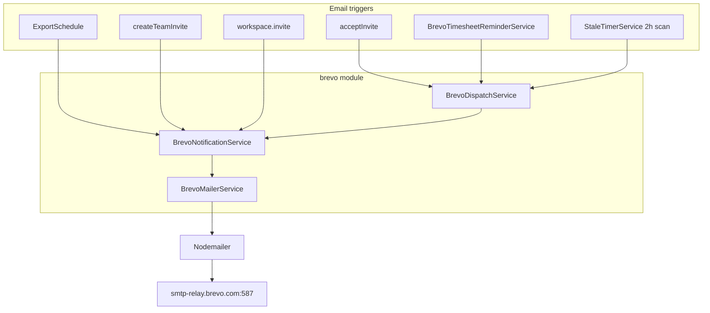

# Brevo Notifications Module

> **Security:** SMTP credentials were shared in chat. **Rotate the Brevo SMTP key** in the Brevo dashboard before production use, and store the new value only in local `.env` / deployment secrets — never commit to git.

## Answer: which emails are included?

| Email (from Settings UI)                   | In this plan? | Notes                                        |
| ------------------------------------------ | ------------- | -------------------------------------------- |
| Email when assigned to a project           | **Yes**       | Fires on invite accept (`acceptInvite`)      |
| Email when assigned to a task              | **No**        | No task-assignment API exists yet — deferred |
| Email reminders to submit timesheets       | **Yes**       | `BrevoTimesheetReminderService`              |
| Email when idle timer triggered (2+ hours) | **Yes**       | Extend `StaleTimerService` at 2h threshold   |
| Email when Jira sync completes             | **No**        | Jira sync feature not built — deferred       |
| Project team invite join link              | **Yes**       | `createTeamInvite` when email provided       |
| Workspace member added                     | **Yes**       | `WorkspaceService.invite`                    |
| Scheduled export delivery                  | **Yes**       | Migrate to Brevo module                      |

---

## Email provider: Brevo SMTP

Use **Brevo SMTP relay** via the existing **Nodemailer** dependency.

| Setting     | Value                                                  |
| ----------- | ------------------------------------------------------ |
| SMTP server | `smtp-relay.brevo.com`                                 |
| Port        | `587` (STARTTLS)                                       |
| Login       | `ae7b52001@smtp-brevo.com`                             |
| Password    | Brevo SMTP key — set via `BREVO_SMTP_KEY` env var only |

**Environment variables** (replace legacy `SMTP_*`):

```bash
BREVO_SMTP_HOST=smtp-relay.brevo.com
BREVO_SMTP_PORT=587
BREVO_SMTP_USER=ae7b52001@smtp-brevo.com
BREVO_SMTP_KEY=<your-brevo-smtp-key>   # never commit
BREVO_SMTP_FROM=Kloqra <noreply@yourdomain.com>  # must be verified in Brevo
```

**Free tier:** 300 emails/day — document in `.env.example`; reminder job should dedup to stay within limits.

---

## Module layout (all `brevo`-named files)

```
apps/api/src/modules/brevo/
  brevo.module.ts
  application/
    brevo-mailer.service.ts              # Nodemailer → Brevo SMTP relay
    brevo-mailer.service.spec.ts
    brevo-notification.service.ts        # typed templates + send methods
    brevo-notification.service.spec.ts
    brevo-dispatch.service.ts            # user prefs + resolveEffectiveNotifications
    brevo-dispatch.service.spec.ts
    brevo-timesheet-reminder.service.ts  # scheduled reminder job
    brevo-timesheet-reminder.service.spec.ts
```

| File                                  | Class                           | Role                                           |
| ------------------------------------- | ------------------------------- | ---------------------------------------------- |
| `brevo.module.ts`                     | `BrevoModule`                   | Global Nest module; exports all brevo services |
| `brevo-mailer.service.ts`             | `BrevoMailerService`            | Low-level Nodemailer transport                 |
| `brevo-notification.service.ts`       | `BrevoNotificationService`      | Email templates + `send*` methods              |
| `brevo-dispatch.service.ts`           | `BrevoDispatchService`          | Preference-gated send wrapper                  |
| `brevo-timesheet-reminder.service.ts` | `BrevoTimesheetReminderService` | Daily timesheet reminder cron                  |



---

## Service details

### `BrevoMailerService` (`brevo-mailer.service.ts`)

Replaces [`apps/api/src/common/mailer/mailer.service.ts`](apps/api/src/common/mailer/mailer.service.ts):

- **Keep** `nodemailer` + `@types/nodemailer`
- Nodemailer transport:

```typescript
nodemailer.createTransport({
  host: process.env.BREVO_SMTP_HOST ?? "smtp-relay.brevo.com",
  port: Number(process.env.BREVO_SMTP_PORT ?? 587),
  secure: false,
  auth: {
    user: process.env.BREVO_SMTP_USER,
    pass: process.env.BREVO_SMTP_KEY
  }
});
```

- `send({ to, subject, html, text?, attachments? })`
- `isConfigured` when `BREVO_SMTP_KEY` is set; no-op with log warning when unset

### `BrevoNotificationService` (`brevo-notification.service.ts`)

| Method                     | Preference gate? | Called from               |
| -------------------------- | ---------------- | ------------------------- |
| `sendProjectTeamInvite`    | No               | `createTeamInvite`        |
| `sendWorkspaceMemberAdded` | No               | `WorkspaceService.invite` |
| `sendScheduledExport`      | No               | `ExportScheduleService`   |
| `sendProjectAssignment`    | Yes              | `BrevoDispatchService`    |
| `sendTimesheetReminder`    | Yes              | `BrevoDispatchService`    |
| `sendIdleTimerAlert`       | Yes              | `BrevoDispatchService`    |

Templates: inline HTML in `brevo-notification.service.ts`.

### `BrevoDispatchService` (`brevo-dispatch.service.ts`)

Loads user prefs, calls `resolveEffectiveNotifications()`, skips when master switch or per-type toggle is off.

### `BrevoTimesheetReminderService` (`brevo-timesheet-reminder.service.ts`)

Daily job (`OnModuleInit` interval); Redis dedup `timesheet_reminder:{userId}:{projectId}:{periodStart}`.

---

## Wiring

### Remove legacy mailer

- Delete [`apps/api/src/common/mailer/`](apps/api/src/common/mailer/)
- Register **`BrevoModule`** globally in [`apps/api/src/app.module.ts`](apps/api/src/app.module.ts)
- Update [`apps/api/src/load-env.ts`](apps/api/src/load-env.ts): `BREVO_SMTP_*` vars replace `SMTP_*`

### Immediate triggers (no preference gate)

- `ProjectsService.createTeamInvite` → `BrevoNotificationService.sendProjectTeamInvite`
- `WorkspaceService.invite` → `BrevoNotificationService.sendWorkspaceMemberAdded`
- `ExportScheduleService` → `BrevoNotificationService.sendScheduledExport`

### Preference-gated triggers

- `ProjectsService.acceptInvite` → `BrevoDispatchService.maybeSendProjectAssignment`
- `StaleTimerService` (2h) → `BrevoDispatchService.maybeSendIdleTimerAlert`; add `IDLE_TIMER_ALERT_HOURS = 2` to contracts
- `BrevoTimesheetReminderService` → `BrevoDispatchService` for opted-in users

---

## Tests

| File                                       | What to test                                               |
| ------------------------------------------ | ---------------------------------------------------------- |
| `brevo-mailer.service.spec.ts`             | Configured vs unconfigured; transport options; attachments |
| `brevo-notification.service.spec.ts`       | Each `send*` method delegates to `BrevoMailerService`      |
| `brevo-dispatch.service.spec.ts`           | Master switch + per-type prefs                             |
| `brevo-timesheet-reminder.service.spec.ts` | Draft periods; dedup                                       |
| `projects.service.spec.ts`                 | Invite + assignment wiring via brevo services              |
| `workspace.service.spec.ts`                | Workspace-added email                                      |
| `export-schedule.service.spec.ts`          | `sendScheduledExport` when due                             |
| `stale-timer.service.spec.ts`              | Idle alert at 2h; dedup; pref off                          |

Mock Nodemailer in `brevo-mailer.service.spec.ts`; higher-level tests mock `BrevoNotificationService` / `BrevoDispatchService`.

---

## Implementation order

1. Scaffold `apps/api/src/modules/brevo/` with `brevo.module.ts` + `brevo-mailer.service.ts` + spec
2. Add `brevo-notification.service.ts` + `brevo-dispatch.service.ts` + specs
3. Add `IDLE_TIMER_ALERT_HOURS` to contracts
4. Remove `common/mailer`; register `BrevoModule` globally; update env files
5. Migrate `ExportScheduleService` to `BrevoNotificationService`
6. Wire invite + workspace emails
7. Wire `acceptInvite` → `BrevoDispatchService`
8. Extend `StaleTimerService` for 2h idle alert
9. Add `brevo-timesheet-reminder.service.ts` + spec
10. Run full pre-PR checks

---

## Future phases (not this PR)

- Task assignment email — when assignee API exists
- Jira sync email — when Jira integration ships
- Auth emails (password reset, welcome)
- Resend invite endpoint
- Brevo transactional templates
- In-app notification feed (replace mock dropdown)
