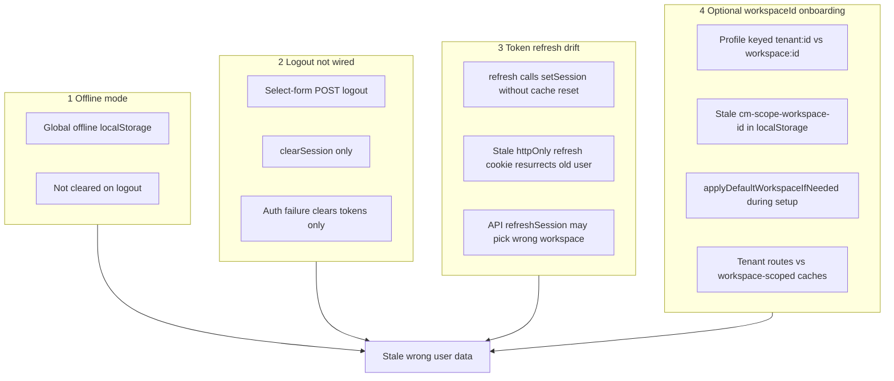

# Professional session cache boundary (re-validated v2)

## Goal

A user must be able to **switch accounts, workspaces, and roles at any time** on the same browser (any tab, any device) without seeing another user's data — online or offline, Chrome or Safari.

---

## Four root-cause clusters (your diagnosis confirmed)

The symptoms likely come from **all four** interacting, not just offline mode. Optional workspace ID for tenant-owner onboarding made cluster 3 and 4 worse.



### Cluster 1 — Offline mode

- [`offline-store.ts`](apps/client/src/stores/offline-store.ts): global `kloqra_offline_logs` / `kloqra_offline_deletions`, no `userId`/`workspaceId`
- Survives logout; `syncQueue(workspaceId)` posts all queued items to active workspace on reconnect
- **Fix:** scope keys + boundary clear on account change

### Cluster 2 — Logout not wired correctly

| Path | Problem |
|------|---------|
| [`workspace-select-form.tsx`](packages/web-shared/src/features/auth/workspace-select-form.tsx) | `POST /auth/logout` (API expects `DELETE`) → refresh cookie may survive |
| Same + [`admin-context-select-form.tsx`](packages/web-shared/src/features/auth/admin-context-select-form.tsx) | Only `clearSession()` — skips profile, notifications, offline, list cache |
| [`workspace-shell.tsx`](apps/client/src/components/workspace-shell.tsx) stop impersonation | `clearSession()` only |
| [`client.ts`](packages/web-shared/src/api/client.ts) fatal auth | Session cleared; all in-memory caches remain |

**Worst case:** User clicks "different account" → localStorage cleared but **httpOnly refresh cookie still valid** → page reload or `tryRefreshSession()` **restores the previous user** while UI thinks they're logged out.

**Fix:** Every logout path uses [`logoutSession()`](packages/web-shared/src/auth/logout.ts) (`DELETE` + full boundary). Never call `clearSession()` alone for user-initiated logout.

### Cluster 3 — Token refresh issues

**Client — refresh updates session without cache reset**

[`refresh-session.ts`](packages/web-shared/src/auth/refresh-session.ts) line 47:
```ts
useSessionStore.getState().setSession(body, body.accessToken, body.refreshToken);
```
No boundary → profile/list/project caches can disagree with new JWT. The **choke point in `setSession`** fixes this for all callers including refresh.

**API — refresh may rebuild wrong session shape**

[`auth.service.ts`](apps/api/src/modules/auth/application/auth.service.ts) `refreshSession()`:
- Uses `stored.workspaceId` from refresh token row
- When `workspaceId` is null, falls back to `workspaceMember.findFirst` (oldest membership)
- For tenant operator with `requiresWorkspaceSetup: true` and **zero** workspaces → correctly resolves via `buildTenantOperatorSession`
- **Risk:** refresh token row still holds **old `workspaceId`** from a prior session (before logout, or before onboarding) → refresh returns workspace session instead of tenant-operator session
- **Risk:** partial logout leaves old refresh cookie → refresh restores wrong user entirely

**Fix (API):**
- On tenant-operator login (`requiresWorkspaceSetup`, no `workspaceId`), persist refresh token with `workspaceId: null` and add session mode flag if needed
- In `refreshSession`, when stored `workspaceId` is null, call `resolveAuthSessionForUser` directly (tenant-operator path) instead of `findFirst` workspace
- On full logout, revoke refresh token family (already in `DELETE /auth/logout` when called correctly)
- Add API tests: refresh after tenant-operator login returns `requiresWorkspaceSetup: true` and no `workspaceId`

**Fix (client):**
- `setSession` choke point treats `requiresWorkspaceSetup` change as identity change (workspace-level boundary)
- After refresh, profile cache key may flip `tenant:{id}` ↔ `workspaceId` → must invalidate both keys

### Cluster 4 — Optional workspaceId (tenant-owner onboarding)

Recent work made `workspaceId` optional in JWT for tenant OWNER/ADMIN before first workspace ([`auth.dto.ts`](packages/contracts/src/dto/auth.dto.ts), [`buildTenantOperatorSession`](apps/api/src/modules/auth/application/auth.service.ts)).

This introduced new mismatch surfaces:

| Surface | Issue |
|---------|-------|
| Profile cache | [`profile-cache-key.ts`](packages/web-shared/src/features/account/profile-cache-key.ts) uses `tenant:{tenantId}` when no workspace — old `workspaceId` profile entries linger in memory |
| `resolveApiWorkspaceId` | Fixed to not fall back to stale localStorage when JWT has no workspace — **keep** |
| `getEffectiveWorkspaceId` | Still falls back to `localStorage` when JWT has no workspace — used by dashboards; can show wrong workspace widgets |
| `applyDefaultWorkspaceIfNeeded` | [`apply-default-workspace.ts`](packages/web-shared/src/auth/apply-default-workspace.ts) runs on bootstrap/login; should **skip** when `requiresWorkspaceSetup === true` |
| `bootstrapSession` | `GET /auth/me` without workspace header for tenant operators — correct; but cached data from prior workspace session may still render until boundary |
| Create workspace | [`create-workspace-dialog.tsx`](apps/admin/src/features/account/components/create-workspace-dialog.tsx) calls `setSession` after switch — identity changes `requiresWorkspaceSetup: true → false` + new `workspaceId` → needs full/workspace boundary |
| Refresh token storage | [`auth.controller.ts`](apps/api/src/modules/auth/interface/http/auth.controller.ts) `setCookies` stores `workspaceId ?? null` on refresh token — correct for tenant operator; must stay null until workspace created |

**Fix:**
- Include `requiresWorkspaceSetup` in `SessionIdentity` diff
- Deprecate `getEffectiveWorkspaceId` storage fallback; use `session.workspaceId ?? null` or `resolveApiWorkspaceId()` only
- Guard `applyDefaultWorkspaceIfNeeded` when `session.requiresWorkspaceSetup`
- Onboarding e2e: login → profile/settings → create workspace → no stale tenant-scoped data

---

## Complete leak inventory (unchanged — still valid)

See prior audit: offline queue, timer store, global favorites, assistant chat, Zustand maps, list cache, inflight GETs — all need boundary reset.

---

## Solution architecture

### Principle 1: Single choke point in `setSession` / `clear`

Instrument [`session.store.ts`](packages/web-shared/src/stores/session.store.ts):
- Diff identity before every `setSession`
- Full boundary on `clear()`
- Route `applySessionFromPeer` through same identity diff (currently bypasses `setSession`)

**SessionIdentity** must include:
```ts
{
  userId, tenantId,
  workspaceId: string | null,
  requiresWorkspaceSetup: boolean,
  impersonatorId: string | null,
  authScope: string
}
```

**Identity change rules:**
| Change | Boundary level |
|--------|----------------|
| `userId` changes | **full** |
| `impersonatorId` changes | **full** |
| `workspaceId` changes | **workspace** |
| `requiresWorkspaceSetup` changes | **workspace** (tenant ↔ workspace mode) |
| `tenantId` changes (same user unlikely) | **full** |
| Same identity (refresh, name patch) | **none** |

### Principle 2: `sessionGeneration` counter

Increment on every boundary. Data hooks (`useUserProfile`, `useTenantCurrent`, `usePaginatedList`, workspace-data-sync) depend on it to force refetch.

### Principle 3: App handler registry

[`session-boundary.ts`](packages/web-shared/src/auth/session-boundary.ts) + per-app registration in client/admin layouts for offline, timer, projects, admin stores.

---

## Implementation phases

### Phase 0 — API auth fixes (cluster 3 + 4)

**Files:** [`auth.service.ts`](apps/api/src/modules/auth/application/auth.service.ts), [`auth.service.spec.ts`](apps/api/src/modules/auth/application/auth.service.spec.ts)

1. `refreshSession(userId, workspaceId?)`: when `workspaceId` is null/undefined, skip `findFirst` workspace membership → go straight to `resolveAuthSessionForUser` (tenant-operator aware)
2. Ensure logout revokes refresh family (verify `DELETE` path; add test)
3. Test: tenant-operator session refresh preserves `requiresWorkspaceSetup: true` and absent `workspaceId`
4. Test: refresh after workspace switch updates `workspaceId` on token row

### Phase 1 — Client choke point + logout unification (cluster 2 + 3)

1. `session-identity.ts` + `session-boundary.ts`
2. Instrument `setSession`, `clear`, `applySessionFromPeer`
3. `clearInflightGetRequests()` in [`client.ts`](packages/web-shared/src/api/client.ts)
4. Extend `logoutSession()` with full boundary
5. Replace partial logouts with `logoutSession()` in select-forms
6. `handleFatalAuthFailure` / `handleSessionFailure` → full boundary
7. Stop impersonation → `logoutSession()` or boundary helper

### Phase 2 — Onboarding + refresh guards (cluster 4)

1. `applyDefaultWorkspaceIfNeeded`: return early if `session.requiresWorkspaceSetup`
2. Replace `getEffectiveWorkspaceId()` dashboard usage with `resolveApiWorkspaceId()` or `session.workspaceId`
3. Profile store: `removeKey()` for both `tenant:{id}` and old `workspaceId` on boundary
4. Verify [`tenant-api-workspace.ts`](packages/web-shared/src/features/tenant/tenant-api-workspace.ts) never sends stale workspace header

### Phase 3 — Offline scoping (cluster 1)

[`offline-store.ts`](apps/client/src/stores/offline-store.ts):
- Keys: `kloqra:offline:logs:{scope}:{userId}:{workspaceId|tenant}`
- Tenant-operator offline: use `tenant:{tenantId}` scope segment when no workspace
- Legacy global keys: migrate or discard
- `syncQueue()` validates scope before POST

### Phase 4 — Storage + Zustand hardening

- [`scoped-storage.ts`](packages/web-shared/src/storage/scoped-storage.ts) for all global prefs
- `clear()` on every app store
- `SESSION_BOUNDARY_EVENT` for Assistant/Onboarding React contexts

### Phase 5 — Tests (must cover all four clusters)

**Unit:**
- `session-identity.spec.ts` — `requiresWorkspaceSetup` flip triggers boundary
- `session.store.spec.ts` — refresh with same identity → no boundary; workspace change → boundary
- `auth.service.spec.ts` — tenant-operator refresh
- `apply-default-workspace.spec.ts` — skips during onboarding
- `offline-store.spec.ts` — scoped keys + legacy migration
- `session-boundary.spec.ts` — list cache, inflight, profile cleared

**E2E (required):**
| Scenario | Clusters |
|----------|----------|
| Login A → logout (select-form path) → login B | 2, 3 |
| Login A → partial clear → reload → must NOT restore A | 2, 3 |
| Tenant owner onboarding → profile/settings → create workspace → clean state | 4 |
| Token refresh during onboarding (wait for proactive refresh) → no stale workspace data | 3, 4 |
| Offline entry → logout → login B → entry never syncs | 1, 2 |
| Workspace switch + role switch (admin org ↔ workspace mode) | 4 |
| Cross-tab user switch | 2, 3 |
| Safari WebKit (if CI available) | all |

### Definition of done

- [ ] All logout paths use `logoutSession()` — grep for `clearSession()` in logout handlers returns zero
- [ ] `setSession` choke point covers refresh, peer sync, login, switch
- [ ] API refresh preserves tenant-operator session shape
- [ ] Zero global user-data localStorage keys
- [ ] `requiresWorkspaceSetup` transitions invalidate caches
- [ ] All e2e scenarios green
- [ ] `pnpm format:check && pnpm lint && pnpm typecheck && pnpm test && pnpm build`

---

## Implementation order

1. **Phase 0** — API refresh fixes (prevents server sending wrong session on refresh)
2. **Phase 1** — Choke point + logout unification (biggest client impact)
3. **Phase 2** — Onboarding guards (tenant-owner specific)
4. **Phase 3** — Offline scoping
5. **Phase 4** — Storage + stores
6. **Phase 5** — Tests

---

## Expected outcome

All four root-cause clusters addressed. Account switch, role switch, workspace switch, impersonation, token refresh, and tenant-owner onboarding all go through one deterministic boundary. No stale user data from offline queues, broken logout, refresh drift, or optional-workspace session shape changes.
