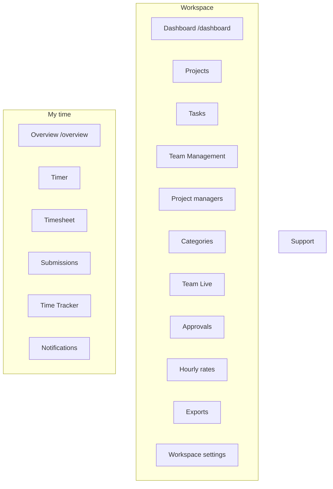

# Sidebar and in-app nav sectionization

## Naming (recommended)

Avoid **ADMINISTRATION** (heavy) and **MY TIMELOGS** (too narrow — timer/timesheet/submissions are not only logs).

| Surface | Section A | Section B | Optional C |
|---|---|---|---|
| Workspace sidebar | **Workspace** | **My time** | **Support** (Support only, or leave ungrouped at bottom) |
| Account sidebar | **Organization** | **Access** | **Billing & data** |
| Settings aside | **Preferences** | **Security** | — |
| Notification prefs | **Work** | **Time** | **Account** |

Why these:
- **Workspace** = manage the space (people, projects, approvals, exports).
- **My time** = what I track and submit.
- Matches existing account chrome language (`navSectionLabel="Organization"`) better than “Administration”.

## Workspace sidebar item placement



- **Dashboard** stays the management/analytics home (current `/dashboard`, management widgets).
- **Overview** becomes the personal home under **My time** at `/overview`, reusing existing personal dashboard widgets from [`dashboard-composition.ts`](apps/app/src/features/dashboard/dashboard-composition.ts) (today/timer/recent logs/quick access) — not a second copy of account `/account` Overview.
- Capability filtering stays as today in [`filterNavByCapabilities`](apps/app/src/config/app-nav.ts); empty sections are omitted.
- Members who only have personal caps still see **My time** (+ Support); **Workspace** section appears only when at least one admin-capable item remains.
- Default landing: unchanged for admins (`/dashboard`); members can keep `/dashboard` or prefer `/overview` only if current startup already routes them there — do not change startup unless existing helpers already expect it.

## Shell API change (enables all section UIs)

Today [`ResponsiveLayoutShell`](packages/ui/src/components/layout-shell.tsx) only supports a flat `navItems` list + one `navSectionLabel`.

Extend to sectioned nav:

```ts
type SidebarNavSection = {
  id: string;
  label: string; // rendered uppercase when expanded; hidden/tooltip when collapsed
  items: readonly SidebarNavItem[];
};
```

- Accept `navSections` (preferred) while keeping `navItems` + single `navSectionLabel` for platform-admin / account backward compatibility, **or** migrate callers to always pass sections (account = one section “Organization” initially, then split).
- Render section headings with the existing uppercase muted style; skip heading when collapsed; skip empty sections after capability filter.
- Update [`layout-shell.spec.tsx`](packages/ui/src/components/layout-shell.spec.tsx) for multi-section + collapsed behavior.
- Wire from [`resolve-app-shell-nav.ts`](apps/app/src/lib/resolve-app-shell-nav.ts) + [`app-shell.tsx`](apps/app/src/components/app-shell.tsx).

## Where else to sectionize (same pass)

1. **Account / organization sidebar** ([`account-nav.ts`](apps/app/src/config/account-nav.ts))
   - **Organization**: Overview, Organization, Workspaces, Workspaces Tree
   - **Access**: Workspace admins, Permission matrix, Access audit, Organization members
   - **Billing & data**: Subscription, Data & privacy, Settings

2. **Settings aside** ([`settings-nav.tsx`](packages/web-shared/src/features/account/settings/settings-nav.tsx) + shell)
   - **Preferences**: Appearance, Time Settings, Notifications, Account Preferences
   - **Security**: Security
   - Shared component pattern: optional `section` on each `SettingsNavItem`, render group labels like the sidebar.

3. **Notification preference rows** ([`notifications-section.tsx`](packages/web-shared/src/features/account/settings/sections/notifications-section.tsx))
   - Group rows under **Work** (assignments, workspace access), **Time** (timesheet reminders/status, timer), **Account** (security/export/billing-related keys as applicable by variant).
   - Visual headings only; no new preference keys.

4. **Additional surfaces that fit the same grouping** (decide include-now vs later)

   | Surface | Fit | Suggested groups |
   |---|---|---|
   | **Global search Pages** ([`global-search-nav.ts`](apps/app/src/features/global-search/global-search-nav.ts)) | Strong | Sub-bucket flat Pages into **Workspace** / **My time** / **Organization** (entity groups Pages/Projects/Tasks stay) |
   | **Platform console sidebar** ([`platform-shell.tsx`](apps/platform-admin/src/components/platform-shell.tsx) `CONSOLE_NAV_ITEMS`) | Strong | Reuse `navSections` API: e.g. **Operations** / **Commercial** / **Support** |
   | **Onboarding tour copy** ([`onboarding-tour.tsx`](apps/app/src/features/onboarding/onboarding-tour.tsx)) | Copy-only | Mention Workspace vs My time after sections ship |
   | Project detail aside | Weak | Entity tabs only — skip |
   | Notification inbox / dropdown | Weak | Chronological lists — skip redesign |
   | Marketing top nav | Weak | Different IA; footer already sectioned |
   | User footer / help popover | Weak | Too few links |
   | Permission Studio catalog | Already grouped | Uses `parentGroup` — leave alone |

5. **Out of scope by default (this change)**
   - Platform-admin console sectioning (unless pulled into this pass).
   - Global search Pages sub-buckets (unless pulled into this pass).
   - Full redesign of the notifications inbox page list UI.
   - Renaming account Overview (`/account`).

## Implementation order

1. Contracts/UI: sectioned `ResponsiveLayoutShell` + tests.
2. App nav config: add `section: "workspace" | "my-time" | "support"` on `AppNavItem`; build sections in `resolveAppShellNav`.
3. Personal **Overview** page: thin route + feature page composing personal widgets only; nav link under My time; e2e/nav specs updated ([`app-nav.spec.ts`](apps/app/src/config/app-nav.spec.ts) if present, shell/nav e2e).
4. Account nav sections + settings nav sections + notification preference group headings.
5. Tests: UI shell, resolve-app-shell-nav, settings-nav, one Playwright check that both section labels appear for an admin session.

## Default product decisions (locked for this plan)

- Labels: **Workspace** + **My time** (not Administration / My Timelogs).
- Two homes: **Dashboard** (workspace) + **Overview** (personal `/overview`).
- Settings + account + notification prefs get the same section treatment in this work.