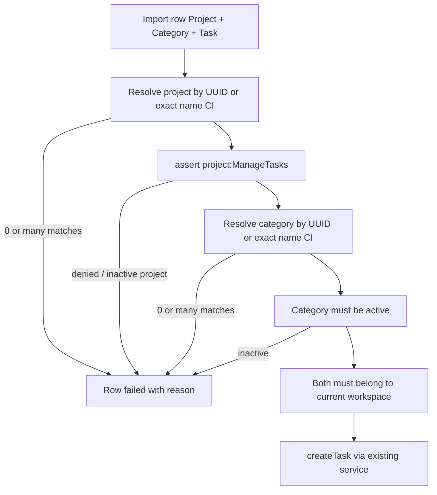

# Tasks CRUD + bulk import/export on `/tasks`

## Context

- API CRUD already exists: [`tasks.service.ts`](apps/api/src/modules/tasks/application/tasks.service.ts) enforces `project:ManageTasks`, `assertProjectInWorkspace`, and `assertCategoryActiveInWorkspace`.
- Full UI already exists on managed project tabs: [`project-tasks-panel.tsx`](apps/app/src/features/projects/project-tasks-panel.tsx).
- Global [`tasks-page.tsx`](apps/app/src/features/tasks/tasks-page.tsx) is list-only today.
- No task catalog import/export routes exist; closest patterns are categories (async Excel) and timelog import (sync per-row results + name/UUID resolve).

**Chosen scope:** 1B (CRUD + deep-link to project tasks) and 2A (import + export of task master data).

---

## Ensuring project and category are correct

This is the hard part of import (and create). Categories are **workspace-scoped**; tasks are **project-scoped**. Validation happens in layers:

### Rules (server is source of truth)

| Check | Rule | Failure message pattern |
|-------|------|-------------------------|
| Project resolve | UUID exact match, else case-insensitive **exact** name match in workspace | `Unknown project "X"` / `Ambiguous project name "X"` |
| Project access | Caller must pass `project:ManageTasks` for that project | `Not allowed to manage tasks on project "X"` |
| Project state | Project must exist in workspace; refuse create on inactive project | `Project "X" is inactive` |
| Category resolve | UUID exact match, else case-insensitive **exact** name match in workspace | `Unknown category "X"` / `Ambiguous category name "X"` |
| Category state | Must be active (reuse `assertCategoryActiveInWorkspace`) | `Cannot use inactive category "X"` |
| Duplicate task | Same `taskName` under same `projectId` → skip (not fail) | counted in `skipped` |
| Common / assignees | **All imported tasks are forced `isCommon=true`** with empty assignees. No assignee column. Ignore/omit any Common column — server always sets common | — |

### How the UI keeps create/edit correct

- Create/edit forms use `SearchableSelect` options loaded from:
  - projects the user can manage (`managedProjectIds` or admin’s full list)
  - **active** categories only (`useCategoriesListQuery` filtered by `isActive`)
- Selecting a project loads that project’s active flag; activate/deactivate copy stays aligned with [`getTaskConfirmCopy`](apps/app/src/features/projects/task-confirmation.ts).
- Deep-link: task row → `/projects/{projectId}/tasks` for advanced project-tab management if needed.
- **Create on `/tasks` and bulk import always create common tasks** (`isCommon=true`, no assignee picker on this page). Assigned/non-common tasks remain editable only via the existing project Tasks tab.

### Import template helps humans stay correct

Excel template (`.xlsx` only for dropdowns; CSV upload still accepted without lists) includes:

1. **Tasks** sheet columns: `Project`, `Category`, `Task`, `Billable` (optional), `Active` (optional, default true). **No Common column** — every import row creates a common task.
2. **Reference** sheet (immutable): workspace **active projects the caller can manage** (col A) and **active categories** (col B), generated at download time
3. **Excel data-validation dropdowns** on Tasks rows 2–501 (same ExcelJS pattern as member Role in [`workspace.service.ts`](apps/api/src/modules/workspace/application/workspace.service.ts)):
   - `Project` → list formula pointing at `Reference!$A$2:$A$n` (not an inline `"a,b,c"` string — Excel caps those at 255 chars)
   - `Category` → `Reference!$B$2:$B$n`
   - `Billable` / `Active` → inline `"TRUE,FALSE"` (or `Yes,No` mapped on parse)
4. Sample row(s) prefilled with the first valid project/category name
5. **Sheet protection:** lock the Reference sheet (`sheet.protect` with no password or a fixed template password) so list values cannot be edited; leave the Tasks sheet editable. Prefer **visible + protected** so users can still see valid options if they inspect the workbook
6. Server validation still runs on upload (typed values, pasted cells, or CSV bypass dropdowns). Dropdowns + immutable Reference reduce mistakes; they are not a security boundary. Import always passes `isCommon: true` and `assigneeUserIds: []` into create.

Import uses the **timelog sync pattern** (`created` / `skipped` / `failed[{row, reason}]`), not fire-and-forget BullMQ — so wrong project/category surfaces immediately per row.

Export columns: Project, Category, Task, Billable, Active (include Common only so existing non-common catalog rows remain visible; import never creates them). Respect current list filters (project filter + search).

---

## Implementation plan

### 1. Contracts (LSA)

Update [`packages/contracts/src/dto/task.dto.ts`](packages/contracts/src/dto/task.dto.ts) and [`routes.ts`](packages/contracts/src/routes.ts):

- `ROUTES.TASKS.BULK_TEMPLATE`, `BULK_UPLOAD`, `EXPORT`
- Schemas: bulk import row (`project`, `category`, `task`, optional `billable`/`active` — **no common/assignees**), import response (`created`/`skipped`/`failed`), export query (`format: csv|xlsx` + same filters as list)
- Update [`contracts.spec.ts`](packages/contracts/src/contracts.spec.ts)

### 2. API

Extend [`tasks.controller.ts`](apps/api/src/modules/tasks/interface/http/tasks.controller.ts) + service:

- `GET` template → ExcelJS workbook (Tasks editable + **protected Reference** sheet with project/category lists + `cell.dataValidation` dropdowns; Billable/Active as `"TRUE,FALSE"`)
- `POST` upload → parse xlsx/csv (max 500 rows / 2MB), resolve project/category as above, create with **`isCommon: true` and no assignees**, reuse existing create helpers so permission + category checks are not duplicated
- `GET`/`POST` export → filtered task catalog download
- Unit tests in `tasks.service.spec.ts` covering: template dropdowns, forced common on import, unknown/ambiguous project, unknown/inactive category, permission denied, duplicate skip, happy path by name and by UUID

### 3. Frontend `/tasks`

Enhance [`tasks-page.tsx`](apps/app/src/features/tasks/tasks-page.tsx):

- Toolbar actions when user can manage ≥1 project: **Add task**, **Import**, **Export**
- Create/edit: modal or inline panel (project select + name, category, billable) — **always common; no assignee picker**
- Row actions: Edit, Activate/Deactivate, Delete (existing confirm copy), and **Open in project** link to `/projects/{id}/tasks`
- Members without manage rights keep browse-only (current behavior)
- Import modal (categories UX): download template → upload → toast summary of created/skipped/failed
- Export: download current filtered set

Extract shared form bits from `ProjectTasksPanel` only if duplication is painful; otherwise call the same APIs from the page with a slim `TaskFormDialog`.

### 4. Tests

- Contract route/DTO specs
- API service specs for resolution matrix + forced `isCommon`
- App unit/RTL or feature specs for gated actions + import modal wiring
- Extend e2e smoke if `/tasks` already covered in `ups-05b-routes.spec.ts`

---

## Out of scope

- Bulk delete / bulk edit
- Creating categories or projects from the task import file
- Changing Exports sidebar `by_task` hours report (separate product surface)
- Assignees / non-common tasks on `/tasks` create or bulk import (use project Tasks tab for that)
