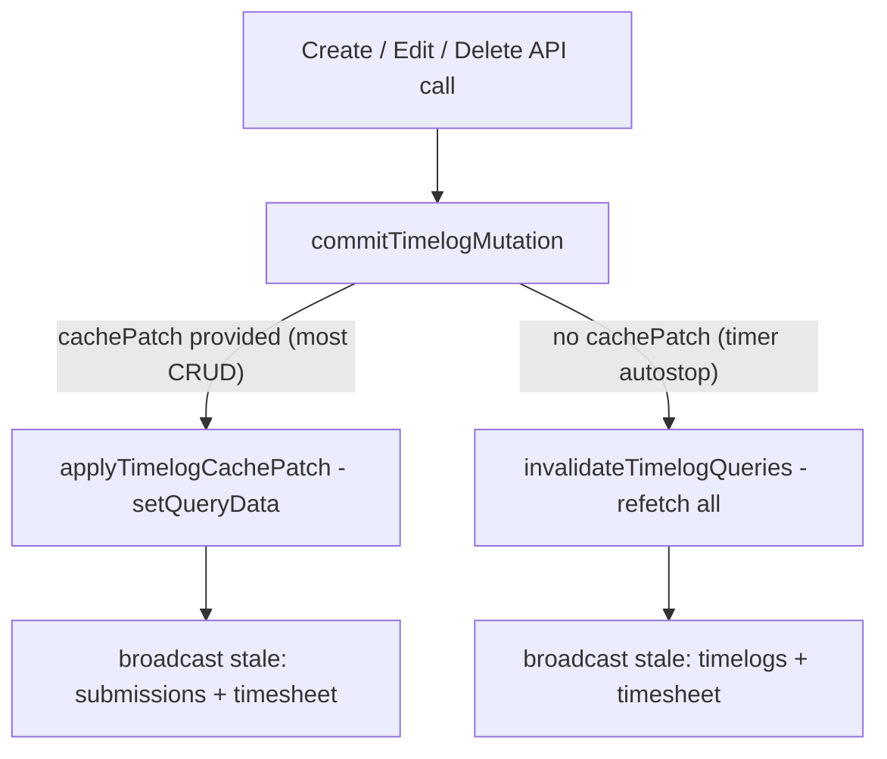
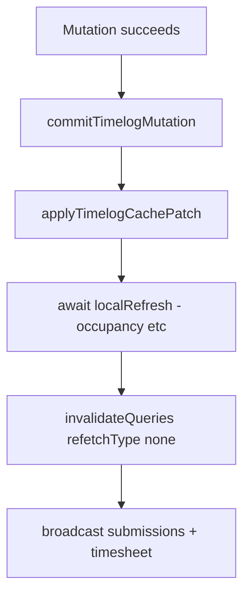

# Timelog UI Sync — Diagnosis and Fix Plan

## What you have today

The client app uses a **two-path post-mutation sync** orchestrated by [`commitTimelogMutation`](packages/web-shared/src/realtime/timelog-data-sync.ts):



**Reads** are centralized in two hooks in [`use-timelog-list-query.ts`](packages/web-shared/src/query/use-timelog-list-query.ts):
- `useTimelogListQuery` — dashboard, timesheet, submissions rows, timer
- `useTimelogListAllQuery` — client time tracker (`all:` key prefix)

**Views that subscribe:**

| View | Hook | File |
|------|------|------|
| Dashboard widgets | `useTimelogListQuery` | [`dashboard-page.tsx`](apps/client/src/features/dashboard/dashboard-page.tsx) |
| Timesheet calendar | `useTimelogListQuery` | [`timesheet-page.tsx`](apps/client/src/features/timesheet/timesheet-page.tsx) |
| Time tracker list | `useTimelogListAllQuery` | [`use-time-tracker-logs.ts`](apps/client/src/features/time-tracker/use-time-tracker-logs.ts) |
| Submissions expanded rows | `useTimelogListQuery` | [`submissions-table.tsx`](apps/client/src/features/submissions/submissions-table.tsx) |
| Timer recents | `useTimelogListQuery` | [`timer-page.tsx`](apps/client/src/features/timer/timer-page.tsx) |

This is a reasonable architecture (optimistic cache patch + targeted invalidation). The problem is the fast path is **incomplete**, not that you need to abandon it.

---

## What is going wrong (root causes)

### 1. Fast path skips `localRefresh` — same-page UI can stay stale

When a `cachePatch` is passed, [`commitTimelogMutation`](packages/web-shared/src/realtime/timelog-data-sync.ts) **returns early** and never calls `localRefresh`:

```38:41:packages/web-shared/src/realtime/timelog-data-sync.ts
  if (cachePatch) {
    applyTimelogCachePatch(workspaceId, cachePatch);
    invalidateWorkspaceData(workspaceId, TIMELOG_DERIVED_INVALIDATE_SCOPES);
    return;
  }
```

Every page passes a `localRefresh` callback (`refreshTimelogSurface`, `refreshLogs`) expecting it to run. Timesheet's callback refreshes **occupancy** (separate API, `useState`) in addition to logs:

```485:487:apps/client/src/features/timesheet/timesheet-page.tsx
  const refreshTimelogSurface = useCallback(async () => {
    await Promise.all([refreshLogs(), refreshOccupancy()]);
  }, [refreshLogs, refreshOccupancy]);
```

**Impact:** After create/edit/delete on timesheet, the calendar entries may update (via cache patch) but the occupancy overlay and overlap validation can remain stale until a full `timelogs` stale event (websocket) or navigation.

### 2. Cache patch only updates queries already in cache + matching date window

[`patch-timelog-list-caches.ts`](packages/web-shared/src/query/patch-timelog-list-caches.ts) iterates `getQueryCache().findAll()` and only upserts when `timelogMatchesListQueryPath` passes (checks `from`/`to` vs `log.startTime` only).

**Gaps:**
- **Uncached views:** If dashboard was never opened this session, there is no cache entry to patch. User must rely on `refetchOnMount: "always"` when navigating there — usually works, but feels "not immediate" if they expected live cross-tab sync.
- **Cross-date-window edits:** `upsert` adds to matching windows but **never removes** from old windows. Moving/resizing an entry across weeks leaves a ghost entry until a full refetch.
- **Filter params ignored:** Submissions queries include `userId` + `projectId` in the path, but matching only checks dates. A log can appear in the wrong submission row cache (or be missing if date boundaries differ between `periodStart`/`periodEnd` formats and `startTime`).

### 3. `useTimelogStaleRefetch` does not fire on local mutations (by design, but misleading)

[`useTimelogStaleRefetch`](apps/client/src/hooks/use-timelog-stale-refetch.ts) listens for `timelogs` scope. Local mutations with `cachePatch` only broadcast `submissions` + `timesheet` ([`TIMELOG_DERIVED_INVALIDATE_SCOPES`](packages/web-shared/src/realtime/timelog-data-sync.ts)).

**Impact:** Dashboard, submissions, and timer stale-refetch hooks **never run** after local saves. They only work for remote/socket changes or the slow path (timer autostop). This is intentional to avoid refetching lists you just patched — but it means **all cross-view correctness depends entirely on cache patch being perfect**.

### 4. Mutation logic is duplicated across 5+ pages

Each page calls `api()` then `commitTimelogMutation()` manually:
- [`timesheet-page.tsx`](apps/client/src/features/timesheet/timesheet-page.tsx)
- [`time-tracker-page.tsx`](apps/client/src/features/time-tracker/time-tracker-page.tsx)
- [`dashboard-page.tsx`](apps/client/src/features/dashboard/dashboard-page.tsx)
- [`submissions-table.tsx`](apps/client/src/features/submissions/submissions-table.tsx)
- [`timer-page.tsx`](apps/client/src/features/timer/timer-page.tsx)

No single `useMutation` contract — easy to add a new entry point and forget sync.

### 5. Secondary data sources outside TanStack Query

| Data | Source | Updated on fast path? |
|------|--------|----------------------|
| Timesheet occupancy | `useState` + `/timelogs/occupancy` | No (`localRefresh` skipped) |
| Submissions list metadata | `useMySubmissionsStore` | Yes (`submissions` scope) |
| Week summary widgets | `useMemberReportingStore` | Yes (`timesheet` scope) |
| Timer quick-actions recents | Direct `api()` fetch | No |
| Admin time tracker | `useState` (not TanStack Query) | Only via websocket `timelogs` stale |

---

## Recommended professional approach

**Keep** the optimistic cache-patch strategy (fast UI, no refetch storm). **Complete** it with three rules:

1. **Patch in-place for all matching cached queries** (instant UI)
2. **Always refresh view-local non-query state** (`localRefresh` for occupancy, etc.)
3. **Mark unmatched caches stale** without refetching patched ones (safety net for cross-page / cross-window)

Do **not** switch to "invalidate everything and refetch" as the default — that regresses performance and was explicitly avoided in the current design.



---

## Implementation plan

### Step 1 — Fix `commitTimelogMutation` contract

**File:** [`packages/web-shared/src/realtime/timelog-data-sync.ts`](packages/web-shared/src/realtime/timelog-data-sync.ts)

- After `applyTimelogCachePatch`, **always await `localRefresh?.()`** before returning.
- Add `queryClient.invalidateQueries({ queryKey: timelogQueryKeys.workspace(workspaceId), refetchType: "none" })` to mark unpatched/inactive caches stale without network refetch.
- Keep **not** broadcasting `timelogs` scope on fast path (avoids double-fetch via `useTimelogStaleRefetch`).
- Update [`timelog-data-sync.spec.ts`](packages/web-shared/src/realtime/timelog-data-sync.spec.ts): expect `localRefresh` called even with `cachePatch`.

### Step 2 — Harden cache patch logic

**File:** [`packages/web-shared/src/query/patch-timelog-list-caches.ts`](packages/web-shared/src/query/patch-timelog-list-caches.ts)

- Extend `timelogMatchesListQueryPath` to also match `userId`, `projectId`, `taskId` when present in the query path (submissions + admin filters).
- Add `relocateTimelogInListCaches(workspaceId, log, previousStartTime?)` for edits:
  - On upsert: remove `log.id` from **all** workspace list caches first, then upsert into matching caches.
  - Fixes ghost entries when moving across date windows.
- Ensure `all:` prefixed paths (time tracker) are handled — strip prefix before parsing params.
- Add tests in [`patch-timelog-list-caches.spec.ts`](packages/web-shared/src/query/patch-timelog-list-caches.spec.ts) for: cross-week move, filtered submission paths, `all:` prefix paths.

### Step 3 — Centralize mutations in one hook

**New file:** `packages/web-shared/src/query/use-timelog-mutations.ts`

```typescript
// Sketch — all pages call this instead of raw api() + commitTimelogMutation
useTimelogMutations(workspaceId, { onLocalRefresh })
  .create(body)   // POST → upsert patch
  .update(id, body) // PATCH → upsert patch
  .delete(id)     // DELETE → remove patch
  .createBatch(body) // POST batch → upsertMany patch
```

- Wraps API calls + `commitTimelogMutation` with correct patch types.
- Accepts optional `onLocalRefresh` per consumer (timesheet passes occupancy refresh).
- Migrate call sites one page at a time (timesheet first — highest complexity).

### Step 4 — Migrate page call sites

Replace duplicated `api()` + `commitTimelogMutation` in:
- [`timesheet-page.tsx`](apps/client/src/features/timesheet/timesheet-page.tsx)
- [`time-tracker-page.tsx`](apps/client/src/features/time-tracker/time-tracker-page.tsx)
- [`dashboard-page.tsx`](apps/client/src/features/dashboard/dashboard-page.tsx)
- [`submissions-table.tsx`](apps/client/src/features/submissions/submissions-table.tsx)
- [`timer-page.tsx`](apps/client/src/features/timer/timer-page.tsx)

### Step 5 — Integration test for cross-view sync

Add a Vitest integration test (extend existing specs) that simulates:
1. Seed dashboard + timesheet + time-tracker query caches
2. Run `commitTimelogMutation` with upsert patch
3. Assert all three caches update immediately
4. Run delete patch → assert removal everywhere
5. Run cross-week update → assert removed from old window

### Step 6 — (Optional, lower priority) Admin + quick-actions

- Migrate admin [`use-time-tracker-logs.ts`](apps/admin/src/features/time-tracker/use-time-tracker-logs.ts) to `useTimelogListAllQuery` for consistency.
- Wire [`quick-actions.tsx`](apps/client/src/features/timer/quick-actions.tsx) to `useTimelogListQuery` or listen for `timesheet` stale scope.

---

## What NOT to do

- **Do not** broadcast `timelogs` stale on every local save while also patching — causes redundant refetches and races with patched data.
- **Do not** remove cache patching in favor of only `invalidateQueries` — slower UX, more API load.
- **Do not** add per-widget manual `refetch()` calls — consolidate in `commitTimelogMutation` and the shared mutation hook.

---

## Verification checklist

After implementation, manually verify each operation updates UI **without page reload**:

| Action | Timesheet | Time Tracker | Dashboard | Submissions row | Timer recents |
|--------|-----------|--------------|-----------|-----------------|---------------|
| Create entry | instant | instant | instant (if in range) | instant (if expanded) | instant |
| Edit entry | instant | instant | instant | instant | instant |
| Delete entry | instant | instant | instant | instant | instant |
| Move across week | no ghost in old week | no ghost | correct | correct | correct |
| Occupancy overlay | updates after save | n/a | n/a | n/a | n/a |

Run: `pnpm format:check && pnpm lint && pnpm typecheck && pnpm test --filter web-shared && pnpm build`
