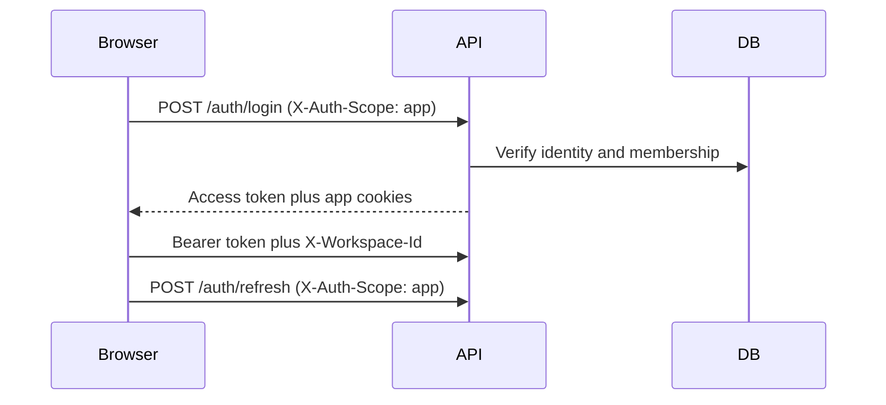

# Authentication and authorization

Kloqra uses JWT access tokens plus httpOnly refresh cookies. All customer personas authenticate
through the unified product with `NEXT_PUBLIC_AUTH_SCOPE=app`. Platform operations use a separate
`platform` scope and origin.

## Login and refresh

The product stores the access token under `cm-app-*` keys and sends it as a Bearer token. The API
prefers a valid Bearer token and can use the access cookie when appropriate. Refresh preserves the
active workspace and rotates the refresh family.

## Workspace and device behavior

`JwtAuthGuard` resolves workspace authority from the token. A conflicting `X-Workspace-Id` is denied;
it never changes authority. `POST /auth/switch-workspace` issues tokens for another workspace only
after membership validation.

Multiple devices and tabs are supported. Logout revokes the presented refresh family. Password
changes and explicit session revocation can invalidate broader session sets. A role change marks
older access tokens revoked; the product clears cached session/capability state and requires a fresh
sign-in.

See [MULTI_DEVICE_SESSIONS.md](./MULTI_DEVICE_SESSIONS.md).

## Authorization

Workspace, tenant, and project roles supply identity context, but the API policy evaluator remains
authoritative for every protected request. Frontend capabilities only compose navigation, widgets,
and actions. Browser-supplied tenant or workspace identifiers are never authorization truth.

| Product               | Scope      | Audience                              |
| --------------------- | ---------- | ------------------------------------- |
| `apps/app`            | `app`      | Members through tenant owners/admins  |
| `apps/platform-admin` | `platform` | Isolated internal platform operations |

### Capability freshness

The `CapabilitySnapshot` type (defined in `packages/contracts/src/permissions.ts`) describes a
versioned, short-lived UI composition hint. It is **not** an authorization token and must never
appear in JWT claims.

| Field           | Purpose                                                                             |
| --------------- | ----------------------------------------------------------------------------------- |
| `policyVersion` | Version of the managed-role policy at snapshot time                                 |
| `computedAt`    | ISO-8601 timestamp of generation                                                    |
| `expiresAt`     | Recommended client-side expiry (typically 5–15 minutes)                             |
| `etag`          | Changes when policy or membership changes; use for cache validation                 |
| `capabilities`  | `CapabilityEntry[]` — each carries `permission`, `scope`, and optional `resourceId` |

**Invalidation triggers** — the client must discard and refetch the snapshot when:

- Any role mutation event is received (WebSocket `workspace_data_stale`)
- The active workspace changes (`POST /auth/switch-workspace`)
- The access token is refreshed after a session-revocation event
- The policy version embedded in the snapshot does not match the current `POLICY_VERSION` constant
- The `expiresAt` timestamp is reached

**Invariant**: Every API call reevaluates against the `AuthorizationPolicyService` regardless of
snapshot state. A stale or missing snapshot only affects UI composition, never security.

## Production security

For cross-site Vercel and Railway hosting, set secure cookies, `SameSite=None`, an exact
`PUBLIC_APP_URL`, and `X-Auth-Scope: app`. Cookie endpoints require a valid production `Origin`.
Use strong independent JWT secrets, CSRF protections, refresh replay detection, rate limiting, and
reviewed CSP/HSTS/frame/referrer headers.

Implementation: [auth controller](../../apps/api/src/modules/auth/interface/http/auth.controller.ts),
[JWT guard](../../apps/api/src/common/guards/jwt-auth.guard.ts), and
[allowed origins](../../apps/api/src/common/auth/allowed-origins.ts).
