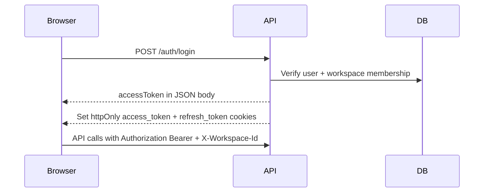

# Authentication and authorization

## Overview

ChronoMint uses JWT access tokens plus httpOnly refresh cookies. All workspace-scoped API routes require authentication and an active workspace context.

## Login flow

### Register / login response

- **Body:** `accessToken`, `user`, `workspaceId`, `workspaceName`, `workspaceRole`
- **Cookies:** `access_token` (short-lived), `refresh_token` (7 days)

Frontends also store `accessToken` in `localStorage` and send `Authorization: Bearer <token>`.

## Refresh

`POST /auth/refresh` reads the `refresh_token` cookie, issues a new access token, and updates the `access_token` cookie. No body required.

## Workspace context

`JwtAuthGuard` accepts workspace from:

1. `X-Workspace-Id` request header (preferred for API clients), or
2. `workspaceId` claim embedded in the JWT at login

Missing workspace → `WORKSPACE_REQUIRED` error.

## Switch workspace

`POST /auth/switch-workspace` (authenticated) changes the active workspace and re-issues tokens for users with multiple memberships.

## Logout

`DELETE /auth/logout` clears `access_token` and `refresh_token` cookies.

## Role-based access

Workspace roles: `ADMIN` | `MEMBER`.

| Area | ADMIN | MEMBER |
|------|-------|--------|
| Create/edit/delete projects | Yes | No |
| Team invites | Yes | No |
| Billing rates | Yes | No |
| Reporting dashboard | Yes | No |
| Admin export wizard | Yes | No |
| Timer, own timelogs | Yes | Yes |
| Member export (`POST /export/me`) | Yes | Yes |
| List projects | All in workspace | Only where on project team |
| Timelogs list | All users (optional filter) | Own logs only |

Enforced via `@Roles("ADMIN")` and `RolesGuard` on controllers, plus service-level checks (e.g. timelogs ownership).

## App separation

| App | Expected role |
|-----|----------------|
| Client (`:3000`) | `MEMBER` (admins may use it but admin features live in admin app) |
| Admin (`:3002`) | `ADMIN` — member accounts should use the client app |

## Production hardening

- Set cookie `secure: true` behind HTTPS.
- Use strong `JWT_ACCESS_SECRET` and `JWT_REFRESH_SECRET` (see [SECURITY.md](../development/SECURITY.md)).
- Restrict `FRONTEND_ORIGIN` to known domains.

Implementation: [auth.controller.ts](../../apps/api/src/modules/auth/interface/http/auth.controller.ts), [jwt-auth.guard.ts](../../apps/api/src/common/guards/jwt-auth.guard.ts).
