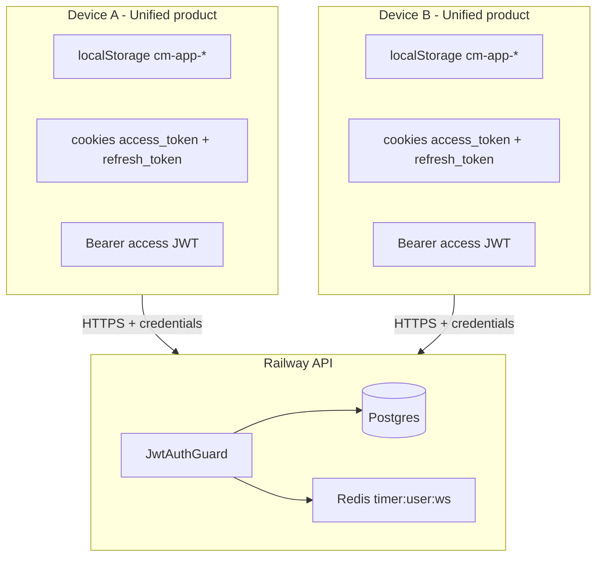

# Multi-device and parallel session handling

Kloqra allows the same user to be signed in to the unified product on multiple devices and tabs.
The customer product uses one `app` auth scope regardless of whether the current experience is
personal, project-management, workspace-admin, or organization-admin. `platform` remains isolated.

## Design stance

| Principle           | Choice                                                                      |
| ------------------- | --------------------------------------------------------------------------- |
| Session model       | **JWT access** + **DB-backed refresh rotation** (`refresh_tokens` table)    |
| Product auth scope  | **`app`** for every customer persona; **`platform`** for internal ops       |
| Parallel devices    | **Allowed** — each login creates a new refresh `family`; logout revokes one |
| Parallel tabs       | **Allowed** — refresh singleflight + rotation grace window                  |
| Workspace authority | **JWT `workspaceId` claim** — not stale `localStorage`                      |
| Running timer       | **One per user per workspace** (Redis) — shared across devices              |
| Role changes        | **Pre-change access tokens invalidated**; refresh-family rows remain        |

**Settings → Sessions** lists active refresh families; revoking one device invalidates its access JWT immediately (Redis blocklist) and revokes the whole refresh family in Postgres.

---

## Architecture

Each device holds its own short-lived access token and refresh family. The API validates tokens and
current authorization independently on every protected request.

---

## Credential layers

| Layer                      | Scope                    | Lifetime                    | Cleared on logout (this device) |
| -------------------------- | ------------------------ | --------------------------- | ------------------------------- |
| Bearer `accessToken`       | Product (`cm-app-*`)     | ~15m (`JWT_ACCESS_EXPIRES`) | Yes — `localStorage`            |
| httpOnly `access_token`    | API host, product        | ~15m                        | Yes — `DELETE /auth/logout`     |
| httpOnly `refresh_token`   | API host, refresh family | ~7d (`JWT_REFRESH_EXPIRES`) | Yes — logout                    |
| `X-Workspace-Id` header    | Per request              | N/A                         | Must match JWT or be omitted    |
| `X-Auth-Scope: app` header | Per request              | N/A                         | Selects product cookies         |

---

## Scenarios matrix

### Login and logout

| Action           | Device A        | Device B                                                  |
| ---------------- | --------------- | --------------------------------------------------------- |
| Login on A       | New tokens on A | Unchanged                                                 |
| Logout on A      | Cleared on A    | **Still logged in** until B's tokens expire or B logs out |
| Login on A again | New tokens on A | Still independent                                         |

### Capability changes

Member, project-manager, workspace-admin, and organization-admin experiences are views of the same
product session, not parallel app sessions. Navigation is recomposed from effective capabilities.
When a workspace or project role changes, the API writes the role audit event and a user-revocation
timestamp. Bearer tokens issued before that timestamp fail with `session_revoked`. This marker does
not delete the user's refresh-family rows; the product treats the fatal response as a session
boundary, clears cached capabilities, and asks the user to sign in again.

### Workspace switch (multi-workspace user)

| Action                                   | Effect on other devices                                                                              |
| ---------------------------------------- | ---------------------------------------------------------------------------------------------------- |
| Switch workspace on A                    | A gets new JWT with new `workspaceId`                                                                |
| B still has old JWT + old `localStorage` | Next request with mismatched `X-Workspace-Id` → **403** until B switches workspace or signs in again |

**Client rule:** Treat JWT as source of truth; sync `localStorage` from token or from `/auth/me` after login/switch.

### Timer (shared state)

| Action                | Effect                                   |
| --------------------- | ---------------------------------------- |
| Start timer on phone  | Redis `timer:{workspaceId}:{userId}` set |
| Start timer on laptop | **409** `TIMER_ALREADY_ACTIVE`           |
| Stop on phone         | Laptop poll/SSE can show timer stopped   |

Timer is **workspace-scoped user state**, not per device. UI should call `GET /timer/active` on focus and handle 409 with a clear message.

---

## API behavior

### `JwtAuthGuard`

1. Resolve Bearer token (header preferred) or scoped `access_token_{scope}` cookie.
2. Verify JWT → `userId`, `workspaceId`, `role`, `family`.
3. Reject if user or refresh `family` is on the Redis revocation list (`session_revoked`).
4. If `X-Workspace-Id` is present and **≠** token `workspaceId` → **403 Forbidden** (stale device/tab).
5. If header omitted → use token `workspaceId`.

### Refresh (`POST /auth/refresh`)

- Reads scoped refresh cookie (`SameSite=None` in cross-site production — see [AUTH.md](./AUTH.md)).
- Rotates refresh token in DB (revokes consumed hash, issues successor in same `family`).
- **Grace window** (`REFRESH_ROTATION_GRACE_MS`, default 10s): duplicate concurrent refresh with the same revoked token returns a new access token without revoking the family.
- Refresh JWT includes `workspaceId` and `typ: "refresh"`.
- Requires `X-Auth-Scope: app` for customer product sessions.

### Logout (`DELETE /auth/logout`)

- Clears product cookies in that browser.
- Revokes the current refresh token in DB; other devices unaffected.

### Session revoke (`DELETE /users/sessions/:id`)

- Revokes **all** refresh tokens in the same `family` (one login = one family).
- Sets Redis keys `auth:revoked-family:{id}` (and `auth:revoked-user:{id}` on password change) for the access-token TTL so Bearer JWTs stop working immediately.

### Password change

- Revokes all refresh tokens for the user + Redis user revocation.
- Client clears local session and redirects to `/login?reason=password-changed`.

---

## Frontend rules

1. Send **`X-Auth-Scope`** on every API call (`NEXT_PUBLIC_AUTH_SCOPE`).
2. Send **`Authorization: Bearer`** only when the access token is **not expired** (`isAccessTokenExpired()`).
3. Send **`X-Workspace-Id`** from `resolveApiWorkspaceId()` — JWT claim always wins over stale React `session.workspaceId`.
4. On **403** workspace mismatch → clear local session, redirect to login.
5. On **401** with `details.reason: token_expired` → singleflight silent refresh, then retry once.
6. On **401** with fatal reasons (`token_invalid`, `session_revoked`, etc.) → clear session, redirect login.
7. Bootstrap via `bootstrapSession()` — refresh cookie if needed, then `GET /auth/me` + `WORKSPACES.LIST`.
8. Cross-tab: `BroadcastChannel` syncs refreshed tokens without duplicate refresh calls.
9. Timer: on **409**, show “Timer already running (possibly on another device)” and refresh `GET /timer/active`.
10. Treat `session_revoked` after a role change as terminal: clear local state and require sign-in
    so the next capability snapshot reflects the new role. Do not describe this as deleting all
    refresh families; only pre-change access tokens are rejected by the role-change marker.

---

## Operational errors (user-facing)

| Code                             | HTTP | Meaning                        | User action                               |
| -------------------------------- | ---- | ------------------------------ | ----------------------------------------- |
| `UNAUTHORIZED`                   | 401  | Missing/invalid access token   | Log in again                              |
| `FORBIDDEN` (workspace mismatch) | 403  | Tab/device workspace ≠ token   | Switch workspace or log in                |
| `TIMER_ALREADY_ACTIVE`           | 409  | Timer running for this user/ws | Stop on other device or open Active timer |
| `TIMER_NOT_ACTIVE`               | 400  | Stop when nothing running      | Refresh timer page                        |

---

## Future enhancements (not implemented)

| Feature                                                | Use case                                       |
| ------------------------------------------------------ | ---------------------------------------------- |
| Logout all devices (single button)                     | Revoke every refresh family + user blocklist   |
| Per-device timer keys `timer:{ws}:{userId}:{deviceId}` | Independent timers per device (product change) |
| Push / SSE notify workspace switch                     | Auto-sync tabs on same device                  |

---

## Related docs

- [AUTH.md](./AUTH.md) — login, CORS, roles
- [ENVIRONMENT.md](../development/ENVIRONMENT.md) — env vars
- [local-troubleshooting.md](../runbooks/local-troubleshooting.md) — product cookies locally
