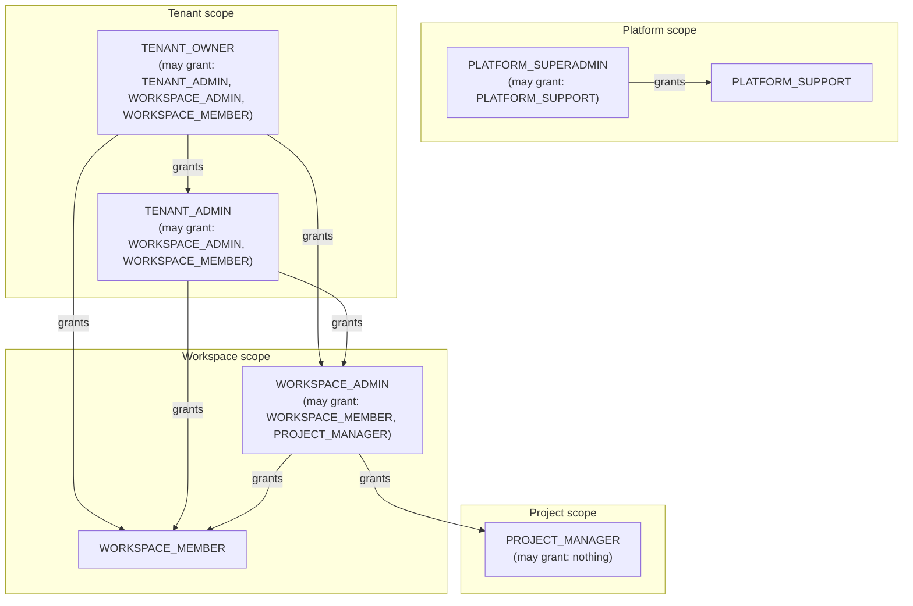
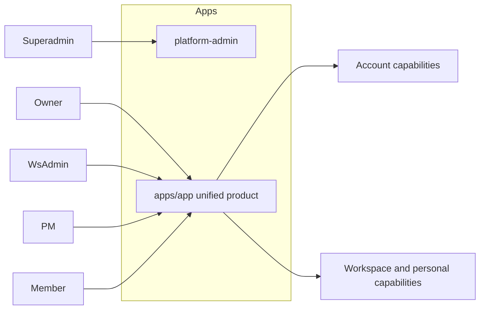
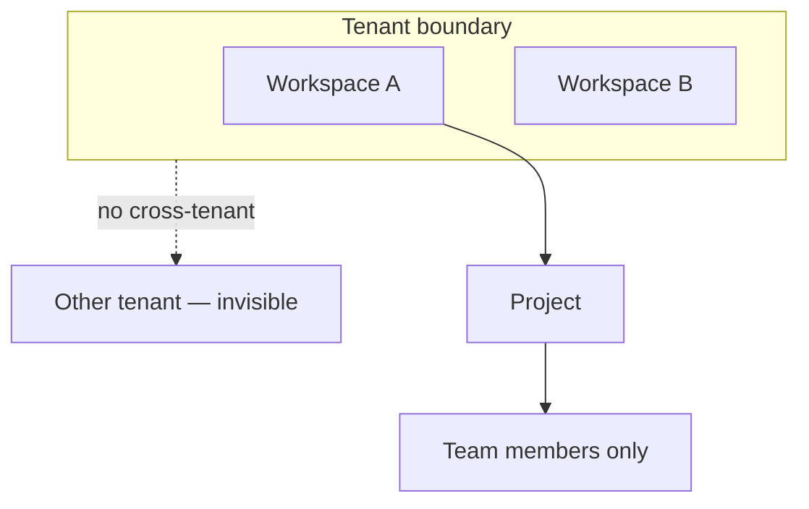
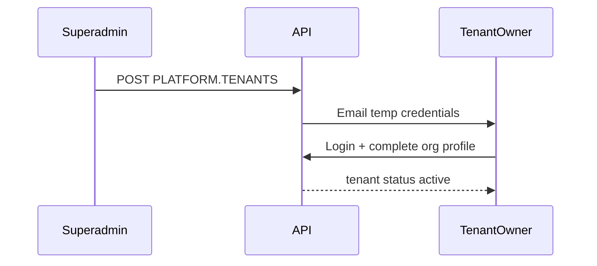
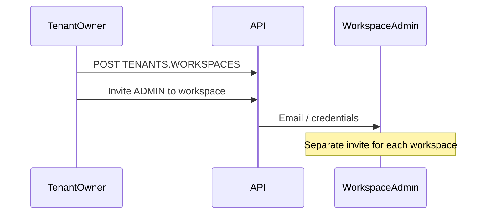
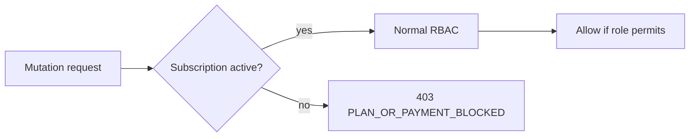
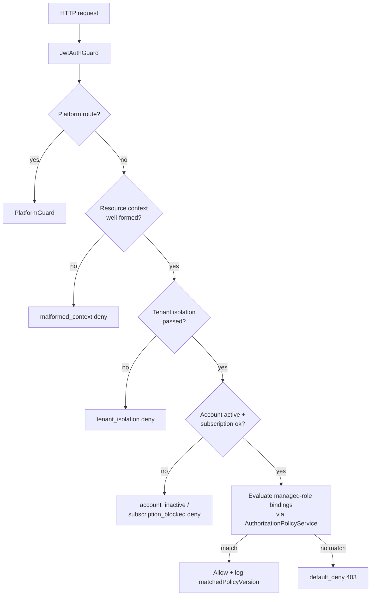

# Tenant RBAC — roles, permissions, and UI map

> **Status:** Design SSOT (SaaS-F03)  
> **Parent:** [SAAS_PLATFORM_PLAN.md](./SAAS_PLATFORM_PLAN.md) §7 · **Domain:** [TENANT_DOMAIN_MODEL.md](./TENANT_DOMAIN_MODEL.md) · **Contracts:** `packages/contracts/src/tenant-rbac.ts`

---

## 1. Overview

Kloqra uses **four authorization layers**. Higher layers manage lower layers; **data isolation** is enforced at **workspace** and **tenant** boundaries.

| Layer                 | Role(s)                      | Experience                                   |
| --------------------- | ---------------------------- | -------------------------------------------- |
| Platform              | Superadmin                   | Isolated `apps/platform-admin`               |
| Tenant (Organization) | Owner, organization admin    | Unified product → `/account/*`               |
| Workspace             | Admin, Member                | Unified product, capability-driven           |
| Project               | Project Manager, Team member | Unified product, project-scoped capabilities |

**Workspace roles** (`ADMIN` \| `MEMBER`) and **team roles** (`PROJECT_MANAGER` \| `MEMBER`) are defined in `@kloqra/contracts` (`common.dto`, `tenant-rbac.ts`).

---

## 2. Role catalog

### Platform superadmin

|              |                                                                                     |
| ------------ | ----------------------------------------------------------------------------------- |
| **Persona**  | Kloqra operations / support                                                         |
| **App**      | `apps/platform-admin` (internal deploy)                                             |
| **Contract** | `platformRoleSchema` → `SUPERADMIN`                                                 |
| **Can**      | Tenant lifecycle, plan assignment, fleet ops, audit log, own account security       |
| **Cannot**   | Impersonate users (D13); access customer timesheet/workspace data; edit plan prices |

Full action catalog: [platform-admin.md](../specs/platform-admin.md). Plan config SSOT: [plans.md](../specs/plans.md).

### Tenant owner (`OWNER`)

|             |                                                                                      |
| ----------- | ------------------------------------------------------------------------------------ |
| **Persona** | Agency principal / org owner                                                         |
| **App**     | Unified product (`apps/app`) → Account home                                          |
| **DB**      | `tenant_members.role = OWNER`                                                        |
| **Can**     | Create workspaces, assign workspace admins, subscription/billing (F13), org settings |
| **Cannot**  | Auto-access every workspace’s ops unless also `workspace_members` row                |

### Organization admin (`tenant_members.role = ADMIN`)

|             |                                                                                              |
| ----------- | -------------------------------------------------------------------------------------------- |
| **Persona** | Operations delegate for the organization                                                     |
| **App**     | Unified product → Account (Workspaces, Workspace admins, Organization) + workspace context   |
| **Can**     | Org profile (`PATCH /tenants/current`), create workspaces, assign/manage workspace admins    |
| **Cannot**  | Subscription/billing, data export, invite other organization admins, account overview rollup |

### Workspace admin (`workspace_members.role = ADMIN`)

|             |                                                                                    |
| ----------- | ---------------------------------------------------------------------------------- |
| **Persona** | Client or department manager                                                       |
| **App**     | Unified product → workspace-management capabilities                                |
| **Can**     | Projects, categories, approvals, exports, billing rates, team live                 |
| **Scope**   | **One workspace** per membership; same person needs **separate row** per workspace |

### Project manager / PM (`team_members.role = PROJECT_MANAGER`)

|             |                                                                     |
| ----------- | ------------------------------------------------------------------- |
| **Persona** | Project manager                                                     |
| **App**     | Unified product with navigation filtered to managed projects        |
| **Can**     | Tasks, team invites, approvals **for assigned projects only** (F17) |
| **Cannot**  | Workspace-wide billing, categories CRUD, create projects (v1)       |
| **Note**    | Same user may be `PROJECT_MANAGER` on **multiple projects** (D06)   |

### Member (`workspace_members.role = MEMBER`)

|             |                                                    |
| ----------- | -------------------------------------------------- |
| **Persona** | Staff logging time                                 |
| **App**     | Unified product personal experience                |
| **Can**     | Timer, timesheet, assigned projects, member export |
| **Cannot**  | Admin aggregates, other members’ revenue           |

---

## 3. Assignment-authority relationships

Roles are **assigned** at specific scopes — they are not inherited. The arrows below show who
may grant a binding to whom, not data inheritance.



> [!NOTE]
> **Tenant ownership does not imply workspace operational access.** A `TENANT_OWNER` with no
> `workspace_members` row cannot access workspace data — they require a separate membership.
> The ROLE_GRANT_MATRIX in `packages/contracts/src/permissions.ts` is the machine-readable SSOT.

---

## 4. App routing



| App                   | `NEXT_PUBLIC_AUTH_SCOPE` | Primary roles                                   |
| --------------------- | ------------------------ | ----------------------------------------------- |
| `apps/platform-admin` | `platform`               | Internal platform operations                    |
| `apps/app`            | `app`                    | Member, PM, workspace admin, tenant owner/admin |

**Unified shell:** `/dashboard` composes personal and management widgets from effective
capabilities. Tenant controls remain under `/account/*`. There is no member/admin mode switch.

**Context orientation (admin):**

- **Breadcrumb** — sticky strip above page content: `Organization › Workspace › Role` (owners in workspace mode) or `Organization › Organization` (account mode). Non-owners see `Workspace › Role` only.
- **Context switcher** — sidebar control lists Organization (owners) and all admin-accessible workspaces with role labels (`Owner · Admin`, `Project manager`, etc.).
- **Post-login picker** — when a user has **3+ contexts** (organization + 2+ workspaces, or 3+ workspaces), login redirects to `/select-context` (“Choose how you want to work”) instead of workspace-only selection.

---

## 5. Data visibility



| Viewer          | Sees                                                                                                       |
| --------------- | ---------------------------------------------------------------------------------------------------------- |
| Superadmin      | Tenant list, status, plan — not member time by default                                                     |
| Tenant owner    | All **tenant** workspaces list; **rollup metrics** on Account overview (F18); workspace ops only if member |
| Workspace admin | All projects in **that workspace**                                                                         |
| PM              | Assigned **projects** only                                                                                 |
| Member          | Team projects only; own time                                                                               |

---

## 6. Provisioning flows

### Superadmin → tenant owner (D16)



### Owner → workspace → workspace admin (D05, D14)



### Multi-workspace member (D15)

One `users` row → one `tenant_members` row → multiple `workspace_members` rows (same `tenant_id` via workspace FK).

---

## 7. Permission matrix (by domain)

Legend: **Y** yes · **N** no · **S** scoped · **A** account-only · **—** not applicable

| Domain                    | Superadmin | Tenant owner | Workspace admin | Project manager | Member |
| ------------------------- | ---------- | ------------ | --------------- | --------------- | ------ |
| Platform tenant CRUD      | Y          | N            | N               | N               | N      |
| Account / subscription    | —          | A            | N               | N               | N      |
| Create workspace          | —          | Y            | N               | N               | N      |
| Assign workspace admin    | —          | Y            | N               | N               | N      |
| Switch workspace (tenant) | —          | S            | S               | S               | S      |
| Projects CRUD             | —          | S            | Y               | N               | N      |
| Categories CRUD           | —          | S            | Y               | N               | N      |
| Tasks CRUD                | —          | S            | Y               | S               | N      |
| Team invites              | —          | S            | Y               | S               | N      |
| Timer / own logs          | —          | S            | Y               | Y               | Y      |
| Timesheet submit          | —          | S            | Y               | Y               | Y      |
| Timesheet approve         | —          | S            | Y               | S               | N      |
| Reporting dashboard       | —          | S            | Y               | S               | S      |
| Billing rates (client)    | —          | S            | Y               | N               | N      |
| Export wizard             | —          | S            | Y               | N               | N      |
| Export me                 | —          | S            | Y               | Y               | Y      |
| Team live / presence      | —          | S            | Y               | S               | N      |
| Public API keys           | —          | S            | Y               | N               | N      |

**S** for tenant owner = only when they have a `workspace_members` row for that workspace.

---

## 8. Subscription overlay (all roles)

When `tenant_subscriptions.status` is `past_due` or `suspended` (D12):



**Blocked mutations (v1):** `POST` timer start, manual timelog create, bulk import. Read access TBD in F12.

---

## 9. Request authorization flow

All authorization decisions flow through the central `AuthorizationPolicyService` evaluator.
No direct role-string comparisons at controller level.



**Evaluation order** (fixed):

1. Malformed/unresolved context → deny
2. Tenant isolation → deny
3. Account inactive → deny
4. Subscription blocked → deny
5. Scoped managed-role allow → allow
6. Default → deny

---

## 10. Combined personas

| Person      | Memberships                                      | Product experience                      |
| ----------- | ------------------------------------------------ | --------------------------------------- |
| **Alex**    | `OWNER` only                                     | Account capabilities                    |
| **Sarah**   | `ADMIN` in two workspaces                        | Workspace management and switcher       |
| **Mike**    | `MEMBER` + `PROJECT_MANAGER` on projects X and Y | Personal plus scoped project management |
| **Jane**    | `MEMBER` in two workspaces                       | Personal workflows and switcher         |
| **Sarah+M** | `ADMIN` + `PROJECT_MANAGER`                      | Workspace-wide management               |

---

## 11. Deny rules (never)

1. Cross-tenant data access (user has only one `tenant_members` row).
2. Cross-workspace access without `workspace_members` row.
3. Auto-provision workspace admin to all workspaces on one invite.
4. Superadmin impersonation (D13).
5. Member sees org-wide revenue or peer rankings (existing principle).
6. Accept `workspaceId` / `tenantId` from body for authorization — use JWT + guards only.

---

## 12. Frontend — Account UI component map (SaaS-F08)

Follow [FRONTEND-UI.md](../development/FRONTEND-UI.md) and [chronomint-fe-feature skill](../../.cursor/skills/chronomint-fe-feature/SKILL.md). **No new primitives in apps** — use `@kloqra/ui` and `@kloqra/web-shared`.

### Layout

```
apps/app/src/app/(app)/account/
  page.tsx              → thin server wrapper
  layout.tsx            → Account sub-nav (optional)

apps/app/src/features/account/
  account-overview-page.tsx
  account-workspaces-page.tsx
  account-organization-page.tsx
  account-billing-page.tsx      (stub until F13)
  components/
    workspace-admin-assign-dialog.tsx
    create-workspace-dialog.tsx
```

### Component rules

| UI need                 | Use                                                |
| ----------------------- | -------------------------------------------------- |
| Tables (workspace list) | `DataTableCard`, `usePaginatedList` or static list |
| Create workspace        | `AppModal` + form                                  |
| Assign admin            | `AppModal` + `fetchListItems` / invite API         |
| Loading                 | `TableLoadingState`, `CenteredLoader`              |
| Success/error           | `toast` from `sonner`                              |
| API calls               | `api()` + `ROUTES.TENANTS.*` from contracts        |
| Types                   | `TenantOverviewDto`, etc. from `@kloqra/contracts` |

### platform-admin (SaaS-F14)

```
apps/platform-admin/src/app/
  (platform)/tenants/page.tsx
apps/platform-admin/src/features/tenants/
  tenant-list-page.tsx
  tenant-create-page.tsx
```

Same table/modal patterns; **separate** `NEXT_PUBLIC_AUTH_SCOPE=platform`.

---

## 13. Production-grade validation

Canonical checklist: [SAAS_PLATFORM_PLAN.md §7.2](./SAAS_PLATFORM_PLAN.md). RBAC-specific gates:

| Gate                                                                     | Status                                           |
| ------------------------------------------------------------------------ | ------------------------------------------------ |
| `TENANT_RBAC.md` signed off (this doc)                                   | ✅ implemented                                   |
| Contracts enums match matrix (`permissions.spec.ts` green)               | ✅ implemented                                   |
| `ROLE_GRANT_MATRIX` covers every managed role, no self-escalation        | ✅ implemented                                   |
| `AuthorizationPolicyService` fail-closed with `malformed_context`        | ✅ implemented                                   |
| `matchedPolicyVersion` present on every allow decision                   | ✅ implemented                                   |
| `RoleGrantAuditEvent` carries `tenantId`, `policyVersion`, `priorRole`   | ✅ implemented                                   |
| Worker re-authorization at execution time (not trusted serialized role)  | ✅ implemented                                   |
| WebSocket room namespacing (`product:user:*` vs `platform:user:*`)       | ✅ implemented                                   |
| Tenant-operator paths through authoritative evaluator                    | ✅ implemented                                   |
| F05 isolation E2E before F06+                                            | ✅ implemented                                   |
| F17 matrix rows implemented in code (`docs/specs/project-manager.md`)    | ✅ implemented                                   |
| Negative integration coverage for every privilege boundary               | ⚠️ partial — unit tests done, E2E matrix pending |
| No `@Roles("ADMIN")` bypass for PROJECT_MANAGER without service check    | ⚠️ partial — migration in progress               |
| `CapabilitySnapshot` consumed by UI (short-lived, scoped, no JWT claims) | 🎯 target                                        |

---

## 14. Current vs target

| Today                             | Target                                  |
| --------------------------------- | --------------------------------------- |
| `ADMIN` \| `MEMBER` per workspace | + tenant + platform + `PROJECT_MANAGER` |
| Any user `POST /workspaces`       | Tenant owner only                       |
| No tenant entity                  | `tenants` + `tenant_members`            |
| Single app pair                   | + `platform-admin`                      |

---

## 15. Implementation map

| Epic    | RBAC deliverable              |
| ------- | ----------------------------- |
| F03     | This document + contracts     |
| F04     | JWT `tenantId`, guards        |
| F05     | Isolation E2E                 |
| F06–F07 | Tenant + workspace APIs       |
| F08     | Account UI (§12)              |
| F10     | Plan limits guard             |
| F12     | Subscription write guard      |
| F14–F15 | Platform routes               |
| F17     | `PROJECT_MANAGER` enforcement |
