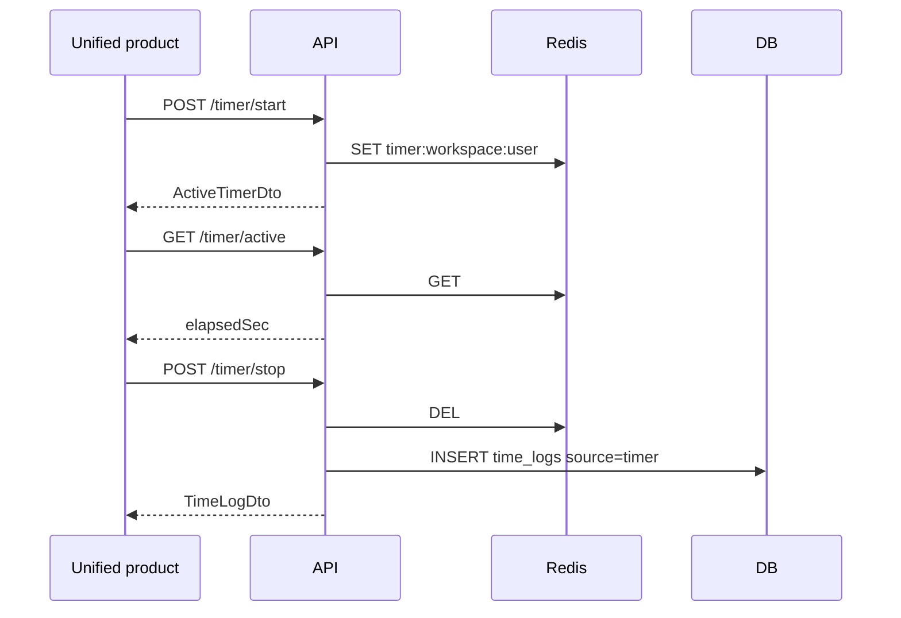

# Timer sequence

```mermaid
sequenceDiagram
  participant Product as Unified product
  participant API
  participant Redis
  participant DB

  Product->>API: POST /timer/start
  API->>Redis: SET timer:workspace:user
  API-->>Product: ActiveTimerDto

  Product->>API: GET /timer/active
  API->>Redis: GET
  API-->>Product: elapsedSec

  Product->>API: POST /timer/stop
  API->>Redis: DEL
  API->>DB: INSERT time_logs source=timer
  API-->>Product: TimeLogDto
```
