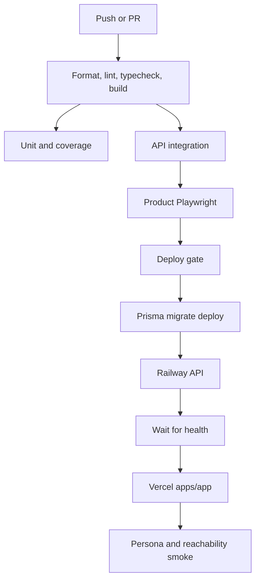

# CI/CD pipeline architecture

Kloqra validates the monorepo and deploys one customer product from `apps/app`.

The deploy workflow runs after successful CI on the release branch or by manual dispatch. Hosting
platform auto-deploy hooks should be disabled when GitHub Actions owns deployment.

Turborepo cache is restored by lockfile and branch for quality, unit, integration, and e2e jobs.
Shared packages are built through Turbo filters so cached `dist` outputs can be reused.

## Deployment sequence

1. `pnpm --filter @kloqra/api exec prisma migrate deploy`
2. `railway up --service="kloqra-api" --ci --detach`
3. `bash scripts/deploy/wait-health.sh "$API_URL"`
4. `pnpm exec vercel deploy --prod --cwd apps/app --project "$VERCEL_APP_PROJECT" --yes`
5. Run API and product smoke checks against `API_URL` and `APP_URL`.

`apps/platform-admin` is deployed separately and never shares the product auth scope.
