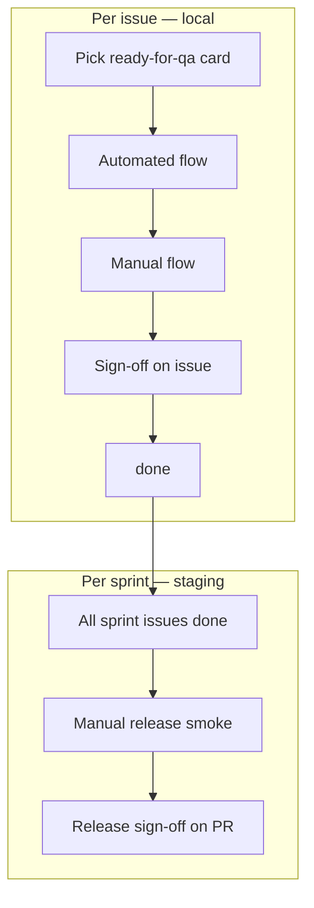
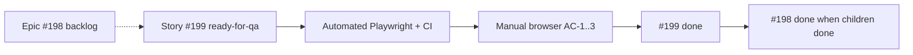

# QA engineer guideline — manual + automated

Official workflow for Kloqra QA engineers. Work **one GitHub issue at a time** on [Project #4](https://github.com/orgs/SCITAIGROUP1/projects/4). Every story has **acceptance criteria (AC-1, AC-2, …)** and a **QA verification matrix** — that is your script.

**Related docs:** [setup & smoke (plain language)](../user-guides/qa/testing-guide.md) · [environments](ENVIRONMENTS.md) · [evidence policy](EVIDENCE.md) · [bugs](BUG_TRIAGE.md) · [releases](RELEASE_PROCESS.md)

---

## Principles

| Rule                        | Meaning                                                                                              |
| --------------------------- | ---------------------------------------------------------------------------------------------------- |
| **One task at a time**      | Finish one card (`done` + sign-off) before picking the next `ready-for-qa`                           |
| **Automated before manual** | Run matrix **Automated** rows first; only click in the browser if robots pass                        |
| **AC-ID traceability**      | Sign-off cites `AC-1`, `AC-2`, … with evidence — not vague “looks good” ([EVIDENCE.md](EVIDENCE.md)) |
| **Local per issue**         | Each story is verified on **local** (`pnpm serve`)                                                   |
| **Staging per release**     | Full smoke on **staging** once per sprint, before merge to production                                |
| **No MVP exclusions**       | Do not QA budget, billing, revenue, or client portal — label `mvp:out-of-scope`                      |

---

## The two flows (overview)



| Flow          | When                                | Where                    | Output                     |
| ------------- | ----------------------------------- | ------------------------ | -------------------------- |
| **Automated** | Every issue + every PR              | Terminal + GitHub Checks | Green tests / CI           |
| **Manual**    | Every issue (matrix rows) + release | Browser                  | AC pass + sign-off comment |

---

## Board lanes (QA only)

Work cards through these statuses **in order**:

| Lane             | What you do                                 |
| ---------------- | ------------------------------------------- |
| `ready-for-qa`   | Dev merged; you pick **one** card           |
| `qa-in-progress` | **Automated flow** (below)                  |
| `testing`        | **Manual flow** (below)                     |
| `done`           | Sign-off posted; matrix checked             |
| `qa-failed`      | AC failed — comment repro; wait for dev fix |

Do not skip lanes. Do not work two cards in `qa-in-progress` at once.

---

## Before you start (once per day)

### 1. Start local environment

1. Open **Postgres.app** (Running).
2. Terminal → project folder:

```bash
cd ~/Desktop/ChronoMint   # your clone path
git pull
corepack pnpm serve
```

3. Leave Terminal open. Open browsers:

| App    | URL                   |
| ------ | --------------------- |
| Client | http://localhost:3000 |
| Admin  | http://localhost:3002 |

**Logins** (after seed): `member@kloqra.dev` / `admin@kloqra.dev` — password `password123`.

If login fails: `corepack pnpm prisma:seed` then refresh.

### 2. Open QA queue

[Project #4](https://github.com/orgs/SCITAIGROUP1/projects/4) → **QA queue** view  
(filter: `ready-for-qa`, `qa-in-progress`, `testing`, `qa-failed`)

---

## Per-issue workflow (one task at a time)

Copy this checklist for each issue:

```text
Issue GH-____  Title: ____________________
[ ] 1. Read AC-1..N and QA matrix on issue
[ ] 2. Confirm linked PR Checks are green
[ ] 3. Move card → qa-in-progress
[ ] 4. Automated flow complete
[ ] 5. Move card → testing
[ ] 6. Manual flow complete
[ ] 7. Sign-off comment posted
[ ] 8. Matrix rows marked [x]
[ ] 9. Move card → done
[ ] → Pick next ready-for-qa
```

---

## Automated flow

**Goal:** Prove the robots pass for **this issue only** before you use the browser.

**When:** Lane `qa-in-progress`  
**Where:** Terminal on your Mac + GitHub PR **Checks** tab

### Step A — CI on the PR (no Terminal)

1. Open the linked pull request on GitHub.
2. **Checks** tab — all must be green:

| Job         | If red, means                           |
| ----------- | --------------------------------------- |
| quality     | Build/lint/typecheck broken — dev fixes |
| unit        | Backend/unit tests failed               |
| integration | API contract tests failed               |
| e2e         | Browser (Playwright) tests failed       |

3. If **e2e** fails: workflow run → **Artifacts** → download `playwright-report` → open `index.html` for screenshots.

You do **not** need to download artifacts if Checks are green.

### Step B — Run matrix commands locally

Copy commands from the issue **QA verification matrix** → **Automated** column.

| Matrix type    | Typical command                                         | Needs                 |
| -------------- | ------------------------------------------------------- | --------------------- |
| **Unit**       | `corepack pnpm --filter @kloqra/api test <module>`      | Postgres not required |
| **API**        | `corepack pnpm --filter @kloqra/api test:e2e <file>`    | Postgres + seed       |
| **E2E**        | `corepack pnpm --filter @kloqra/client test:e2e <spec>` | `pnpm serve` running  |
| **Contract**   | `corepack pnpm --filter @kloqra/contracts test`         | —                     |
| **Regression** | `corepack pnpm test` or path from matrix                | varies                |

**First-time / API tests:**

```bash
corepack pnpm prisma:seed
```

**Full CI parity (optional, before release):**

```bash
corepack pnpm test:prepush
```

**Browse reports locally:**

```bash
corepack pnpm test:dashboard
```

Opens http://localhost:9321 (coverage + Playwright HTML).

### Step C — Record automated results

| Result                             | Action                                                              |
| ---------------------------------- | ------------------------------------------------------------------- |
| All matrix automated rows **pass** | Move card → `testing`                                               |
| Any row **fails**                  | Move card → `qa-failed`; comment which command failed + log snippet |

### Example — issue #201 (unit only)

```bash
corepack pnpm --filter @kloqra/api test presence
```

### Example — issue #200 (API integration)

```bash
corepack pnpm prisma:seed
corepack pnpm --filter @kloqra/api test:e2e workspace
corepack pnpm --filter @kloqra/api test:e2e timesheets
```

### Example — issue #199 (Playwright + manual)

```bash
corepack pnpm --filter @kloqra/client test:e2e timesheet
corepack pnpm --filter @kloqra/client test:e2e smoke
```

---

## Manual flow

**Goal:** Confirm what a **real user** sees matches each **AC** on the issue.

**When:** Lane `testing`  
**Where:** Browser on **local** (staging only if issue says deploy/email — see [ENVIRONMENTS.md](ENVIRONMENTS.md))

### Step A — Follow matrix manual rows

Each matrix row has **Manual steps** — execute them in order:

1. Use the account from the issue (usually `member@kloqra.dev` or `admin@kloqra.dev`).
2. Use the workspace named in the issue (e.g. Acme Corporation).
3. Number your clicks exactly as in the matrix.
4. Compare **expected** (from AC) vs **actual** (what you see).
5. Screenshot anything non-obvious (UI bugs, wrong data).

### Step B — Scope manual work to this issue

| Do                                                          | Don't                                |
| ----------------------------------------------------------- | ------------------------------------ |
| Test only what AC and matrix describe                       | Run full 15-row smoke on every issue |
| Quick regression on **adjacent** screens if AC touches them | Test unrelated features              |
| Note browser + version in sign-off if UI issue              |                                      |

### Step C — Full smoke tables (release only)

Use these **once per sprint** on staging, not every issue:

- [Client smoke (7 rows)](../user-guides/qa/testing-guide.md#client-app-member--smoke-checklist)
- [Admin smoke (8 rows)](../user-guides/qa/testing-guide.md#admin-app--smoke-checklist)
- [Cross-app checks](../user-guides/qa/testing-guide.md#cross-app-checks-when-relevant)

### Step D — Pass or fail

| Result            | Action                                                 |
| ----------------- | ------------------------------------------------------ |
| Every AC **pass** | Post sign-off (below) → `done`                         |
| Any AC **fail**   | `qa-failed` + comment `AC-N FAIL` + repro + screenshot |

---

## Sign-off (required for every issue)

Full policy: **[EVIDENCE.md](EVIDENCE.md)** — naming (`GH-<issue#>-AC-<n>-<label>.png`), what to attach per AC type, CI links, optional local pack.

Generate a template:

```bash
node .cursor/skills/kloqra-qa-workflow/scripts/print-signoff.mjs <issue#> --env local --acs <count>
```

Optional — stage screenshots locally before uploading to GitHub:

```bash
node .cursor/skills/kloqra-qa-workflow/scripts/archive-evidence.mjs <issue#> --env local --copy-playwright
```

Paste as a **comment on the GitHub issue**. Fill every row:

```text
QA sign-off GH-199
Environment: local
Tester: Your Name — 2026-06-15

| AC | Result | Evidence |
|----|--------|----------|
| AC-1 | PASS | Playwright timesheet.spec.ts; screenshot GH-199-AC-1-export-csv.png |
| AC-2 | PASS | Toast "No entries to export" — GH-199-AC-2-empty-toast.png |
| AC-3 | PASS | smoke.spec.ts; GH-199-AC-3-login-redirect.png |
| Regression | PASS | pnpm --filter @kloqra/client test:e2e timesheet |

Gate: CI green on PR #___
Matrix: all rows [x] on issue body
```

Then move Project card → **`done`**.

---

## Release flow (manual + automated, staging)

Run **after all sprint issues are `done`** (or explicitly deferred by PM).

### Automated (staging gate)

1. Release PR on GitHub — **Checks** all green.
2. Optional local: `corepack pnpm test:prepush`

### Manual (staging)

1. Confirm staging deployed — URLs in [ENVIRONMENTS.md](ENVIRONMENTS.md):
   - Client: https://kloqra-client-staging.vercel.app
   - Admin: https://kloqra-admin-staging.vercel.app

2. Run **full** client + admin smoke checklists (link above).
3. Post **release sign-off** on the release PR:

```text
QA release sign-off — v0.x / sprint name
Environment: staging
Client: https://kloqra-client-staging.vercel.app — PASS / FAIL
Admin: https://kloqra-admin-staging.vercel.app — PASS / FAIL
Sprint issues verified: #199 done, #200 done, #201 done
Blockers: none
Tester: Your Name — date
```

Details: [RELEASE_PROCESS.md](RELEASE_PROCESS.md)

---

## Production (light manual only)

After production deploy — **short smoke** (5–10 min), not full matrix per issue:

1. Client — login, timer, timesheet load
2. Admin — login, dashboard load
3. One path for whatever shipped

File bugs with **Environment: production** via [Bug template](https://github.com/SCITAIGROUP1/ChronoMint/issues/new?template=bug.yml).

Do **not** use production for sprint feature sign-off — that happens on **local** (per issue) and **staging** (per release).

---

## When something fails

### During automated flow

1. Save Terminal output or CI log link.
2. Comment on issue: which matrix row failed + command.
3. Card → `qa-failed`.
4. Do **not** start the next issue until dev reassigns or fixes.

### During manual flow

1. Comment: `AC-2 FAIL` + numbered repro + expected vs actual.
2. Attach screenshot or screen recording.
3. Card → `qa-failed`.
4. Optional: [file a Bug](https://github.com/SCITAIGROUP1/ChronoMint/issues/new?template=bug.yml) linked as sub-issue.

### Bug keeps coming back

Ask dev to add a row to the matrix **Automated** column (Playwright or API test). You verify that row on retest.

Triage: [BUG_TRIAGE.md](BUG_TRIAGE.md)

---

## Environment summary

| Environment    | Per-issue QA            | Release QA              | Automated tests       |
| -------------- | ----------------------- | ----------------------- | --------------------- |
| **Local**      | Yes — primary           | Optional `test:prepush` | Run matrix commands   |
| **CI**         | Read PR Checks          | Read release PR Checks  | Runs on every push    |
| **Staging**    | Only if deploy-specific | Yes — full smoke        | Trust CI + spot-check |
| **Production** | No                      | Post-deploy smoke only  | No                    |

---

## Worked example: Epic #198 → Story #199 (Export)

**Full sample flow (commands, expected output, AI prompts, evidence, sign-off):**  
**[examples/WALKTHROUGH_EPIC_198_STORY_199.md](examples/WALKTHROUGH_EPIC_198_STORY_199.md)**

Summary for [Epic #198 — Export (hours only)](https://github.com/SCITAIGROUP1/ChronoMint/issues/198). Use the linked doc whenever someone asks “how do we test #198?”

### Epic vs story

| Issue                                                         | Type      | QA tests directly?                    |
| ------------------------------------------------------------- | --------- | ------------------------------------- |
| [#198](https://github.com/SCITAIGROUP1/ChronoMint/issues/198) | **Epic**  | **No** — track progress; scope only   |
| [#199](https://github.com/SCITAIGROUP1/ChronoMint/issues/199) | **Story** | **Yes** — wire export on `/timesheet` |

```text
Epic #198 (F-12 Export) — backlog
  └── Story #199 — Wire member timesheet CSV export  ← QA works HERE
  └── (backlog) Deprecate legacy GET /export
```

### Scope from #198

- **In scope:** `POST /export/me`, member CSV on `/timesheet`
- **Out of scope:** invoice, revenue, billing (`mvp:out-of-scope`)
- **Spec:** [docs/specs/export.md](../specs/export.md)

### QA on #199 (not #198)

| Step | Lane             | Action                      |
| ---- | ---------------- | --------------------------- |
| 1    | `ready-for-qa`   | Pick **#199** on Project #4 |
| 2    | `qa-in-progress` | **Automated** (below)       |
| 3    | `testing`        | **Manual** (below)          |
| 4    | `done`           | Sign-off on **#199**        |

#### Automated (`qa-in-progress`)

PR **Checks** green, then:

```bash
corepack pnpm serve
corepack pnpm --filter @kloqra/client test:e2e timesheet
corepack pnpm --filter @kloqra/client test:e2e smoke
```

| AC         | Automated                                | Proves                 |
| ---------- | ---------------------------------------- | ---------------------- |
| AC-1       | `timesheet.spec.ts` — member exports CSV | Download + columns     |
| AC-2       | `timesheet.spec.ts` — empty range toast  | No file + toast        |
| AC-3       | `smoke.spec.ts` — unauthenticated        | Redirect to login      |
| Regression | full timesheet suite                     | No calendar regression |

#### Manual (`testing`) — http://localhost:3000

**AC-1:** Login `member@kloqra.dev` → `/timesheet` → **Export** → open CSV (Date, Project, Task, Duration, ≥1 row).

**AC-2:** From `2099-01-01` to `2099-01-07` → **Export** → toast “No entries to export”, no download.

**AC-3:** Logged out → `/timesheet` → redirect to login.

#### Sign-off

```bash
node .cursor/skills/kloqra-qa-workflow/scripts/print-signoff.mjs 199 --env local --acs 3
```

Post on **#199** → card **`done`**.

### When is epic #198 complete?

When **all child stories** are `done` (e.g. #199). PM moves **#198** → `done`. Optional epic comment:

```text
Epic F-12 QA complete — #199 signed off; member export on /timesheet verified local.
```

### Flow diagram



### Generate scaffold for any issue

```bash
node .cursor/skills/kloqra-qa-workflow/scripts/issue-walkthrough.mjs 198
node .cursor/skills/kloqra-qa-workflow/scripts/issue-walkthrough.mjs 199
```

Agents use [issue-walkthrough-format.md](../../.cursor/skills/kloqra-qa-workflow/reference/issue-walkthrough-format.md) for the same structure on other issues. Canonical filled example: [examples/WALKTHROUGH_EPIC_198_STORY_199.md](examples/WALKTHROUGH_EPIC_198_STORY_199.md).

### Ask the agent (Cursor)

With **kloqra-qa-workflow** skill enabled, ask in chat:

- _“How do we test issue #198?”_
- _“Walk me through QA for #199”_
- _“Epic vs story — what does QA run for export?”_

The agent reads the issue, classifies Epic vs Story, and replies in the same structure as this example.

### Generate scaffold yourself

```bash
node .cursor/skills/kloqra-qa-workflow/scripts/issue-walkthrough.mjs 198
node .cursor/skills/kloqra-qa-workflow/scripts/issue-walkthrough.mjs 199
```

Uses `gh issue view` when logged in; otherwise loads bodies from `docs/agent/backlog/bodies/`.

---

## Command quick reference

```bash
# Daily start
corepack pnpm serve

# Reseed demo data
corepack pnpm prisma:seed

# Unit tests (all packages)
corepack pnpm test

# API integration
corepack pnpm test:integration

# Client browser tests
corepack pnpm --filter @kloqra/client test:e2e

# Admin browser tests
corepack pnpm --filter @kloqra/admin test:e2e

# CI parity
corepack pnpm test:prepush

# Test report hub
corepack pnpm test:dashboard

# Sign-off helper
node .cursor/skills/kloqra-qa-workflow/scripts/print-signoff.mjs <issue#> --env local
```

---

## Where things live

| Item                    | Link                                                                                           |
| ----------------------- | ---------------------------------------------------------------------------------------------- |
| Sprint board            | https://github.com/orgs/SCITAIGROUP1/projects/4                                                |
| New bug                 | https://github.com/SCITAIGROUP1/ChronoMint/issues/new?template=bug.yml                         |
| PR checks               | GitHub PR → Checks tab                                                                         |
| CI artifacts            | GitHub Actions run → Artifacts (7 days)                                                        |
| Agent skill (technical) | [.cursor/skills/kloqra-qa-workflow/SKILL.md](../../.cursor/skills/kloqra-qa-workflow/SKILL.md) |

---

## One-page daily rhythm

```text
Morning
  1. pnpm serve + open QA queue
  2. ONE card: ready-for-qa → qa-in-progress
  3. AUTOMATED: PR Checks green + matrix commands pass
  4. testing → MANUAL: matrix manual steps in browser
  5. Sign-off comment → done
  6. Repeat until queue empty

Sprint end
  7. Staging: full smoke + release sign-off on PR

After prod deploy
  8. Production: 5-min smoke only
```
