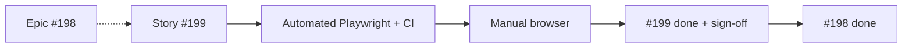

# Full sample flow — Epic #198 → Story #199 (Export)

Complete end-to-end QA scenario: commands, expected output, AI prompts, where results live, sign-off, and epic closure.

**Use this doc when:** someone asks “how do we test [#198](https://github.com/SCITAIGROUP1/ChronoMint/issues/198)?” or you need a reference pattern for epic vs story QA.

**Related:** [QA_ENGINEER_GUIDE.md](../QA_ENGINEER_GUIDE.md) · [EVIDENCE.md](../EVIDENCE.md) · [ENVIRONMENTS.md](../ENVIRONMENTS.md) · [export spec](../../specs/export.md)

---

## Important rule

[#198](https://github.com/SCITAIGROUP1/ChronoMint/issues/198) is an **Epic**. You do **not** run the AC matrix on the epic card.

You QA the **child story** [#199](https://github.com/SCITAIGROUP1/ChronoMint/issues/199) (wire CSV export on `/timesheet`). When #199 is signed off → `done`, the epic can close.

---

## Epic vs story

| Issue                                                         | Type      | QA tests directly?                |
| ------------------------------------------------------------- | --------- | --------------------------------- |
| [#198](https://github.com/SCITAIGROUP1/ChronoMint/issues/198) | **Epic**  | **No** — scope + track children   |
| [#199](https://github.com/SCITAIGROUP1/ChronoMint/issues/199) | **Story** | **Yes** — full automated + manual |

```text
Epic #198 (F-12 Export)
  └── Story #199 — Wire TimesheetExport on /timesheet  ← QA works HERE
  └── (backlog) Deprecate legacy GET /export
```

**In scope (from #198):** member hours CSV via `POST /export/me`, client UI on `/timesheet`  
**Out of scope:** invoice, revenue, billing (`mvp:out-of-scope`)

---

## How this fits the board

| Where                                                         | What you do                                                                |
| ------------------------------------------------------------- | -------------------------------------------------------------------------- |
| [Project #4](https://github.com/orgs/SCITAIGROUP1/projects/4) | Move **#199** card: `ready-for-qa` → `qa-in-progress` → `testing` → `done` |
| Epic #198                                                     | Stay in backlog until **all** child stories are `done`; PM closes epic     |
| GitHub PR                                                     | Confirm **Checks** green before sign-off                                   |



---

## Prompt to ask the AI agent (Cursor)

Copy one of these into chat (with **kloqra-qa-workflow** skill enabled):

```text
Act as QA. Walk me through testing Epic #198 — Export hours only.
Classify epic vs story, give every command, expected output, where to see results,
manual browser steps, and the sign-off comment for GitHub issue #199.
```

Shorter:

```text
How do we test issue #198? Full step-by-step with commands and expected responses.
```

Scaffold-only:

```text
Run issue-walkthrough for #198 and #199 and fill in the matrix commands from the issue body.
```

**CLI scaffold (no AI):**

```bash
node .cursor/skills/kloqra-qa-workflow/scripts/issue-walkthrough.mjs 198
node .cursor/skills/kloqra-qa-workflow/scripts/issue-walkthrough.mjs 199
```

The agent should reply using [issue-walkthrough-format.md](../../../.cursor/skills/kloqra-qa-workflow/reference/issue-walkthrough-format.md) — same structure as this document.

---

## Acceptance criteria (from #199)

| AC       | Criterion                                                                                                               |
| -------- | ----------------------------------------------------------------------------------------------------------------------- |
| **AC-1** | MEMBER with ≥1 timelog in visible week → click **Export** → `.csv` within 5s with columns Date, Project, Task, Duration |
| **AC-2** | MEMBER with zero logs in range → **Export** → toast “No entries to export”, no file                                     |
| **AC-3** | Unauthenticated user → `/timesheet` → redirect to `/login`, no CSV                                                      |

**QA matrix (automated):**

| AC         | Type | Command                                                           |
| ---------- | ---- | ----------------------------------------------------------------- |
| AC-1       | E2E  | `apps/client/e2e/timesheet.spec.ts` — “AC-1: member exports CSV…” |
| AC-2       | E2E  | same spec — “AC-2: empty date range shows no-entries toast”       |
| AC-3       | E2E  | `apps/client/e2e/smoke.spec.ts` — “AC-3: unauthenticated…”        |
| Regression | E2E  | `pnpm --filter @kloqra/client test:e2e timesheet`                 |

---

## Step 0 — One-time setup

**Terminal A:**

```bash
cd /path/to/ChronoMint
corepack pnpm install
createdb kloqra 2>/dev/null || true   # skip if DB exists
corepack pnpm prisma:migrate
corepack pnpm prisma:seed
```

**Expected:** seed completes without error.

**Demo login** ([ENVIRONMENTS.md](../ENVIRONMENTS.md)):

| Email               | App    | Password      |
| ------------------- | ------ | ------------- |
| `member@kloqra.dev` | Client | `password123` |
| `admin@kloqra.dev`  | Admin  | `password123` |

---

## Step 1 — Pick the card

1. Open [Project #4](https://github.com/orgs/SCITAIGROUP1/projects/4).
2. Find **Story #199** in `ready-for-qa` (not Epic #198).
3. Assign yourself → move card to **`qa-in-progress`**.

**Checklist:**

```text
[ ] Read AC + matrix on issue #199
[ ] Linked PR merged (or branch checked out locally)
[ ] Card in qa-in-progress
```

---

## Step 2 — Automated flow (`qa-in-progress`)

### 2a — Start local stack

**Terminal A:**

```bash
corepack pnpm serve
```

**Expected (after ~30–60s):**

```text
Client  http://localhost:3000
Admin   http://localhost:3002
API     http://localhost:3001
```

### 2b — Confirm CI (if dev merged)

Open the PR on GitHub → **Checks** tab. All jobs green:

| Job         | Pass means                     |
| ----------- | ------------------------------ |
| quality     | format, lint, typecheck, build |
| unit        | Vitest + coverage gates        |
| integration | API Supertest                  |
| e2e         | Playwright admin + client      |

**Where to see CI results:**

- PR → **Checks** tab (status while PR is open)
- Actions → workflow run → **Artifacts** (`playwright-report`, `coverage`) — **7 days** retention

See [EVIDENCE.md](../EVIDENCE.md) and [ci-artifacts.md](../../../.cursor/skills/kloqra-qa-workflow/reference/ci-artifacts.md).

### 2c — Run local E2E

**Terminal B:**

```bash
corepack pnpm --filter @kloqra/client test:e2e timesheet
```

**Expected output (success):**

```text
Running 5 tests using 1 worker
  ✓ Timesheet calendar › shows mobile Time Tracker tip on a narrow viewport
  ✓ Timesheet calendar › week view scrolls horizontally instead of overflowing the page
  ✓ Timesheet export (GH-199) › AC-1: member exports CSV for visible range
  ✓ Timesheet export (GH-199) › AC-2: empty date range shows no-entries toast
  5 passed
```

```bash
corepack pnpm --filter @kloqra/client test:e2e smoke
```

**Expected output (success):**

```text
  ✓ login page loads
  ✓ AC-3: unauthenticated /timesheet redirects to login
  2 passed
```

### 2d — Browse reports (optional)

```bash
corepack pnpm test:dashboard
```

Open **http://localhost:9321** → client Playwright report with traces and screenshots.

Or open directly after E2E: `apps/client/playwright-report/index.html`

| AC         | Automated test             | What PASS proves                                    |
| ---------- | -------------------------- | --------------------------------------------------- |
| AC-1       | `timesheet.spec.ts` — AC-1 | `.csv` download; columns Date/Project/Task/Duration |
| AC-2       | `timesheet.spec.ts` — AC-2 | Toast “No entries to export”; no file               |
| AC-3       | `smoke.spec.ts` — AC-3     | `/timesheet` → `/login`                             |
| Regression | full `test:e2e timesheet`  | Calendar tests still green                          |

### 2e — If automated fails

1. Move card → **`qa-failed`**
2. Comment on #199:

```text
AC-N FAIL on GH-199
Environment: local
Command: pnpm --filter @kloqra/client test:e2e timesheet
Expected: <from AC>
Actual: <failure message>
Evidence: GH-199-AC-N-FAIL-<label>.png (attach screenshot or Playwright trace)
```

3. Do **not** proceed to manual until dev fixes and automated is green again.

### 2f — If automated passes

Move **#199** on Project #4 → **`testing`**.

---

## Step 3 — Manual flow (`testing`)

**Browser:** http://localhost:3000  
**Account:** `member@kloqra.dev` / `password123`

### AC-1 — CSV export

1. Log in → navigate to **/timesheet**
2. Confirm heading **“Export my timesheet”** and **Export** button visible
3. Click **Export**
4. Open the downloaded `.csv` file

**Expected:**

- File downloads within 5 seconds
- Header row includes **Date, Project, Task, Duration**
- At least one data row for the current visible week (seed data)

**Screenshot:** `GH-199-AC-1-export-csv.png` (export UI + download or opened CSV)

### AC-2 — Empty range

1. Set **From** to `2099-01-01` (field `#export-from`)
2. Set **To** to `2099-01-07` (field `#export-to`)
3. Click **Export**

**Expected:**

- Toast: **“No entries to export”**
- **No** file download

**Screenshot:** `GH-199-AC-2-empty-toast.png`

### AC-3 — Unauthenticated

1. Log out (or use incognito/private window)
2. Go to http://localhost:3000/timesheet

**Expected:**

- Redirect to **/login**
- No CSV generated

**Screenshot:** `GH-199-AC-3-login-redirect.png` (address bar shows `/login`)

---

## Step 4 — Evidence pack (optional)

Stage files locally before uploading to GitHub:

```bash
node .cursor/skills/kloqra-qa-workflow/scripts/archive-evidence.mjs 199 --env local --copy-playwright
```

**Creates:**

```text
.qa-evidence/GH-199/
  manifest.json
  SIGNOFF.md
  screenshots/          ← drop renamed PNGs here
  playwright/client/    ← copy of report (with --copy-playwright)
```

Rename screenshots per [EVIDENCE.md](../EVIDENCE.md), then attach to the GitHub issue comment. Folder is gitignored — never commit it.

---

## Step 5 — Sign-off (`done`)

### Generate comment scaffold

```bash
node .cursor/skills/kloqra-qa-workflow/scripts/print-signoff.mjs 199 --env local --acs 3
```

### Example sign-off (paste on [#199](https://github.com/SCITAIGROUP1/ChronoMint/issues/199))

```text
QA sign-off GH-199
Environment: local — http://localhost:3000
Tester: Your Name — YYYY-MM-DD

| AC | Result | Evidence |
|----|--------|----------|
| AC-1 | PASS | timesheet.spec.ts AC-1; 5/5 e2e green; screenshot GH-199-AC-1-export-csv.png |
| AC-2 | PASS | timesheet.spec.ts AC-2; screenshot GH-199-AC-2-empty-toast.png |
| AC-3 | PASS | smoke.spec.ts AC-3; screenshot GH-199-AC-3-login-redirect.png |
| Regression | PASS | pnpm --filter @kloqra/client test:e2e timesheet — 5 passed |

Gate: CI green — https://github.com/SCITAIGROUP1/ChronoMint/pull/___
Matrix: all rows [x] on issue body
```

### Where results are saved

| What                   | Where                            | Retention                        |
| ---------------------- | -------------------------------- | -------------------------------- |
| Sign-off + screenshots | **GitHub issue #199 comment**    | Permanent                        |
| CI proof               | PR **Checks** URL in sign-off    | While PR exists                  |
| Playwright HTML        | `apps/client/playwright-report/` | Until next test run (gitignored) |
| Test hub               | `pnpm test:dashboard` → :9321    | Ephemeral                        |
| Optional pack          | `.qa-evidence/GH-199/`           | Local (gitignored)               |

### Finish

1. Attach screenshots to the comment (`GH-199-AC-*.png`)
2. Mark matrix `[x]` on issue #199 body (or note “matrix checked in sign-off”)
3. Move **#199** on Project #4 → **`done`**

---

## Step 6 — Epic #198 closure

When **all** child stories under #198 are `done` (minimum #199 for wire-export), PM moves **#198** → `done`.

**Optional comment on [#198](https://github.com/SCITAIGROUP1/ChronoMint/issues/198):**

```text
Epic F-12 QA complete — #199 signed off; member CSV export on /timesheet verified local.
Out of scope confirmed: invoice/revenue/billing not tested.
```

You do **not** re-run the full matrix on the epic — reference child sign-offs.

---

## Failure example (qa-failed)

If AC-2 fails in the browser after automated passed:

```text
AC-2 FAIL on GH-199
Environment: local — http://localhost:3000
Steps:
  1. Login member@kloqra.dev
  2. /timesheet
  3. From 2099-01-01 To 2099-01-07
  4. Click Export
Expected: toast "No entries to export", no download
Actual: file still downloaded / no toast
Evidence: GH-199-AC-2-FAIL-no-toast.png
```

1. Move #199 → **`qa-failed`**
2. File `[Bug][F-12]` sub-issue if needed ([BUG_TRIAGE.md](../BUG_TRIAGE.md))
3. Retest after fix: automated first, then manual AC-2 only (or full matrix if regression risk)

---

## Cheat sheet

```text
1. #198 = Epic → QA #199 (story), not the epic card
2. pnpm serve → test:e2e timesheet + smoke → all green
3. Browser manual AC-1..3 on localhost:3000 as member@kloqra.dev
4. Sign-off comment on #199 + screenshots GH-199-AC-*.png
5. #199 done → when all children done, close #198
```

---

## Command reference (copy-paste)

```bash
# Scaffold
node .cursor/skills/kloqra-qa-workflow/scripts/issue-walkthrough.mjs 198
node .cursor/skills/kloqra-qa-workflow/scripts/issue-walkthrough.mjs 199

# Setup (first time)
corepack pnpm install && corepack pnpm prisma:migrate && corepack pnpm prisma:seed

# Run stack + tests
corepack pnpm serve                                    # Terminal 1
corepack pnpm --filter @kloqra/client test:e2e timesheet
corepack pnpm --filter @kloqra/client test:e2e smoke
corepack pnpm test:dashboard                           # http://localhost:9321

# Sign-off + evidence
node .cursor/skills/kloqra-qa-workflow/scripts/print-signoff.mjs 199 --env local --acs 3
node .cursor/skills/kloqra-qa-workflow/scripts/archive-evidence.mjs 199 --env local --copy-playwright

# Verify issue has matrix (CI/local)
node .cursor/skills/kloqra-qa-workflow/scripts/verify-matrix.mjs docs/agent/backlog/bodies/f-12-wire-export.md
```

---

## Per-issue checklist (full)

```text
[ ] 0. DB seeded; member@kloqra.dev works
[ ] 1. Pick #199 on Project #4 → qa-in-progress
[ ] 2. PR Checks green (if merged)
[ ] 3. pnpm serve running
[ ] 4. test:e2e timesheet — 5 passed
[ ] 5. test:e2e smoke — 2 passed (AC-3)
[ ] 6. Move card → testing
[ ] 7. Manual AC-1 — CSV columns + row
[ ] 8. Manual AC-2 — empty toast
[ ] 9. Manual AC-3 — login redirect
[ ] 10. Screenshots GH-199-AC-*.png attached
[ ] 11. Sign-off comment on #199
[ ] 12. Matrix [x] on issue
[ ] 13. Card → done
[ ] 14. When all children done → epic #198 → done
```
